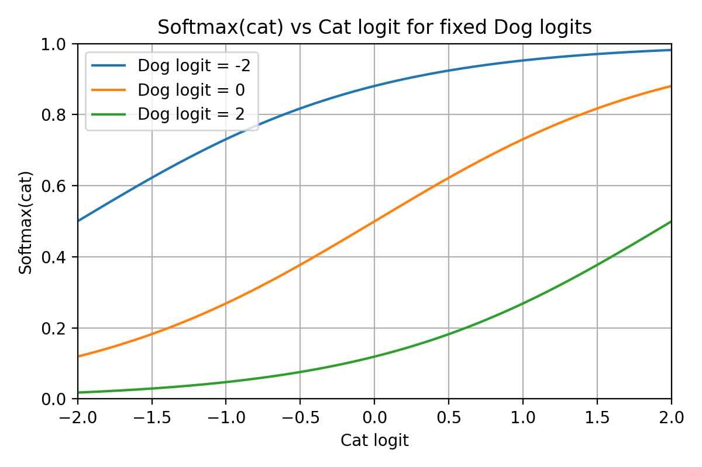

# Abs-Max + MSE vs. Softmax + Cross-Entropy

A comparison of two ways to turn raw logits into a training signal for classification.

- **Standard:** `logits → softmax → cross-entropy` against a one-hot target.
- **Proposed:** `logits → absolute value → divide by the max → MSE` against a one-hot target.

The short answer: your scheme *will* train, and on an easy problem it may even work. But it is inferior on several concrete counts, and — importantly — it does **not** fix the vanishing-gradient problem that made you distrust MSE in the first place. It reintroduces the same problem through a different door.

---

## Table of Contents

- [Setup and Notation](#setup-and-notation)
- [First, You're Right About Softmax + MSE](#first-youre-right-about-softmax--mse)
- [Why Softmax + Cross-Entropy Is So Clean](#why-softmax--cross-entropy-is-so-clean)
- [The Proposed Scheme, Step by Step](#the-proposed-scheme-step-by-step)
- [Problem 1: It Reintroduces Vanishing Gradients](#problem-1-it-reintroduces-vanishing-gradients)
- [Problem 2: The Absolute Value Folds the Space](#problem-2-the-absolute-value-folds-the-space)
- [Problem 3: Scale Invariance Leaves a Flat Direction](#problem-3-scale-invariance-leaves-a-flat-direction)
- [Problem 4: No Margin Pressure Once You're Right](#problem-4-no-margin-pressure-once-youre-right)
- [Problem 5: No Probabilistic Meaning](#problem-5-no-probabilistic-meaning)
- [A Concrete Numerical Example](#a-concrete-numerical-example)
- [So When *Is* MSE the Right Choice? (Embeddings, Diffusion, …)](#so-when-is-mse-the-right-choice-embeddings-diffusion-)
- [Cheat-Sheet](#cheat-sheet)
- [Appendix: The Gradients, Derived Rigorously](#appendix-the-gradients-derived-rigorously)
  - [Calculus Rules Used](#calculus-rules-used)
  - [A. The Softmax Jacobian](#a-the-softmax-jacobian)
  - [B. Softmax + Cross-Entropy → $p - y$](#b-softmax--cross-entropy--p--y)
  - [C. Softmax + MSE → the Saturating Gradient](#c-softmax--mse--the-saturating-gradient)
  - [D. Abs-Max + MSE → the $1/\max|z|$ Factor](#d-abs-max--mse--the-1maxz-factor)

---

## Setup and Notation

Two classes, cat and dog. The last layer produces raw logits $z = (z_{\text{cat}}, z_{\text{dog}})$. The ground truth is one-hot; say the true class is cat, so the target is $y = (1, 0)$.

**Standard scheme.** Convert to probabilities and score with cross-entropy:

$$
p_i = \frac{e^{z_i}}{\sum_j e^{z_j}}, \qquad L_{\text{CE}} = -\sum_i y_i \log p_i = -\log p_{\text{cat}}
$$

**Proposed scheme.** Take absolute values, normalize by the largest, and score with MSE:

$$
o_i = \frac{|z_i|}{\max_j |z_j|}, \qquad L_{\text{MSE}} = \sum_i (o_i - y_i)^2
$$

Note two immediate structural facts about $o$: the element with the largest magnitude **always** outputs exactly $1$, and the whole output is unchanged if you scale every logit by the same positive constant. Both of these matter below.

---

## First, You're Right About Softmax + MSE

Your instinct about *why people avoid MSE after softmax* is correct. Consider a single output $p$ that should be $1$ but the network currently produces $p \approx 0$ (confidently wrong). With MSE the loss is $(p - y)^2$ and the gradient with respect to the logit is

$$
\frac{\partial L}{\partial z} = \underbrace{2(p - y)}_{\text{error term}} \cdot \underbrace{p(1-p)}_{\text{softmax slope}}
$$

The error term $2(p-1)$ is large (about $-2$), but the softmax slope $p(1-p)$ collapses to $0$ when $p$ is near $0$ or $1$. The two multiply, so the gradient **vanishes exactly when the network is most wrong**. Learning stalls in a flat region. This is the saturation you were describing.

So MSE-after-a-squashing-function is a real problem. Keep that mechanism in mind — *error term times a slope that can go to zero* — because your scheme has the same shape.

{ width=50% }

---

## Why Softmax + Cross-Entropy Is So Clean

Cross-entropy is designed to cancel the softmax slope. Work through the derivative and everything collapses to:

$$
\frac{\partial L_{\text{CE}}}{\partial z_i} = p_i - y_i
$$

That is the whole thing. No slope factor that can vanish. If the network is confidently wrong ($p_{\text{cat}} \approx 0$ when $y_{\text{cat}} = 1$), the gradient is about $-1$ — full strength. If it is already correct ($p_{\text{cat}} \approx 1$), the gradient is near $0$ — nothing left to fix. The $\log$ in cross-entropy is the exact inverse of the $\exp$ in softmax, and that pairing is *why* the two are always used together. The gradient magnitude tracks the mistake, which is exactly what you want.

---

## The Proposed Scheme, Step by Step

Let us compute the gradient of your scheme so we can compare it on the same footing.

Say cat is currently the smaller-magnitude logit and dog is the max, i.e. $\max_j |z_j| = |z_{\text{dog}}|$. Then:

$$
o_{\text{cat}} = \frac{|z_{\text{cat}}|}{|z_{\text{dog}}|}, \qquad o_{\text{dog}} = 1
$$

The gradient that tries to raise the correct class output $o_{\text{cat}}$ toward its target of $1$ is:

$$
\frac{\partial L}{\partial z_{\text{cat}}}
= 2\,(o_{\text{cat}} - 1) \cdot \frac{\partial o_{\text{cat}}}{\partial z_{\text{cat}}}
= 2\,(o_{\text{cat}} - 1) \cdot \frac{\mathrm{sign}(z_{\text{cat}})}{|z_{\text{dog}}|}
$$

Look at that last factor: $1 / |z_{\text{dog}}|$. **The denominator is the size of the wrong class's logit.** This is the crux.

---

## Problem 1: It Reintroduces Vanishing Gradients

The very failure mode you wanted to avoid is back. When the network is *confidently wrong* — the wrong class dog has a large logit — the denominator $|z_{\text{dog}}|$ is large, so the gradient available to fix the correct class is divided by a big number and shrinks toward zero.

This is structurally the same disease as softmax + MSE: an *error term* (here $2(o_{\text{cat}}-1)$, which is healthy and near $-2$) multiplied by a *slope* ($1/|z_{\text{dog}}|$) that collapses precisely when the mistake is most confident. So your scheme is in the same class as softmax + MSE, **not** in the better class occupied by softmax + cross-entropy. You have not escaped the problem; you have re-encoded it as "divide by the biggest logit."

Cross-entropy's gradient in the same situation stays at full strength ($\approx -1$). That is the gap.

---

## Problem 2: The Absolute Value Folds the Space

$|z|$ is non-monotonic: it decreases for $z < 0$, hits a kink at $0$, and increases for $z > 0$. Three consequences:

- **Sign is thrown away.** A logit of $+5$ and one of $-5$ produce the identical output. The network has two symmetric ways to represent "confidently this class," so it wastes capacity and the loss surface has mirror-image minima. Optimization can drift between them for no reason.
- **A dead zone at zero.** Right at $z_i = 0$ the function is non-differentiable; PyTorch hands back a subgradient (typically $0$), so a logit sitting near zero gets little or no useful signal. Worse, the gradient direction *flips* as a logit crosses zero, so a small nudge can reverse which way training pushes.
- **Ambiguous target.** To make the correct class output $1$, the network can drive its logit large *positive or large negative*. Either works. That is a strange thing to ask an optimizer to converge on.

Softmax has none of this: $e^{z}$ is smooth, strictly increasing, and gives sign a consistent meaning (bigger logit ⇒ bigger probability).

---

## Problem 3: Scale Invariance Leaves a Flat Direction

Because you divide by the max, multiplying every logit by any positive constant leaves the output unchanged: $o(z) = o(2z) = o(100z)$. So there is an entire ray of weight settings that produce identical loss. That is a flat direction in the loss landscape — the optimizer gets no signal about the overall scale, weights can drift or blow up without changing the loss, and the problem is poorly conditioned.

Additionally, `max` is itself non-smooth: as training proceeds, *which* class is the maximum can switch, and at that moment the normalizing denominator changes identity, kinking the loss surface. Again PyTorch will differentiate through it, but "the framework can compute *a* gradient" is not the same as "the gradient is well-behaved."

---

## Problem 4: No Margin Pressure Once You're Right

The max-magnitude element outputs exactly $1$ by construction. So the moment the correct class becomes the largest-magnitude logit, its MSE term is exactly $0$ and contributes **no gradient**. Training stops pushing to separate the classes further, even if the correct logit only barely edges out the wrong one. Thin margins mean fragile decision boundaries and worse generalization.

Cross-entropy never reaches zero loss — $-\log p_{\text{cat}}$ keeps applying a (shrinking but nonzero) pull to increase the margin. That gentle, never-satisfied pressure is part of why it generalizes well.

---

## Problem 5: No Probabilistic Meaning

$o$ does not sum to $1$ and is not a distribution, so there is no calibrated confidence, no meaningful threshold, and no probabilistic interpretation to plug into downstream decisions or losses. For pure argmax classification this is survivable, but you lose everything softmax gives you for free.

---

## A Concrete Numerical Example

True class cat, target $y = (1, 0)$. Network is **confidently wrong**: $z = (z_{\text{cat}}, z_{\text{dog}}) = (0.5,\ 10)$.

**Proposed scheme.**

$$
o = \left(\tfrac{0.5}{10},\ \tfrac{10}{10}\right) = (0.05,\ 1.0)
$$

Gradient to raise the correct logit:

$$
\frac{\partial L}{\partial z_{\text{cat}}} = 2(0.05 - 1)\cdot\frac{1}{10} = -0.19
$$

Now make the network *more* confidently wrong, $z_{\text{dog}} = 100$:

$$
\frac{\partial L}{\partial z_{\text{cat}}} = 2(0.005 - 1)\cdot\frac{1}{100} \approx -0.02
$$

The signal to fix the mistake got **10× weaker precisely because the mistake got worse**. That is the vanishing-gradient pathology.

**Softmax + cross-entropy, same logits.** $p_{\text{cat}} = \dfrac{e^{0.5}}{e^{0.5} + e^{10}} \approx 7.5\times10^{-5}$, so

$$
\frac{\partial L_{\text{CE}}}{\partial z_{\text{cat}}} = p_{\text{cat}} - 1 \approx -1.0
$$

And it stays $\approx -1$ no matter how large $z_{\text{dog}}$ grows. Full-strength correction exactly when you need it most.

---

## So When *Is* MSE the Right Choice? (Embeddings, Diffusion, …)

Your intuition is correct, and it's worth stating the rule precisely — because the takeaway is **not** "MSE is bad." MSE is perfectly good; it's just being asked to do the wrong job when it sits behind a softmax.

**The real culprit is saturation, not softmax specifically.** Every squashing output nonlinearity has a slope that dies at its extremes. Softmax's slope is $p(1-p)$; sigmoid's is $\sigma(1-\sigma)$; `tanh` flattens near $\pm 1$. Compose MSE with any of them and the gradient is *error* $\times$ *slope*, and the slope factor kills learning exactly where the network is most wrong. So the caution generalizes: **avoid MSE behind any saturating activation** (softmax, sigmoid, tanh), not just softmax.

**When the output is a raw linear layer — identity activation — the slope factor is just $1$.** Then

$$
\frac{\partial}{\partial \hat{y}} (\hat{y} - y)^2 = 2(\hat{y} - y)
$$

is a clean, non-vanishing gradient. Nothing to cancel, nothing to saturate. This is exactly the embedding / regression setting: the target is an arbitrary real-valued vector (positive, negative, anything), there is no squashing in front, so MSE behaves well. That is *why* it's fine there and not fine behind softmax.

**The unifying principle (maximum likelihood).** Pick the loss that matches the distribution you're assuming for the target:

- **Continuous target, Gaussian-ish noise** → MSE. (MSE *is* the negative log-likelihood of a Gaussian.) Regression, predicting a continuous embedding, diffusion models predicting the added noise, latent-space prediction (JEPA-style), feature distillation — all continuous targets, all naturally MSE.
- **Categorical target (a class / a probability distribution)** → cross-entropy. (CE *is* the negative log-likelihood of a categorical.) Paired with softmax so the $\log$ cancels the $\exp$.
- **Independent binary targets** → binary cross-entropy, paired with sigmoid for the same cancellation reason.

Seen this way, softmax + cross-entropy and identity + MSE are the *same idea* applied to different output distributions: choose the loss whose gradient is clean for that activation. Your abs-max scheme breaks this because abs-max is neither a probability model (so CE doesn't fit) nor an identity map (so MSE's slope isn't 1 — it's $1/\max|z|$, which saturates).

**One caveat on the "embeddings use MSE" claim.** MSE is indeed common for embeddings — but many of the most popular representation-learning methods actually use a *contrastive cross-entropy* (InfoNCE): CLIP, SimCLR, and most retrieval-style training. Those still avoid the trap, because InfoNCE is cross-entropy over a softmax of similarities — the matched pairing again. So the honest summary is: embeddings are trained with **MSE when the objective is "predict/reconstruct this specific target vector"** (BYOL, MAE, JEPA, distillation, diffusion) and with **cross-entropy when the objective is "pick the right match out of many"** (CLIP, SimCLR). Either way, the loss is matched to the output — never MSE-behind-a-saturating-squash.

---

## Cheat-Sheet

| Property | Softmax + CE | Softmax + MSE | Abs-Max + MSE (proposed) |
|---|---|---|---|
| Gradient when confidently wrong | full strength ($\approx -1$) | **vanishes** | **vanishes** (÷ by max logit) |
| Output is a probability | yes | yes | no |
| Monotonic in the logit | yes | yes | no (abs folds the space) |
| Sign of logit meaningful | yes | yes | no (±z equivalent) |
| Smooth loss surface | yes | yes | no (kinks at $0$ and at max-switches) |
| Pushes for larger margin | yes (never zero loss) | weakly | no (max element pinned to 1) |
| Scale of logits pinned down | shift-invariant, fine | fine | flat direction (scale-invariant) |

**Bottom line.** Backprop through `abs` and `max` is not the issue — PyTorch handles it. The issue is the *shape* of the gradient. Your scheme lands in the same bucket as softmax + MSE (vanishing gradient when confidently wrong), plus extra baggage from the absolute value and the max-normalization. Softmax + cross-entropy is special not because it is conventional, but because the $\log$ exactly cancels the $\exp$, leaving the clean, non-vanishing gradient $p - y$. That single property is what all three columns above really come down to.

---

## Appendix: The Gradients, Derived Rigorously

> The main text states three gradient results and reasons about them intuitively. This appendix derives each one from scratch and names the calculus rule at every step. (This is the deliberate exception to the "intuition over formalism" house style.)

Throughout, the logits are $z = (z_1, \dots, z_K)$, the softmax is $p_i = e^{z_i} / S$ with $S = \sum_{k=1}^{K} e^{z_k}$, and $y = (y_1, \dots, y_K)$ is the target. We assume the target is a valid distribution, $\sum_i y_i = 1$ (a one-hot label is the special case).

### Calculus Rules Used

| Rule | Statement |
|---|---|
| Chain rule | $\dfrac{d}{dx} f(g(x)) = f'(g(x))\, g'(x)$ |
| Quotient rule | $\left(\dfrac{u}{v}\right)' = \dfrac{u'v - uv'}{v^2}$ |
| Product / reciprocal | $\dfrac{d}{dx}\,(u v) = u'v + uv'$, and $\dfrac{d}{dx}\,v^{-1} = -v^{-2}v'$ |
| Exponential | $\dfrac{d}{dz} e^{z} = e^{z}$ |
| Logarithm | $\dfrac{d}{dp} \ln p = \dfrac{1}{p}$ |
| Absolute value | $\dfrac{d}{dz} |z| = \mathrm{sign}(z)$ for $z \neq 0$; a subgradient (any value in $[-1,1]$, PyTorch returns $0$) at $z = 0$ |
| Linearity | $\dfrac{d}{dx}\sum_i f_i = \sum_i \dfrac{d f_i}{dx}$ |
| Kronecker delta | bookkeeping device: $\delta_{ij} = 1$ if $i = j$, else $0$; note $\dfrac{\partial z_i}{\partial z_j} = \delta_{ij}$ |

### A. The Softmax Jacobian

Everything downstream needs $\partial p_i / \partial z_j$. Write $p_i = e^{z_i} S^{-1}$ and apply the **quotient rule** with $u = e^{z_i}$ and $v = S$. First the pieces, using the **exponential rule** and **linearity**:

$$
\frac{\partial u}{\partial z_j} = \frac{\partial e^{z_i}}{\partial z_j} = e^{z_i}\,\delta_{ij}, \qquad
\frac{\partial v}{\partial z_j} = \frac{\partial}{\partial z_j}\sum_k e^{z_k} = e^{z_j}
$$

The first uses the chain rule: $e^{z_i}$ depends on $z_j$ only when $i = j$, hence the $\delta_{ij}$. Now the quotient rule:

$$
\frac{\partial p_i}{\partial z_j}
= \frac{e^{z_i}\delta_{ij}\,S - e^{z_i} e^{z_j}}{S^2}
= \frac{e^{z_i}}{S}\,\delta_{ij} - \frac{e^{z_i}}{S}\frac{e^{z_j}}{S}
= p_i \delta_{ij} - p_i p_j
$$

$$
\boxed{\ \frac{\partial p_i}{\partial z_j} = p_i(\delta_{ij} - p_j)\ }
$$

Two special cases worth naming:

- **Diagonal** ($i = j$): $\ \partial p_i / \partial z_i = p_i(1 - p_i)$. This is the *saturation factor* — it $\to 0$ as $p_i \to 0$ or $p_i \to 1$.
- **Off-diagonal** ($i \neq j$): $\ \partial p_i / \partial z_j = -p_i p_j$.

### B. Softmax + Cross-Entropy → $p - y$

Loss: $L = -\sum_i y_i \ln p_i$. Differentiate with respect to $z_j$ using **linearity**, then the **chain rule** on $\ln p_i$ (the **logarithm rule** gives the inner $1/p_i$):

$$
\frac{\partial L}{\partial z_j}
= -\sum_i y_i \cdot \frac{1}{p_i} \cdot \frac{\partial p_i}{\partial z_j}
$$

Substitute the softmax Jacobian from (A). The $1/p_i$ cancels the $p_i$ in $p_i(\delta_{ij}-p_j)$ — this cancellation is the whole point:

$$
\frac{\partial L}{\partial z_j}
= -\sum_i y_i \cdot \frac{1}{p_i} \cdot p_i(\delta_{ij} - p_j)
= -\sum_i y_i(\delta_{ij} - p_j)
$$

Split the sum by linearity:

$$
= -\sum_i y_i \delta_{ij} + p_j \sum_i y_i
= -y_j + p_j \cdot 1
$$

using $\sum_i y_i \delta_{ij} = y_j$ and the constraint $\sum_i y_i = 1$. Hence:

$$
\boxed{\ \frac{\partial L_{\text{CE}}}{\partial z_j} = p_j - y_j\ }
$$

No surviving $p_i(1-p_i)$ factor — the log's $1/p_i$ annihilated it. That is *why* the gradient never saturates.

### C. Softmax + MSE → the Saturating Gradient

Loss: $L = \sum_i (p_i - y_i)^2$. By **linearity** and the **chain rule** (outer power, inner $p_i$):

$$
\frac{\partial L}{\partial z_j}
= \sum_i 2(p_i - y_i)\,\frac{\partial p_i}{\partial z_j}
= \sum_i 2(p_i - y_i)\,p_i(\delta_{ij} - p_j)
$$

Here there is **no** $1/p_i$ to cancel the Jacobian's $p_i$, so the saturation factor survives. Split off the $i = j$ term:

$$
\boxed{\ \frac{\partial L_{\text{MSE}}}{\partial z_j}
= \underbrace{2(p_j - y_j)\,p_j(1 - p_j)}_{\text{diagonal term}}
\;-\; 2 p_j \underbrace{\sum_{i \neq j} (p_i - y_i)\,p_i}_{\text{off-diagonal coupling}}\ }
$$

Every term carries an explicit softmax factor ($p_j(1-p_j)$ in the diagonal term, and a leading $p_j$ in the coupling). When the network is confidently wrong on class $j$ — $p_j \to 0$ while $y_j = 1$ — both pieces vanish even though the error $(p_j - y_j) \to -1$ is maximal. That is the stall described in the main text.

**The two-class reduction used in the main text.** For $K = 2$, softmax over $(z_{\text{cat}}, z_{\text{dog}})$ collapses to a sigmoid of the difference. Let $t = z_{\text{cat}} - z_{\text{dog}}$; then

$$
p_{\text{cat}} = \frac{e^{z_{\text{cat}}}}{e^{z_{\text{cat}}} + e^{z_{\text{dog}}}} = \frac{1}{1 + e^{-t}} = \sigma(t)
$$

and by the **chain rule** with the standard $\sigma'(t) = \sigma(t)(1-\sigma(t))$,

$$
\frac{\partial L_{\text{MSE}}}{\partial t} = 2(\sigma - y)\,\sigma(1 - \sigma)
$$

which is exactly the single-output "$\text{error} \times \text{slope}$" picture from [First, You're Right About Softmax + MSE](#first-youre-right-about-softmax--mse), with the slope $\sigma(1-\sigma) \to 0$ at both extremes.

### D. Abs-Max + MSE → the $1/\max|z|$ Factor

Let $M = \max_k |z_k| = |z_m|$, where $m$ is the (assumed unique) argmax index, and $o_i = |z_i| \, M^{-1}$. Loss $L = \sum_i (o_i - y_i)^2$.

For a **non-max** index $i \neq m$, the denominator $M$ does not depend on $z_i$, so it is a constant for this partial derivative. Using the **absolute-value rule** on the numerator:

$$
\frac{\partial o_i}{\partial z_i} = \frac{1}{M}\frac{\partial |z_i|}{\partial z_i} = \frac{\mathrm{sign}(z_i)}{M}
$$

Then the **chain rule** through the MSE gives the correct-class gradient quoted in [Problem 1](#problem-1-it-reintroduces-vanishing-gradients) (take $i = \text{cat}$, $M = |z_{\text{dog}}|$):

$$
\frac{\partial L}{\partial z_{\text{cat}}}
= 2(o_{\text{cat}} - y_{\text{cat}})\,\frac{\mathrm{sign}(z_{\text{cat}})}{M}
= 2(o_{\text{cat}} - 1)\,\frac{\mathrm{sign}(z_{\text{cat}})}{|z_{\text{dog}}|}
$$

The offending $1/M$ is just the constant denominator passing through the derivative — and it shrinks the gradient whenever the winning (here wrong) logit is large.

For completeness, the dependence on the **max** logit $z_m$ itself, via the **reciprocal rule** $\partial M^{-1}/\partial z_m = -M^{-2}\mathrm{sign}(z_m)$:

$$
\frac{\partial o_i}{\partial z_m} = |z_i|\cdot\left(-\frac{\mathrm{sign}(z_m)}{M^2}\right) = -\frac{|z_i|\,\mathrm{sign}(z_m)}{M^2} \quad (i \neq m),
\qquad
\frac{\partial o_m}{\partial z_m} = \frac{\partial (1)}{\partial z_m} = 0
$$

The last equation restates a structural fact: since $o_m \equiv 1$ identically, the max element contributes **zero** gradient — the no-margin-pressure problem, now visible in one line. Note also that $\mathrm{sign}(\cdot)$ is only valid away from $z = 0$, and that $M = \max(\cdot)$ is non-differentiable at ties (where the argmax switches) — the kinks flagged in [Problem 2](#problem-2-the-absolute-value-folds-the-space) and [Problem 3](#problem-3-scale-invariance-leaves-a-flat-direction).
