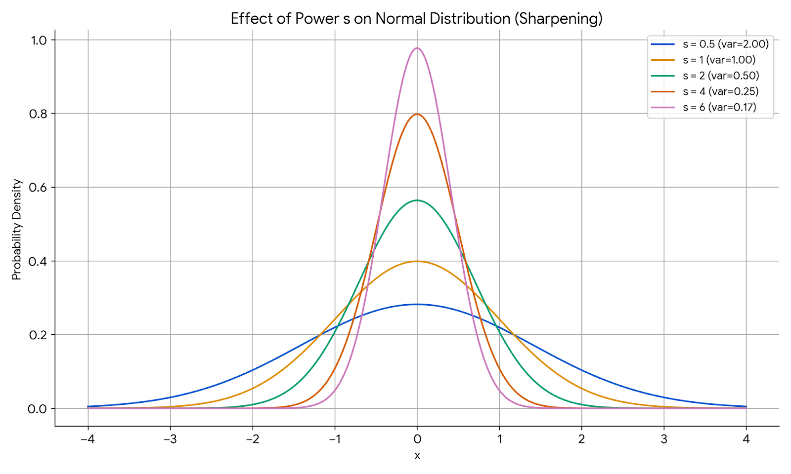

# Classifer guidance to Diffusion/Flow based methods

This file collects methods that use a **classifier** to steer generative diffusion (and later flow-based) models toward a desired output. The foundation is laid by **"Diffusion Models Beat GANs on Image Synthesis"** (Dhariwal & Nichol, OpenAI, NeurIPS 2021) — the paper that introduced *classifier guidance* and was the immediate predecessor of Classifier-Free Guidance.

---

## Diffusion Models Beat GANs on Image Synthesis (2021)

### Table of Contents

- [The One-Line Idea](#the-one-line-idea)
- [Setup and Notation](#setup-and-notation)
- [Background You Need: The "Score" View of Diffusion](#background-you-need-the-score-view-of-diffusion)
- [The Core Derivation](#the-core-derivation)
- [The Guidance Scale $s$](#the-guidance-scale-s)
- [Two Sampling Algorithms](#two-sampling-algorithms)
- [How the Classifier Was Trained](#how-the-classifier-was-trained)
- [Where Do Gradients Flow?](#where-do-gradients-flow)
- [Results & Takeaways](#results--takeaways)
- [Cheat-Sheet](#cheat-sheet)

---

## The One-Line Idea

Suppose you already have an **unconditional** diffusion model — it can denoise random noise into *some* plausible image, but you can't tell it *which* class to produce. Separately, suppose you have a **classifier** that, given an image, tells you how "cat-like" it is.

Classifier guidance is just this: at every denoising step, take the classifier's opinion ("push the pixels this way to look more like a cat") and **nudge the sample in that direction**. Concretely, the nudge is the *gradient of the classifier's log-probability with respect to the image*. Do this at every step and the unconditional model is steered into producing the class you asked for.

That is the whole idea. Everything below is (a) why that nudge is mathematically the *right* thing to add, and (b) the practical details — how the classifier is trained and where gradients actually flow.

---

## Setup and Notation

Before any equations, here is every symbol used in this note. Diffusion works by gradually adding noise to an image (the *forward* process) and training a network to remove it (the *reverse* process).

| Symbol | Meaning |
|---|---|
| $x_0$ | A **clean image** (a real training image, e.g. an actual photo of a cat). |
| $t$ | The **diffusion timestep**, $t = 0, 1, \dots, T$. $t=0$ is the clean image; larger $t$ means more noise added; $t=T$ is essentially pure noise. |
| $x_t$ | The **noisy image at step $t$** — the clean image $x_0$ with $t$ steps' worth of Gaussian noise mixed in. This is the variable the model works on. |
| $y$ | The **class label** we want to generate (e.g. "cat"). An integer class index, exactly like an ImageNet label. |
| $\epsilon$ | A **standard Gaussian noise** sample, $\epsilon \sim \mathcal{N}(0, I)$, same shape as the image. |
| $\bar\alpha_t$ | The **noise-schedule** term: a known, fixed number in $(0,1]$ that says how much of the clean image survives at step $t$. Close to $1$ for small $t$ (little noise), close to $0$ for large $t$ (almost all noise). |
| $\epsilon_\theta(x_t, t)$ | The **diffusion network** (the U-Net), with weights $\theta$. Given a noisy image $x_t$ and the step $t$, it predicts the noise that was added. This is the trained generative model. |
| $p_\phi(y \mid x_t)$ | The **classifier**, with weights $\phi$. Given a noisy image $x_t$, it outputs the probability that its class is $y$. |
| $p(x_t)$ | The (unconditional) **probability density** of noisy images at step $t$ — how likely a given $x_t$ is to occur, across all images. |
| $\mu, \Sigma$ | The **mean and covariance** of one reverse (denoising) step, both produced by the diffusion model. |

The precise forward-process relation, for reference, is $x_t = \sqrt{\bar\alpha_t}\, x_0 + \sqrt{1 - \bar\alpha_t}\, \epsilon$ — clean image scaled down, noise scaled up, with $\bar\alpha_t$ controlling the mix.

---

## Background You Need: The "Score" View of Diffusion

The one piece of machinery we need is the idea of a **score**. For a probability density $p(x_t)$ (defined in the [notation](#setup-and-notation) — how likely a noisy image $x_t$ is), the score is

$$
\text{score}(x_t) = \nabla_{x_t} \log p(x_t)
$$

That is: **the gradient of $\log p(x_t)$ taken with respect to the image $x_t$ itself** (not with respect to network weights). It is a vector with the same shape as the image, and each component says "how should this pixel change to make the image more probable / more realistic." So the score is a vector field that, at any point, **points toward higher-probability (more realistic) regions**. Sampling a diffusion model is essentially "follow the score uphill (plus a little noise) from pure noise to a clean image."

Here is the key link: a trained diffusion model's noise-predictor $\epsilon_\theta(x_t, t)$ *is* the score, up to a known scale factor:

$$
\nabla_{x_t} \log p(x_t) = -\frac{\epsilon_\theta(x_t, t)}{\sqrt{1 - \bar\alpha_t}}
$$

(This falls out of the forward relation $x_t = \sqrt{\bar\alpha_t}\,x_0 + \sqrt{1-\bar\alpha_t}\,\epsilon$: the network predicts the added noise $\epsilon$, and the noise direction is exactly the "downhill in probability" direction — hence the minus sign and the $\sqrt{1-\bar\alpha_t}$ scale.)

So "the diffusion model gives us the score" is not hand-waving — it is literally what the network outputs. Keep this in mind: **the diffusion model already hands us $\nabla_{x_t}\log p(x_t)$.** We now just need to bend it toward a class.

---

## The Core Derivation

We want to sample from the **class-conditional** distribution $p(x_t \mid y)$ — the density of noisy images $x_t$ *given that the class is $y$* (e.g. "images that are cats") — instead of the unconditional $p(x_t)$, which covers images of any class. Bayes' rule on the noisy marginal gives:

$$
p(x_t \mid y) \;\propto\; p(x_t)\, p(y \mid x_t)
$$

In words: the probability that a noisy image is *both* realistic *and* looks like class $y$ is the realistic-ness $p(x_t)$ times the classifier's confidence $p(y \mid x_t)$.

Now take $\nabla_{x_t}\log$ of both sides. The constant of proportionality has zero gradient and drops out, leaving the **score decomposition** — the heart of the paper:

$$
\underbrace{\nabla_{x_t} \log p(x_t \mid y)}_{\text{conditional score (what we want)}}
=
\underbrace{\nabla_{x_t} \log p(x_t)}_{\text{diffusion model}}
+
\underbrace{\nabla_{x_t} \log p(y \mid x_t)}_{\text{classifier}}
$$

Read this slowly, because it is the entire trick:

> **Conditional score = unconditional score + classifier gradient.**

The diffusion model supplies the first term (as we just saw). A separate classifier supplies the second term. Add them and you have the score of the *conditional* distribution — without ever training a conditional diffusion model.

### Why this shifts the sampling mean

The reverse denoising step is a Gaussian: $p(x_t \mid x_{t+1}) = \mathcal{N}(x_t;\, \mu, \Sigma)$, where $\mu$ and $\Sigma$ come from the diffusion model. Guiding means we instead want to draw from $p(x_t \mid x_{t+1}, y) \propto \mathcal{N}(x_t; \mu, \Sigma)\, p(y \mid x_t)$.

The classifier term $\log p(y \mid x_t)$ has no closed form, but it changes slowly compared to the sharp Gaussian, so we **Taylor-expand it to first order around the mean $\mu$**:

$$
\log p(y \mid x_t) \;\approx\; \log p(y \mid \mu) + (x_t - \mu)^\top g,
\qquad g = \nabla_{x_t} \log p(y \mid x_t)\big|_{x_t = \mu}
$$

Multiplying the Gaussian by $e^{(x_t - \mu)^\top g}$ (a log-linear factor) just **completes the square** — you get back a Gaussian with the *same* covariance but a *shifted* mean:

$$
\boxed{\; p(x_t \mid x_{t+1}, y) \;\approx\; \mathcal{N}\big(x_t;\; \mu + \Sigma\, g,\; \Sigma\big) \;}
$$

So guidance is beautifully simple in practice: **sample as usual, but shift the mean by $\Sigma\, g$** — the covariance-scaled classifier gradient. That is the concrete "nudge" from the one-line idea, now derived.

---

## The Guidance Scale $s$

With the shift $\mu + \Sigma g$ exactly as derived, guidance turns out to be *too weak* — samples only mildly resemble the target class. Dhariwal & Nichol found you must **scale the classifier gradient by a factor $s > 1$**:

$$
\text{shifted mean} = \mu + s\,\Sigma\, g
$$

What does $s$ mean? Scaling the gradient of $\log p(y\mid x_t)$ by $s$ is exactly raising the classifier distribution to a power:

$$
s \cdot \nabla_{x_t}\log p(y\mid x_t) = \nabla_{x_t}\log p(y\mid x_t)^{\,s}
$$

So you are effectively sampling from $p(x_t)\,p(y\mid x_t)^{s}$. Since $s>1$ **sharpens** the classifier distribution (see [Appendix: Distribution Sharpening](#appendix-distribution-sharpening-with-pxs) for why raising a distribution to a power $s>1$ sharpens it), it concentrates mass on the images the classifier is *most* confident about.

This gives the central trade-off:

- **Larger $s$** → higher fidelity, sharper class identity, better Inception Score and precision — but **lower diversity** (recall drops), because you keep collapsing toward the classifier's favourite modes.
- **Smaller $s$** → more diverse but less on-class.

This is the diffusion analogue of the **truncation trick** in GANs (trading variety for sample quality by staying near the distribution's high-density core). They report a scale around $s \approx 1$–$10$ depending on the setup, tuned to balance FID (which likes diversity) against IS (which likes fidelity).

---

## Two Sampling Algorithms

Both algorithms fall straight out of the same score decomposition; they differ only in *how* the reverse step is structured.

**1. Stochastic (DDPM ancestral) sampling.** The reverse step is genuinely random ($\mathcal{N}(\mu, \Sigma)$ with noise added), so we can literally shift its mean:

$$
x_{t-1} \sim \mathcal{N}\big(\mu + s\,\Sigma\, g,\; \Sigma\big),
\qquad g = \nabla_{x_t}\log p_\phi(y \mid x_t)
$$

Compute the classifier gradient at the current $x_t$, add $s\,\Sigma g$ to the model's predicted mean, sample, repeat.

**2. Deterministic (DDIM) sampling.** DDIM adds no noise, so there is no "mean of a Gaussian" to shift. Instead we inject guidance at the level of the **noise prediction** itself, using the score↔$\epsilon$ relationship in reverse. Define a *guided* noise estimate:

$$
\hat\epsilon(x_t) = \epsilon_\theta(x_t, t) - s\,\sqrt{1 - \bar\alpha_t}\;\nabla_{x_t}\log p_\phi(y \mid x_t)
$$

then run the ordinary DDIM update using $\hat\epsilon$ in place of $\epsilon_\theta$. The extra term is just the classifier score converted into "equivalent noise" via the same $\sqrt{1-\bar\alpha_t}$ factor from the [score view](#background-you-need-the-score-view-of-diffusion). Same idea, different bookkeeping.

---

## How the Classifier Was Trained

This is the crucial practical detail, and it is *not* "grab a pretrained ImageNet classifier."

**The classifier must be noise-aware.** During sampling, the model only ever sees **noisy intermediate images** $x_t$ — mostly-noise early on, gradually cleaner later. A standard classifier trained on clean photos would be useless on a snowstorm of noise. So they train a dedicated classifier

$$
p_\phi(y \mid x_t, t)
$$

directly on **noised images** produced by the same forward diffusion process, across *all* timesteps $t$, conditioned on $t$ so it knows how much noise to expect. This way, when sampling asks "how cat-like is this half-noised blob at step $t$?", the classifier can actually answer.

**Architecture.** They reused the **downsampling half (the encoder) of the U-Net** — the same backbone as the diffusion model — and added an **attention-pooling head at the 8×8 resolution** to produce class logits. It is conditioned on the timestep $t$ just like the diffusion model.

**Separately trained.** The classifier is trained on ImageNet with the same noise schedule, but as a **completely independent training run** from the diffusion model. Neither one's training sees the other. (This independence is exactly what the next section is about.)

---

## Where Do Gradients Flow?

This is the question that trips people up, so here it is directly.

**At sampling time**, the only gradient computed is

$$
\nabla_{x_t} \log p_\phi(y \mid x_t)
$$

— the gradient of the **classifier's** log-probability, taken **with respect to the input image $x_t$**. Backpropagation runs **through the classifier network only**, from its output logit for class $y$ back to its pixel input. The result is a same-shape-as-the-image gradient telling you which pixels to change to raise the classifier's confidence.

**No gradient flows through the diffusion U-Net.** The diffusion model $\epsilon_\theta$ is called **forward only** — you evaluate it to get $\mu$ (or $\epsilon$), and that is it. It is frozen and never differentiated during guided sampling. The two networks are **never differentiated jointly**; the classifier gradient and the diffusion output are simply *added* (in score space), not chained through one another.

**At training time**, there is likewise **no gradient coupling**. The diffusion model is trained normally to predict noise; the classifier is trained separately to classify noisy images. There is **no joint / end-to-end training**, no backprop from one into the other. Guidance is purely a **sampling-time (inference-time) modification** — you can bolt any compatible noise-aware classifier onto an already-trained diffusion model after the fact.

So to answer the natural question "do gradients go back through the diffusion process?": **no.** Gradients go through the classifier, with respect to the image, at each sampling step — nowhere else.

---

## Results & Takeaways

- **It works, decisively.** Combined with their improved architecture, classifier guidance let diffusion models **beat BigGAN-deep on ImageNet FID** (e.g. 128×128, 256×256, 512×512) — the headline result that made "diffusion beats GANs" a credible claim.
- **Guidance stacks on top of conditioning.** Even for a *class-conditional* diffusion model (which already takes $y$ as input), adding classifier guidance on top further improves sample quality. Guidance and conditioning are complementary.
- **Architecture note (context only).** The other half of the paper is the improved "ADM" U-Net: adaptive group norm (**AdaGN**) that injects the timestep and class embeddings into each residual block, **attention at multiple resolutions** (32×32, 16×16, 8×8) rather than one, **BigGAN-style residual blocks** for up/downsampling, and more width/depth. These gains are architectural and largely orthogonal to the guidance idea, so we don't dwell on them here.

The lasting conceptual gift of this paper is the **score decomposition** — "conditional score = unconditional score + classifier gradient." That single equation is the seed from which Classifier-Free Guidance grows by replacing the explicit classifier with an implicit one — see the companion note `classifier-free-guidance.md`.

---

## Cheat-Sheet

| Quantity | Formula | Who provides it |
|---|---|---|
| Unconditional score | $\nabla_{x_t}\log p(x_t) = -\epsilon_\theta / \sqrt{1-\bar\alpha_t}$ | Diffusion model (forward pass) |
| Class gradient | $\nabla_{x_t}\log p_\phi(y\mid x_t)$ | Classifier (backprop w.r.t. image) |
| Conditional score | unconditional score $+$ class gradient | The two, **added** |
| Guided mean (DDPM) | $\mu + s\,\Sigma\,\nabla_{x_t}\log p_\phi(y\mid x_t)$ | Sampling-time shift |
| Guided noise (DDIM) | $\hat\epsilon = \epsilon_\theta - s\sqrt{1-\bar\alpha_t}\,\nabla_{x_t}\log p_\phi(y\mid x_t)$ | Sampling-time shift |
| Guidance scale $s$ | samples from $p(x_t)\,p(y\mid x_t)^{s}$ | Fidelity ↑, diversity ↓ as $s$ grows |
| Classifier input | noisy image $x_t$ + timestep $t$ | Trained on noised images |
| Gradient target | the image $x_t$ (through classifier only) | — |
| Trained jointly? | **No** — separate training, no gradient coupling | — |
| Diffusion U-Net differentiated at sampling? | **No** — forward pass only, frozen | — |

---

## The Broader Landscape: The Same Trick Across Modalities

Once you have the [score decomposition](#the-core-derivation) — *conditional score = unconditional score + a guide's gradient* — a whole family of papers falls out by varying two things:

1. **What plays the role of the classifier?** A trained class classifier, a CLIP text-image judge, an attribute classifier, an object detector — anything that outputs a differentiable score for "how well does this image match what I want."
2. **How do you cope with the fact that the guide has to look at a noisy $x_t$?** The original paper's answer was "retrain the classifier on noisy images." Much of the follow-up work is about avoiding that.

The papers below are ordered from *most similar* to the paper above to *most different*, and their length reflects that.

### Diffusion Models Beat GANs on Image Synthesis (NeurIPS 2021)

The subject of this whole note — listed here only for completeness. External classifier trained on noisy images; its gradient is injected during reverse sampling to steer toward a class. Everything below is a variation on it.

### Guided-TTS (ICML 2022) — the closest cousin, different modality

Almost the identical recipe, just in **audio**. An unconditional diffusion model is trained on mel-spectrograms of *untranscribed* speech, and a **separately trained phoneme classifier** supplies the guidance gradient at inference — turning the unconditional speech generator into a text-to-speech system. The payoff is that the generator never needs aligned transcripts to train; the text conditioning enters entirely through the classifier at sampling time. Same "train the guide separately, add its gradient during sampling" structure as the main paper; the only real news is that it works for speech.

### Diffusion-LM (NeurIPS 2022) — guidance in text-embedding space

Text is discrete, which breaks the "nudge the pixels" picture. Diffusion-LM runs the diffusion process in a **continuous word-embedding space** and adds a rounding step to map the final embeddings back to tokens. Controllable generation (sentiment, syntax, sentence length) then comes from ordinary classifier guidance on the continuous latent: a small classifier scores the latent for the desired attribute, and its gradient nudges each denoising step — **with no retraining of the base model**. Mechanically it is the same trick as image classifier guidance; the novelty is porting it to language and bridging the discrete–continuous gap.

### Blended Diffusion (CVPR 2022) — CLIP as an off-the-shelf judge, for local editing

Two shifts from the original. First, the "classifier" is a pre-trained **CLIP** model used zero-shot: instead of a fixed class label $y$, the guide is the CLIP similarity between the image and a **free-form text prompt**, so the gradient pushes the image to match the text. Second, it edits only inside a **user-provided mask** and *blends* the guided (edited) region with the untouched background at every denoising step, giving seamless local edits.

It also had to solve a problem that recurs everywhere: CLIP was trained on **clean** images, so scoring it on a noisy $x_t$ is unreliable. Their fix is to evaluate CLIP not on $x_t$ but on the model's **predicted clean image** $\hat{x}_0$ — the diffusion model's current best guess of the final image, obtainable at any step from $x_t$ and the predicted noise:

$$
\hat{x}_0 = \frac{x_t - \sqrt{1 - \bar\alpha_t}\;\epsilon_\theta(x_t, t)}{\sqrt{\bar\alpha_t}}
$$

(This is just the [forward relation](#setup-and-notation) solved for $x_0$.) That "evaluate the guide on $\hat{x}_0$ instead of $x_t$" idea is exactly what the next paper turns into a general principle. *(For the mechanics of the CLIP guidance and the seamless local editing, see the [deep dive](#deep-dive-guiding-with-off-the-shelf-clean-image-models-blended-diffusion--universal-guidance) below.)*

### Universal Guidance (CVPR 2023) — reuse *any* off-the-shelf model, no noisy retraining

The most different of the five, because it removes the biggest practical pain point of the original recipe: needing a special **noise-aware** classifier. Their key move generalizes the Blended trick — at each step, form the predicted clean image $\hat{x}_0$ from the current $x_t$, then evaluate a **standard, off-the-shelf** model on $\hat{x}_0$: an ordinary ImageNet classifier, an object detector, a segmentation network, a face-recognition model — all trained only on clean images — and backpropagate that guidance gradient through to $x_t$. Because the guide only ever sees a clean-*looking* image, any pretrained model works unchanged, with no retraining on noisy data.

On top of this "forward guidance," they add two refinements: a **backward guidance** step (a small optimization that more directly enforces the constraint the guide encodes) and a **self-recurrence** loop (re-noise and re-denoise a step a few times) to keep image quality high under strong guidance. The net effect is to turn classifier guidance from *"train a bespoke noisy classifier per task"* into *"plug in whatever pretrained model you already have."* *(Expanded in the [deep dive](#deep-dive-guiding-with-off-the-shelf-clean-image-models-blended-diffusion--universal-guidance) below.)*

### Comparison at a Glance

| Paper | What plays the "classifier" | Modality | How it handles the noisy-$x_t$ problem |
|---|---|---|---|
| Beat GANs (NeurIPS'21) | Class classifier | Images | Retrain classifier on noisy images |
| Guided-TTS (ICML'22) | Phoneme classifier | Speech (mel) | Retrain classifier on noisy audio |
| Diffusion-LM (NeurIPS'22) | Attribute classifier | Text (embeddings) | Classifier trained on noisy latents |
| Blended Diffusion (CVPR'22) | Pre-trained CLIP (text prompt) | Images (masked edit) | Evaluate guide on predicted clean $\hat{x}_0$ |
| Universal Guidance (CVPR'23) | Any off-the-shelf model | Images | Evaluate guide on $\hat{x}_0$ (+ backward guidance, self-recurrence) |

---

## Deep Dive: Guiding with Off-the-Shelf, Clean-Image Models (Blended Diffusion & Universal Guidance)

Two of the survey papers deserve a closer look, because they share one elegant idea that dissolves the single biggest annoyance of the original recipe.

Recall the pain point from the [main paper](#how-the-classifier-was-trained): the classifier had to be **retrained on noisy images**, because during sampling it only ever sees a noisy $x_t$, and a normal clean-image classifier is useless on noise. That is a real tax — every new guidance signal means training a new noise-aware model.

**The shared insight:** at any step you can ask the frozen diffusion model for its **predicted clean image** $\hat{x}_0$ — its best current guess of the final, denoised result — computed from $x_t$ and the predicted noise (from the [notation](#setup-and-notation), the forward relation solved for $x_0$):

$$
\hat{x}_0 = \frac{x_t - \sqrt{1 - \bar\alpha_t}\;\epsilon_\theta(x_t, t)}{\sqrt{\bar\alpha_t}}
$$

$\hat{x}_0$ *looks like a clean image* (blurry early on, sharp later), so you can hand it to any **off-the-shelf model trained on clean data** and get a sensible answer. Guide on $\hat{x}_0$ instead of $x_t$ and the noisy-retraining problem simply disappears. **Blended Diffusion** is the specific, beautiful case of this idea (CLIP + local editing); **Universal Guidance** is its full generalization (any model, plus two refinements).

### Blended Diffusion (CVPR 2022)

**Task.** You give three things: an image, a binary **mask** $m$ marking a region of interest (ROI), and a **text prompt** $d$. The goal is to edit *only* inside the mask so the region matches the text — "put a party hat here" — while leaving the rest of the image untouched and making the result look seamless, not pasted. Both networks are **frozen**: a pretrained unconditional diffusion model and pretrained **CLIP**. Nothing is trained; the whole method is zero-shot.

**CLIP as the guide (a judge, not a fixed label).** In the [core recipe](#the-core-derivation) the guide was a classifier for a fixed class $y$. Here the guide is **CLIP**, which embeds an image and a text into a shared space and scores their similarity. The guidance signal is the gradient of a CLIP loss

$$
\mathcal{L}_{\text{CLIP}} = -\,\mathrm{sim}\big(\text{CLIP}_{\text{img}}(\cdot),\; \text{CLIP}_{\text{txt}}(d)\big)
$$

that pushes the image to be *more similar to the prompt $d$*. Because $d$ is free-form text, you are no longer limited to a fixed label set — any description works. This is what "CLIP as an off-the-shelf judge" means.

**Mechanism 1 — how CLIP (a clean-image model) works inside a noisy loop.** Two pieces:

1. **Evaluate CLIP on $\hat{x}_0$, not $x_t$.** CLIP was trained on clean natural images; feeding it a noisy $x_t$ gives unreliable, off-distribution scores. So at each step they run CLIP on the predicted clean image $\hat{x}_0$ instead. Now CLIP always sees something clean-looking, exactly the distribution it understands.
2. **Extending augmentations (to avoid adversarial gradients).** A subtle trap: if you differentiate CLIP through a *single* view of $\hat{x}_0$, the gradient tends to produce an **adversarial** result — imperceptible high-frequency pixel noise that spikes the CLIP score without actually looking like the prompt. Their fix is to apply a set of **random augmentations** (crops, projective transforms) to $\hat{x}_0$, score CLIP on each, and **average the loss over them**. An adversarial perturbation tuned for one view falls apart under a different crop, so only a *genuinely semantic* change survives all views. Averaging over augmentations is what turns the CLIP gradient from "adversarial noise" into "make this region actually look like the text."

**Mechanism 2 — how local editing stays seamless (blending).** The naive approach — generate a new region and paste it into the mask at the end — leaves visible seams and ignores context. Blended Diffusion instead **blends at every denoising step, in the noisy latent space.** At step $t$ it maintains two versions of the latent:

- $x_t^{\text{fg}}$ — the **foreground**: the CLIP-guided denoising result (the edit in progress).
- $x_t^{\text{bg}}$ — the **background**: the *original input image* pushed forward through the diffusion noising process to the *same* noise level $t$.

It then combines them with the mask:

$$
x_t \;\leftarrow\; m \odot x_t^{\text{fg}} \;+\; (1 - m)\odot x_t^{\text{bg}}
$$

($\odot$ is elementwise multiply.) So inside the mask you keep the guided edit; outside the mask you keep a correctly-noised copy of the original. The key is that this happens **at every step, on noisy latents** — not as a final paste. Because the blended latent is fed back through the next denoising step, the network **re-harmonizes the boundary**: it denoises the edited region and the original background *together*, so lighting, texture, and edges match across the mask edge. The result is a coherent local edit with no seam, and — since sampling is stochastic — you can draw several different plausible edits for the same prompt.

**Why it mattered.** It was the first method to do **text-driven, region-based editing of arbitrary natural images**, entirely zero-shot from two frozen pretrained models.

### Universal Guidance (CVPR 2023)

Universal Guidance takes Blended's "evaluate the guide on $\hat{x}_0$" trick and turns it into a **general framework**: control *any* frozen pretrained diffusion model (they use **Stable Diffusion**) with *any* off-the-shelf guidance model, with no retraining of either.

**Forward guidance (the generalized Blended trick).** Exactly the shared insight above, but the guide can be *anything* that reads a clean image: an ordinary ImageNet **classifier**, an **object detector**, a **segmentation** network, a **face-recognition** model, or CLIP. Form $\hat{x}_0$, evaluate the chosen model on it, backprop that loss to $x_t$, and steer. One recipe, a whole zoo of controls — because every one of those models was trained on clean images and $\hat{x}_0$ is clean-looking.

**Backward guidance (for precise, pixel-aligned constraints).** A single forward gradient is a weak nudge — fine for "make it more cat-like," but too soft for a hard spatial constraint like "match *this* segmentation map" or "put the box *here*." So they add a **backward** step: solve a small **optimization** to find a correction $\Delta$ such that the predicted clean image $\hat{x}_0 + \Delta$ actually (nearly) satisfies the guidance constraint, then steer the sample using that $\Delta$. This enforces the constraint far more directly than one gradient step, and the paper shows the hybrid **forward + backward** scheme clearly beats forward-only on fine, pixel-aligned tasks (segmentation, box placement, complex inpainting).

**Self-recurrence (to protect image quality).** Strong guidance can drag the sample off the diffusion model's natural manifold, hurting realism. Their fix is a **self-recurrence** ("time-travel") loop: at a given step, **re-noise** the partially denoised sample back up a level and **denoise it again**, repeating a few times. This lets the guided content and the model's own image statistics settle into agreement, keeping quality high under aggressive guidance.

**Why it mattered.** It reframed classifier guidance from *"train a bespoke noise-aware classifier per task"* into *"plug in whatever pretrained model you already have"* — segmentation, detection, face ID, CLIP — on top of an off-the-shelf diffusion model.

### Why This Family Matters

Both papers attack the same structural weakness of the original recipe — the need for a **noise-aware** guide — and solve it the same way: **guide on the predicted clean image $\hat{x}_0$**, so any clean-trained model qualifies. Blended adds the two ideas that make it actually work in practice (augmentations to kill adversarial gradients; per-step blending for seamless locality), and Universal Guidance generalizes the guide to anything and adds backward guidance + self-recurrence for precision and quality. Together they mark the shift from *train-a-classifier-on-noise* to *reuse-any-pretrained-model-off-the-shelf* — the practical form of guidance most systems use today.

### Sources

- Blended Diffusion: [Avrahami, Lischinski, Fried — *Blended Diffusion for Text-Driven Editing of Natural Images* (CVPR 2022)](https://openaccess.thecvf.com/content/CVPR2022/html/Avrahami_Blended_Diffusion_for_Text-Driven_Editing_of_Natural_Images_CVPR_2022_paper.html); code: [`omriav/blended-diffusion`](https://github.com/omriav/blended-diffusion).
- Universal Guidance: [Bansal et al. — *Universal Guidance for Diffusion Models* (CVPR 2023 Workshops), arXiv:2302.07121](https://arxiv.org/abs/2302.07121).

---

## Guidance for Flow-Based Models

This note's title says "Diffusion/**Flow** based methods" for a reason: the whole guidance story carries over to flow-based generative models essentially unchanged. In fact flow-matching models are now the *more common* backbone for large text-to-image and video systems, so this is where guidance mostly lives today.

**First, which "flow" we mean.** *Classic normalizing flows* (RealNVP, Glow — invertible nets with exact likelihood) are a separate world where guidance is rare. The relevant models here are **flow matching / rectified flow** (Lipman et al. 2023; Liu et al.) — the modern ODE-based generators that are close cousins of diffusion.

**Why guidance transfers for free.** Diffusion and flow matching are two views of the same transport from noise to data. A diffusion model learns the [score](#background-you-need-the-score-view-of-diffusion) $\nabla_{x_t}\log p(x_t)$; a flow-matching model learns a **velocity field** $v_\theta(x_t, t)$ — the arrow that the probability-flow ODE follows at each point and time. For the usual Gaussian noising paths, the two are **linearly related**:

$$
v_\theta(x_t, t) = a_t\, x_t + b_t \, \nabla_{x_t}\log p(x_t)
$$

where $a_t, b_t$ are known scalar functions of the noise schedule (not learned). Because velocity is just a linear function of the score, the [score decomposition](#the-core-derivation) at the heart of this note — *conditional score = unconditional score + guide gradient* — drops straight into a **velocity correction**:

$$
\underbrace{v_\theta(x_t, t \mid y)}_{\text{guided velocity}}
= \underbrace{v_\theta(x_t, t)}_{\text{unconditional velocity}}
+ \; b_t \, \nabla_{x_t}\log p_\phi(y \mid x_t)
$$

Same idea, same classifier gradient — you just add $b_t$ times it to the velocity field instead of shifting a Gaussian mean. Guidance is really a property of the underlying probability path, not of diffusion specifically.

**What has actually been done.**

- **Classifier-free guidance on flows** is now standard and at production scale: **Stable Diffusion 3** and **Flux** are rectified-flow models that use CFG. *Guided Flows* (Zheng et al., 2023) was an early paper explicitly porting CFG to flow matching.
- **Classifier / training-free guidance on flows**: **TFG-Flow** brings training-free guidance to generative flows, and the off-the-shelf-model recipe from the [deep dive](#deep-dive-guiding-with-off-the-shelf-clean-image-models-blended-diffusion--universal-guidance) applies directly — the predicted clean image $\hat{x}_0$ is just as recoverable from the flow ODE, so any clean-trained guide works the same way.
- **Flow-specific refinements**: guidance can push rectified-flow samples off-manifold (over-saturation, structural distortion), so methods like **CFG-Zero\*** and **Rectified-CFG++** adjust the guidance schedule to keep samples faithful.

**Takeaway.** Classifier guidance was born in diffusion, but it moved with the field to flow matching, where the same score-space nudge becomes a velocity-field nudge. Nothing conceptual changes.

### Sources

- [Lipman et al. — *Flow Matching for Generative Modeling* (ICLR 2023), arXiv:2210.02747](https://arxiv.org/abs/2210.02747)
- [Zheng et al. — *Guided Flows for Generative Modeling and Decision Making*, arXiv:2311.13443](https://arxiv.org/abs/2311.13443)
- [TFG-Flow — *Training-free Guidance in Multimodal Generative Flow*, arXiv:2501.14216](https://arxiv.org/abs/2501.14216)
- [CFG-Zero\* — *Improved Classifier-Free Guidance for Flow Matching Models*, arXiv:2503.18886](https://arxiv.org/abs/2503.18886)

---

## Appendix: Distribution Sharpening with $p(x)^s$

This appendix explains the mathematical effect of raising a probability distribution $p(x)$ to a power $s$ (with $s > 0$) — the operation behind the [guidance scale](#the-guidance-scale-s), where using scale $s$ makes us sample from $p(x_t)\,p(y\mid x_t)^{s}$. The same operation is called **temperature scaling** or **annealing** in machine learning and statistical physics.

One thing to keep in mind throughout: $p(x)^s$ is **not itself a valid distribution** — its values no longer sum (or integrate) to $1$. We always implicitly **renormalize** afterwards. Sharpening is about how renormalization redistributes mass once the powers have stretched the values apart.

### 1. The Intuition: Punishing Small Probabilities

When $s > 1$ you amplify the *differences* between probabilities. Because probability values lie in $[0, 1]$, raising them to a power $s > 1$ shrinks them all — but shrinks the *smaller* ones much faster than the larger ones. After renormalizing, the already-confident outcomes take an even bigger share.

**Discrete example ($s = 2$).** Start with $p(x) = [0.6,\, 0.3,\, 0.1]$.

1. **Raise to the power** ($p(x)^2$):
   - $0.6^2 = 0.36$
   - $0.3^2 = 0.09$
   - $0.1^2 = 0.01$
2. **Renormalize** (divide by the new sum $0.36 + 0.09 + 0.01 = 0.46$):
   - $0.36 / 0.46 \approx 0.78$
   - $0.09 / 0.46 \approx 0.20$
   - $0.01 / 0.46 \approx 0.02$

The confident outcome ($0.6 \to 0.78$) becomes even more dominant while the uncertain one ($0.1 \to 0.02$) is suppressed. That is **sharpening**. (For $s < 1$ the opposite happens — the distribution flattens toward uniform.)

### 2. Worked Case: The Normal Distribution

If $p(x)$ is a Normal distribution $\mathcal{N}(m, v)$ with mean $m$ and variance $v$:

$$
p(x) = \frac{1}{\sqrt{2\pi v}} \exp\left(-\frac{(x-m)^2}{2v}\right)
$$

Raising to the power $s$:

$$
p(x)^s = \left(\frac{1}{\sqrt{2\pi v}}\right)^{s} \exp\left(-\frac{s\,(x-m)^2}{2v}\right)
$$

The prefactor is just a constant (it disappears under renormalization), so look at the exponential. Rearranging the denominator:

$$
\exp\left(-\frac{(x-m)^2}{2\,(v/s)}\right)
$$

This is the *kernel* of a new Normal distribution, and after renormalization it is exactly:

$$
\boxed{\; p(x)^s \;\propto\; \mathcal{N}\!\left(m,\; \frac{v}{s}\right) \;}
$$

- **Same mean** $m$.
- **New variance** $v_\text{new} = v / s$.

{width=50%}

**Interpretation.**
- **$s > 1$:** variance shrinks ($v_\text{new} < v$) → the bell curve gets narrower and taller (**sharper**).
- **$s < 1$:** variance grows ($v_\text{new} > v$) → the bell curve gets wider and flatter (**smoother**).

### 3. Where This Shows Up

**Temperature scaling ($T = 1/s$).** In neural networks — LLM sampling especially — sharpening is usually written with a temperature $T$ in the softmax:

$$
q_i = \frac{\exp(z_i / T)}{\sum_j \exp(z_j / T)}
$$

This is the same operation: if $p_i \propto \exp(z_i)$, then $p_i^{\,s} \propto \exp(s\,z_i) = \exp(z_i / T)$ with $T = 1/s$. So:

- $T \to 0$ (i.e. $s \to \infty$): the distribution collapses to a **one-hot** vector — pure greedy $\arg\max$.
- $T \to \infty$ (i.e. $s \to 0$): the distribution becomes **uniform** — maximum entropy, maximum randomness.

**Bayesian inference.** Posteriors are sometimes *tempered* by raising the likelihood to a power, emphasizing the data's signal against a weak or misspecified prior (so-called power posteriors).

**Back to guidance.** This is precisely why the [guidance scale $s$](#the-guidance-scale-s) trades diversity for fidelity: sampling from $p(y\mid x_t)^s$ with $s>1$ sharpens the classifier's distribution onto the images it is most confident belong to class $y$ — the diffusion analogue of turning the temperature down.
