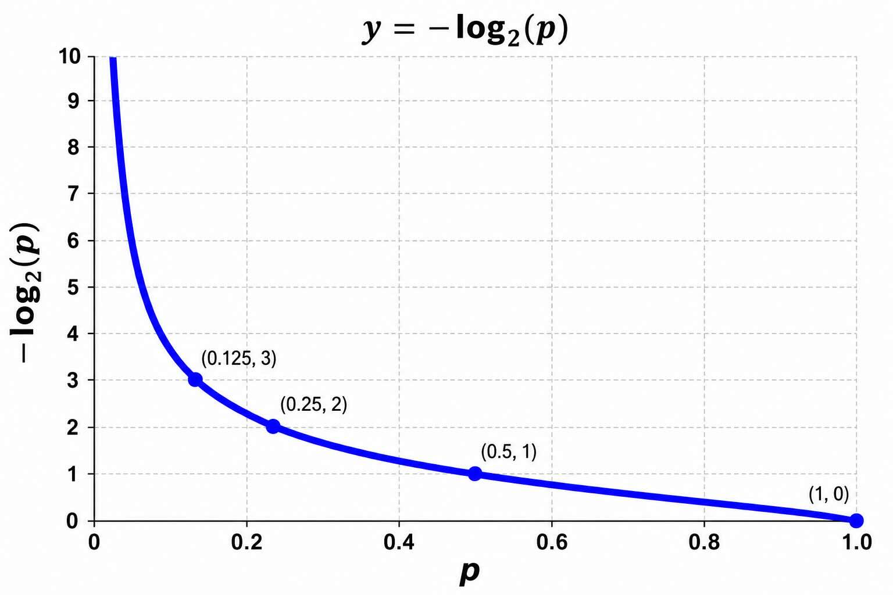

# Cross-Entropy, Label Smoothing, and KL Divergence

### The Intuition of Cross-Entropy Loss

To understand Cross-Entropy (CE) Loss, it helps to start with a concept from information theory: **Entropy**, which is essentially a measure of "surprise" or uncertainty.

- If an event is guaranteed to happen, its surprise is zero.
- If an event is highly unlikely but happens anyway, your surprise is massive.

Mathematically, we measure the surprise of an event with a probability $p$ as:

$$\text{Surprise} = -\log(p)$$

**Entropy** $H(P)$ is the average surprise you experience if you know the true distribution $P$.

**Cross-Entropy** $H(P,Q)$ is the average surprise you experience if you predict the world using distribution $Q$, but the world actually behaves according to the true distribution $P$.

The formula for Cross-Entropy is:

$$H(P,Q) = -\sum_i P(i) \log Q(i)$$

Where:
- $P(i)$ is the true probability of class $i$ (Ground Truth)
- $Q(i)$ is the predicted probability of class $i$ from your network (usually the output of a Softmax layer)

{ width=50% }

### Why is it used for Classification? (The One-Hot Case)

In standard classification, your Ground Truth (GT) is a one-hot encoded vector. Let's say you are classifying images into 3 categories: [Dog, Cat, Bird]. If the image is a Cat, your true distribution is:

$$P = [0, 1, 0]$$

If we plug this into the Cross-Entropy formula, look at how beautifully it simplifies. Because $P(i) = 0$ for Dog and Bird, those terms completely vanish:

$$H(P,Q) = -\big(0 \cdot \log Q(\text{Dog}) + 1 \cdot \log Q(\text{Cat}) + 0 \cdot \log Q(\text{Bird})\big)$$

$$H(P,Q) = -\log Q(\text{Cat})$$

For a single one-hot vector, Cross-Entropy loss is just the negative log-likelihood of the correct class.

**Why neural networks love this:**

1. **Heavy Penalty for Confidence Errors**: If your network outputs a high probability for Cat (e.g., 0.99), $-\log(0.99) \approx 0.01$ (nearly zero loss). If it outputs a low probability (e.g., 0.01), $-\log(0.01) \approx 4.6$ (high loss). If it outputs 0, the loss shoots to infinity.

2. **No Vanishing Gradients (with Softmax)**: When you pair Cross-Entropy with a Softmax activation function, the math works out so that the gradient of the loss with respect to the network's unnormalized outputs (logits) is simply:

$$\frac{\partial L}{\partial z_i} = Q(i) - P(i)$$

This is just the literal difference between your prediction and the truth. It's linear, intuitive, and keeps training moving fast.

### Label Smoothing: Shifting Away from 100% Certainty

You asked if people train networks where the GT gets a high probability (like 90%) and the rest is split among other categories. **Yes, they absolutely do.** This technique is called **Label Smoothing**, and it is widely used to train state-of-the-art models (like Vision Transformers and deep ResNets).

**Why do we do this?**

When you use a hard one-hot target (1 for the correct class, 0 for others), you are telling the network to be infinitely confident. To get a Softmax output of exactly 1.0, the logit for the correct class has to be infinitely larger than all other logits.

This forces the network to drive its weights to extremes, leading to two major problems:

- **Overfitting**: The network memorizes the training data quirks to maximize its confidence.
- **Overconfidence**: The network will output 99.9% confidence even when it's making a wrong prediction on new data. It becomes a poor judge of its own uncertainty.

**How the Math Changes:**

If we have $K$ classes and a smoothing factor $\alpha$ (say, $\alpha = 0.1$), we modify the target distribution $P(i)$ like this:

$$P_{\text{smoothed}}(i) = (1-\alpha)P(i) + \frac{\alpha}{K}$$

For our [Dog, Cat, Bird] example ($K=3$) with $\alpha=0.1$:

- The correct class (Cat) gets: $(1-0.1) \cdot 1 + \frac{0.1}{3} = 0.9 + 0.0333 = 0.9333$
- The incorrect classes get: $(1-0.1) \cdot 0 + \frac{0.1}{3} = 0.0333$

Now, your target distribution is $P = [0.0333, 0.9333, 0.0333]$.

When you compute Cross-Entropy with these soft targets, the terms for the incorrect classes no longer vanish. The network is explicitly penalized if it drives the probabilities of the incorrect classes all the way to absolute zero. This acts as an excellent regularizer, making the model more robust and adaptable.

### Cross-Entropy vs. KL Divergence

**KL (Kullback-Leibler) Divergence** measures how much information is lost when we use a predicted distribution $Q$ instead of the true distribution $P$. You can think of it as the "distance" between two distributions (though mathematically it's not a true distance because it's asymmetric).

The formula for KL Divergence is:

$$D_{\text{KL}}(P \| Q) = \sum_i P(i) \log \frac{P(i)}{Q(i)}$$

Using log rules ($\log \frac{A}{B} = \log A - \log B$), we can split this apart:

$$D_{\text{KL}}(P \| Q) = \sum_i P(i) \log P(i) - \sum_i P(i) \log Q(i)$$

If you look closely at those two terms, you will recognize our definitions from earlier:

- The first term is the negative Entropy of the true distribution: $-H(P)$
- The second term is the Cross-Entropy: $H(P,Q)$

So, we can rewrite the relationship as:

$$D_{\text{KL}}(P \| Q) = H(P,Q) - H(P)$$

Which means:

$$H(P,Q) = H(P) + D_{\text{KL}}(P \| Q)$$

**In plain English**: The total surprise of using your model ($H(P,Q)$) is equal to the inherent randomness of the real world ($H(P)$) plus the extra penalty you pay for your model being imperfect ($D_{\text{KL}}(P \| Q)$).

**How do they compare when training a network?**

When you are training a standard classification network, your Ground Truth distribution $P$ is completely fixed (whether it's a hard one-hot vector or a fixed smoothed label). Because $P$ never changes during training, the entropy of the true distribution $H(P)$ is a constant.

When you take the derivative of your loss function to update the network weights ($\theta$):

$$\frac{\partial}{\partial \theta} H(P,Q) = \frac{\partial}{\partial \theta} \Big[\underbrace{H(P)}_{\text{Constant} \to 0} + D_{\text{KL}}(P \| Q)\Big]$$

$$\frac{\partial}{\partial \theta} H(P,Q) = \frac{\partial}{\partial \theta} D_{\text{KL}}(P \| Q)$$

Because the constant drops out, **minimizing Cross-Entropy is mathematically identical to minimizing KL Divergence**.

**When do people choose one over the other?**

- **Use Cross-Entropy** when your target distribution $P$ is static (like traditional classification). It requires fewer computations because you don't have to calculate the $\log P(i)$ term.

- **Use KL Divergence** when your target distribution $P$ is dynamic and changing during training. For example, in Knowledge Distillation (where a student network learns from a moving teacher network) or in Variational Autoencoders (VAEs) (where you force a latent distribution to match a changing target Gaussian distribution). In those scenarios, $H(P)$ is not a constant, so you must use the full KL Divergence formula.

---

## No Vanishing Gradients (Softmax + Cross-Entropy Derivation)

For detailed mathematical derivation of why Softmax + Cross-Entropy avoids vanishing gradients, and analysis of alternative approaches like direct MSE on logits, refer to `absmax-mse-vs-softmax-ce.md`.
