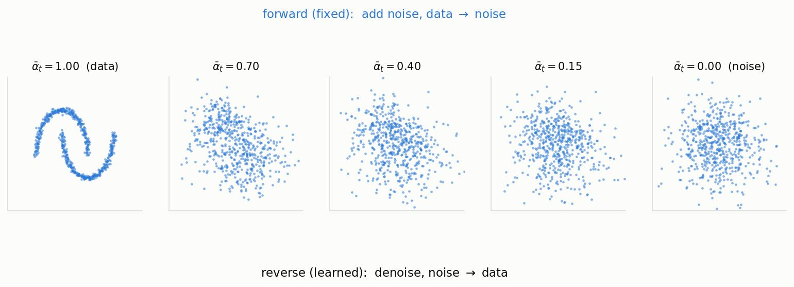
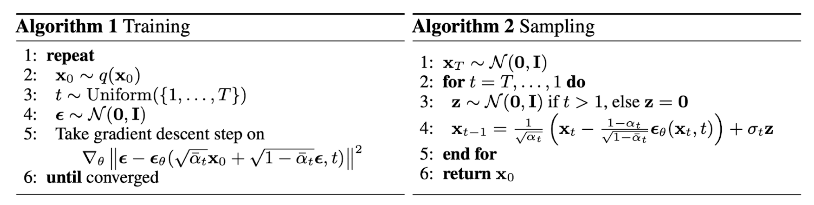
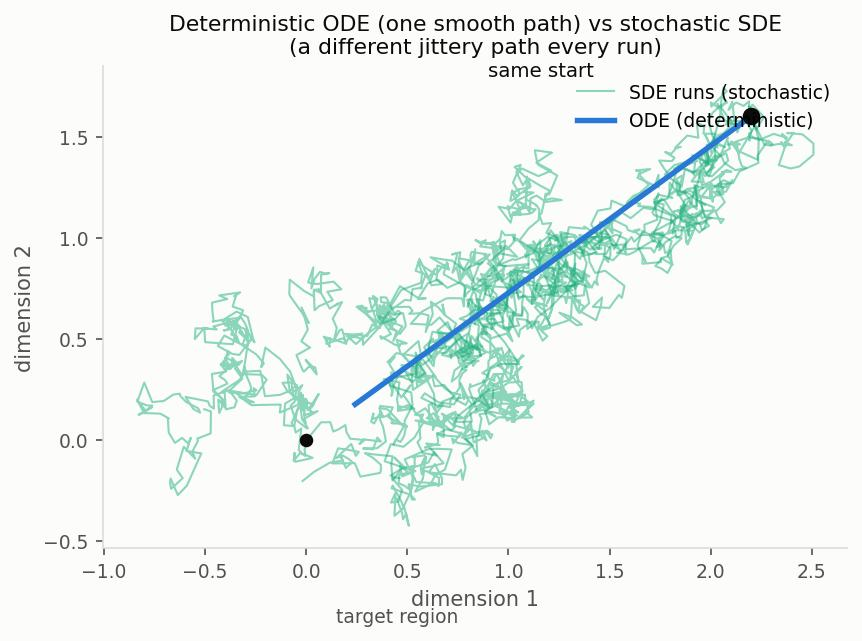
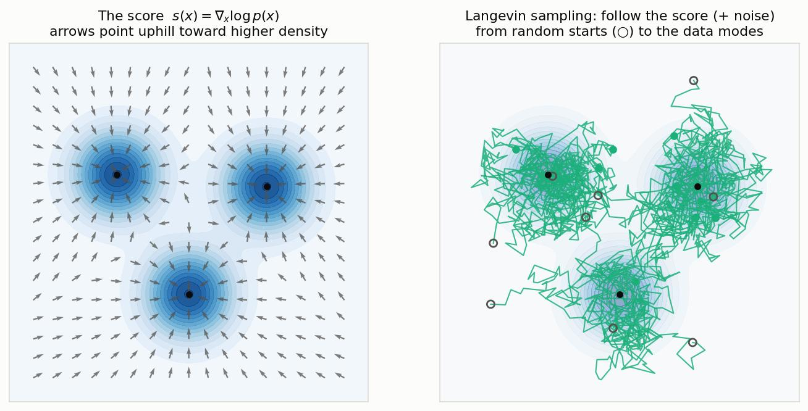
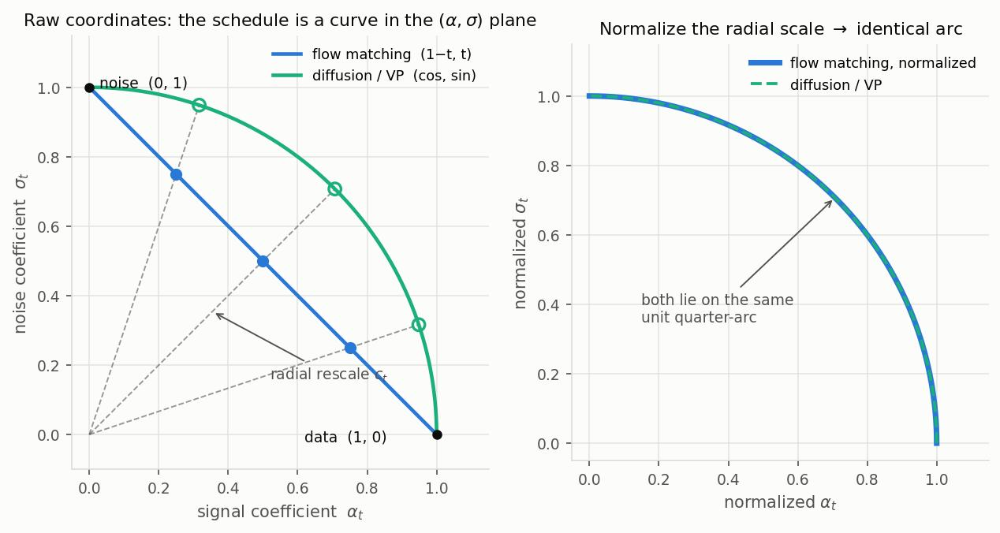
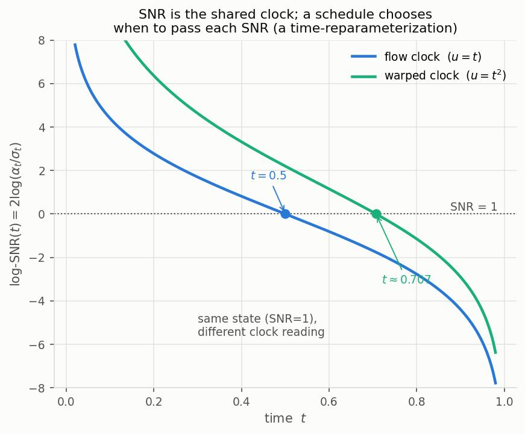
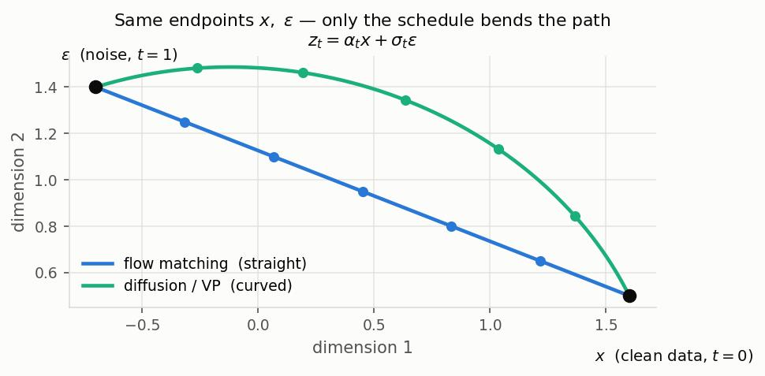
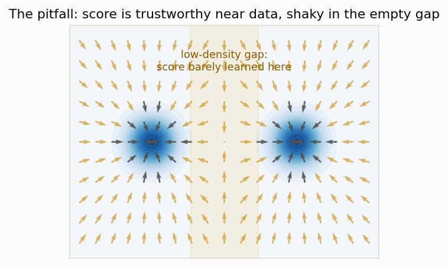

# DDPM, Rectified Flow, DDIM, and the Score Function

This note builds up two generative recipes as **separate units** first — **DDPM** (denoising diffusion) and **Rectified Flow** — then covers **DDIM** briefly, and finally shows how the **score function** ties all of them together (with **Flow Matching** as the umbrella). The goal is to understand DDPM and Rectified Flow on their own terms, and *then* see why they are two dialects of one language.

The unifying section follows the framing of the **MIT "Flow Matching and Diffusion Models" course** (see [Sources](#sources)); a companion note, `classifier-guidance-diffusion.md`, already introduces the score view and a short flow-vs-diffusion section that this note expands.

---

## Table of Contents

- [Shared Setup and a Warning About Time](#shared-setup-and-a-warning-about-time)
- [Part 1 — DDPM (Denoising Diffusion Probabilistic Models)](#part-1--ddpm-denoising-diffusion-probabilistic-models)
- [Part 2 — Rectified Flow](#part-2--rectified-flow)
- [Part 3 — DDIM (Briefly)](#part-3--ddim-briefly)
- [Part 4 — The Universal View: The Score Function Ties It All Together](#part-4--the-universal-view-the-score-function-ties-it-all-together)
- [Sources](#sources)

---

## Shared Setup and a Warning About Time

All these methods do the same job: learn to transform **pure noise** into **data** (e.g. images), by building a continuum of intermediate distributions between the two and learning to walk along it.

| Symbol | Meaning |
|---|---|
| $x_0$ (or "data") | A clean data sample — a real image drawn from the data distribution $p_{\text{data}}$. |
| noise | A sample from a simple reference distribution, almost always a standard Gaussian $\mathcal{N}(0, I)$. |
| $t$ | Time / noise-level index, interpolating between data and noise. |
| $x_t$ | The intermediate (partly noised) sample at time $t$. |
| $\epsilon$ | A standard Gaussian noise sample, $\epsilon \sim \mathcal{N}(0, I)$, same shape as the data. |
| $\epsilon_\theta, v_\theta, s_\theta$ | Neural networks predicting, respectively, the noise / a velocity / the score (defined where used). |

> **⚠️ The two communities index time in opposite directions.** This trips everyone up.
> - **DDPM** uses discrete steps $t = 0, 1, \dots, T$ with $t=0$ = **data** and $t=T$ = **noise**. "Forward" means *adding* noise; sampling runs *backward* $T \to 0$.
> - **Rectified Flow / Flow Matching** use continuous $t \in [0,1]$ with $t=0$ = **noise** and $t=1$ = **data**. Generation runs *forward* $0 \to 1$.
>
> I keep each section in its own paper's convention and reconcile them in [Part 4](#part-4--the-universal-view-the-score-function-ties-it-all-together). When comparing, just remember: one counts up toward noise, the other counts up toward data.

---

## Part 1 — DDPM (Denoising Diffusion Probabilistic Models)

*(Ho, Jain, Abbeel, 2020. Convention: $t=0$ data, $t=T$ noise.)*

### 1.0 The picture first

DDPM is built from two processes that are mirror images of each other.

- A **forward process** that takes a clean image and, over many small steps, *drowns it in noise* until nothing is left but static. This process is **fixed** — we design it by hand, it has no learnable parameters, and it always ends in the same place: pure Gaussian noise.
- A **reverse process** that starts from that pure noise and, step by step, *removes a little noise at a time* until a clean image emerges. This process is **learned** — a neural network is trained to undo one step of the corruption.

Why bother destroying an image just to rebuild it? Because the forward process gives us free, perfectly-labeled training data: for any clean image we can cheaply produce "slightly noised" and "slightly-more noised" versions, so we always know exactly what noise was added between two levels. The network's job is only ever the small, local task of "given this noisy image, guess what got added." Generation is then just: start from noise (which we can sample trivially) and apply that small denoising step over and over. The rest of this section makes each half precise, one equation at a time.

{ width=100% }

*The two processes on a 2-D toy (each dot is one data point). Left to right is the fixed **forward** process dissolving the two-moons data into a featureless Gaussian; right to left is the learned **reverse** process a trained model performs to generate. $\bar\alpha_t$ (defined in §1.2) is the fraction of signal still present.*

### 1.1 The forward process, one step at a time

Take the image at step $t-1$, call it $x_{t-1}$, and produce the slightly noisier $x_t$ by shrinking it a touch and adding a dab of Gaussian noise:

$$
x_t = \sqrt{1 - \beta_t}\; x_{t-1} \;+\; \sqrt{\beta_t}\; \epsilon_{t-1}, \qquad \epsilon_{t-1} \sim \mathcal{N}(0, I)
$$

Read the two terms:

- $\sqrt{1-\beta_t}\, x_{t-1}$ — the **surviving signal**. We multiply the previous image by a number slightly less than 1, so it fades a little.
- $\sqrt{\beta_t}\, \epsilon_{t-1}$ — the **injected noise**. Fresh Gaussian noise, scaled by $\sqrt{\beta_t}$.

Here $\beta_t \in (0,1)$ is the **noise schedule**: a small, pre-chosen number saying *how much noise to add at step $t$*. If $\beta_t$ is tiny, we keep almost all of the image and add a whiff of noise; if $\beta_t$ is larger, we fade more signal and add more noise. In equation form, $\beta_t$ directly sets the split between how much of $x_{t-1}$ survives ($\sqrt{1-\beta_t}$) and how much noise comes in ($\sqrt{\beta_t}$).

**Why those particular square-root coefficients?** They are chosen so the step is **variance-preserving**. Suppose $x_{t-1}$ has unit variance (roughly true for normalized images). The variance of the two independent terms adds: $(\sqrt{1-\beta_t})^2 + (\sqrt{\beta_t})^2 = (1-\beta_t) + \beta_t = 1$. So $x_t$ again has unit variance. Without this balancing, repeatedly adding noise would make the numbers grow without bound over hundreds of steps; with it, every $x_t$ stays on the same scale, and the endpoint is a clean standard Gaussian rather than some huge-variance mess.

**How the schedule progresses.** In the original paper $\beta_t$ increases *linearly* over time, e.g. from $\beta_1 = 10^{-4}$ up to $\beta_T = 0.02$, with $T = 1000$. Two design intuitions:

- **Small** — each step is a gentle nudge. A small change is nearly reversible: a network can plausibly guess "what did this tiny bit of noise hide?", whereas one giant noising step would destroy too much to invert. This is why we use *many* small steps rather than a few big ones.
- **Increasing** — near the start ($x_t$ still close to a real image) we tread carefully so as not to wreck structure prematurely; later, when the image is already mostly noise, extra noise costs little, so we can afford larger $\beta_t$ to reach pure noise in a finite number of steps.

The forward process is the Markov chain formed by applying this step over and over; in the paper's conditional notation the single step is written $q(x_t \mid x_{t-1}) = \mathcal{N}\big(x_t;\ \sqrt{1-\beta_t}\,x_{t-1},\ \beta_t I\big)$, which is exactly the sentence "$x_t$ is Gaussian, centered at the faded previous image, with variance $\beta_t$."

### 1.2 Jumping to any noise level in one shot

Training will need $x_t$ for a *randomly chosen* $t$. Running the chain $t$ times for each sample would be painfully slow — but we don't have to, because a sum of Gaussians is again Gaussian, and the steps compose in closed form.

Fold the recursion. Define $\alpha_t = 1 - \beta_t$ (the fraction of signal a *single* step keeps) and substitute one step into the next:

$$
x_t = \sqrt{\alpha_t}\, x_{t-1} + \sqrt{1-\alpha_t}\,\epsilon_{t-1}
= \sqrt{\alpha_t}\big(\sqrt{\alpha_{t-1}}\,x_{t-2} + \sqrt{1-\alpha_{t-1}}\,\epsilon_{t-2}\big) + \sqrt{1-\alpha_t}\,\epsilon_{t-1} = \cdots
$$

Keep unrolling to $x_0$. The signal picks up a factor of $\sqrt{\alpha_s}$ at every step, so after $t$ steps it carries $\sqrt{\prod_{s=1}^t \alpha_s}$. The many independent noise terms, each Gaussian, merge into **one** Gaussian (their variances add). Define the **cumulative signal-retention** $\bar\alpha_t = \prod_{s=1}^{t}\alpha_s$, and everything collapses to a single equation:

$$
q(x_t \mid x_0) = \mathcal{N}\big(x_t;\ \sqrt{\bar\alpha_t}\, x_0,\ (1 - \bar\alpha_t) I\big)
\quad\Longleftrightarrow\quad
x_t = \sqrt{\bar\alpha_t}\, x_0 + \sqrt{1 - \bar\alpha_t}\, \epsilon,\quad \epsilon \sim \mathcal{N}(0,I)
$$

Digest it term by term — this is the workhorse of the whole method:

- $\sqrt{\bar\alpha_t}\, x_0$ — **how much of the original image survives** to step $t$. Since $\bar\alpha_t$ is a product of numbers less than 1, it shrinks as $t$ grows, so the image fades.
- $\sqrt{1-\bar\alpha_t}\, \epsilon$ — **the total accumulated noise**, collapsed into a single Gaussian draw $\epsilon$.
- The two weights satisfy $\bar\alpha_t + (1-\bar\alpha_t) = 1$: at every level $x_t$ is a variance-1 blend of "signal" and "noise," with a dial $\bar\alpha_t$ sliding from all-signal to all-noise.

**Why $\bar\alpha_t \to 0$ as $t \to T$, and why that matters.** $\bar\alpha_t = \prod_{s=1}^t \alpha_s$ multiplies many factors each slightly below 1, so like $0.999 \times 0.999 \times \cdots$ it decays toward 0. As $\bar\alpha_t \to 0$: the signal weight $\sqrt{\bar\alpha_t} \to 0$ and the noise weight $\sqrt{1-\bar\alpha_t} \to 1$, so $x_T \approx \epsilon \sim \mathcal{N}(0, I)$ — **pure standard Gaussian noise, with the original image completely washed out.** This is crucial: it means at generation time we can start sampling from a plain $\mathcal{N}(0,I)$, needing no knowledge of any real image to begin.

This closed form is also exactly what makes training cheap: to get a training example at level $t$, draw one $\epsilon$ and evaluate the formula — no chain simulation.

{ width=92% }

*The schedule, made concrete (linear $\beta_t$, $T=1000$). Left: $\beta_t$ is small and increasing (§1.1). Right: because $\bar\alpha_t=\prod\alpha_s$ is a product of numbers just below 1, it decays to $0$ — so the signal coefficient $\sqrt{\bar\alpha_t}$ falls to $0$ while the noise coefficient $\sqrt{1-\bar\alpha_t}$ rises to $1$; their crossover is where a noisy $x_t$ is a $50/50$ signal–noise blend.*

### 1.3 The reverse process: why it's hard, and why a Gaussian

To generate, we must go the other way: given $x_t$, produce a slightly cleaner $x_{t-1}$. The honest object we'd want is the reverse conditional $q(x_{t-1} \mid x_t)$.

**Why it's intractable.** By Bayes' rule, $q(x_{t-1}\mid x_t) \propto q(x_t \mid x_{t-1})\, q(x_{t-1})$. The first factor is easy (it's our forward step), but $q(x_{t-1})$ is the distribution of *all possible slightly-noised images at level $t-1$* — which depends on the entire data distribution (you'd have to average over every image that could have produced this $x_t$). We don't have that distribution in closed form; it's the very thing generative modeling is trying to capture. So the exact reverse step can't be written down.

**Why we can still use a Gaussian.** A classic result about diffusions: when each forward step is *small* (tiny $\beta_t$), the corresponding reverse step is itself approximately **Gaussian**. Intuitively, if going forward only nudged the image a little, then going backward only requires a little correction, and over an infinitesimally small move the reverse distribution is locally bell-shaped. This is precisely why the schedule uses many small $\beta_t$ steps: it keeps every reverse step in the regime where a Gaussian is a good model. So we approximate the intractable reverse by a **learned** Gaussian:

$$
p_\theta(x_{t-1} \mid x_t) = \mathcal{N}\big(x_{t-1};\ \mu_\theta(x_t, t),\ \Sigma_\theta(x_t, t)\big)
$$

**The bridge that makes learning possible.** Although $q(x_{t-1}\mid x_t)$ is intractable, the same conditional *with $x_0$ also given* is a tractable Gaussian:

$$
q(x_{t-1} \mid x_t, x_0) = \mathcal{N}\big(x_{t-1};\ \tilde\mu_t(x_t, x_0),\ \tilde\beta_t I\big)
$$

Why is this one easy while the plain reverse was hard? Because fixing $x_0$ removes the need to average over the whole dataset — with both endpoints pinned, "where was $x_{t-1}$?" is a simple Gaussian interpolation between $x_t$ and $x_0$, and both its mean $\tilde\mu_t$ and variance $\tilde\beta_t$ come out in closed form from the schedule. During training we *have* $x_0$ (we made $x_t$ from it), so we can use this exact posterior as the target the network should match. This posterior is the hinge the whole training objective swings on.

### 1.4 What the network predicts, and why the variance is fixed

The learned reverse Gaussian has two parameters, a mean $\mu_\theta$ and a covariance $\Sigma_\theta$. DDPM **learns the mean and fixes the covariance** to $\Sigma_\theta = \sigma_t^2 I$ with $\sigma_t^2$ set to a schedule constant (either $\beta_t$ or the posterior variance $\tilde\beta_t$ from §1.3). Why this split?

- **The mean must be learned** because it says *where* to move — "given this noisy blob, which direction is the clean image?" That answer is entirely **data-dependent**: it's the only place the model's knowledge of what real images look like enters. Get the mean wrong and you denoise toward garbage.
- **The variance can be fixed** because the *spread* of one small reverse step is, to good approximation, **not data-dependent** — it's governed by how much noise the schedule added at that level, which we already know ($\tilde\beta_t$). So there's little to gain by learning it, and the paper found that simply setting $\Sigma_\theta = \sigma_t^2 I$ works well.
- **Why not fix both?** Because the mean is exactly the useful, image-specific signal — fixing it would leave nothing for the network to learn. **Why not learn both?** You can, and later work (Improved DDPM) *does* learn $\Sigma_\theta$ for modest gains; the original chose to fix it for **simplicity and training stability** (one fewer thing to balance, and the variance's optimum is already roughly known).

So the entire learning problem reduces to: **model the mean of each small reverse step.**

### 1.5 Training: from likelihood, to ELBO, to "predict the noise"

We'd like to train by **maximum likelihood** — make the model assign high probability $p_\theta(x_0)$ to real images. But $p_\theta(x_0) = \int p_\theta(x_0, x_1, \dots, x_T)\, dx_{1:T}$ requires integrating over *all* the intermediate noisy versions $x_1,\dots,x_T$ (the latent variables), which is intractable. We can't compute the likelihood directly, so we can't maximize it directly.

**What ELBO is.** The **Evidence Lower BOund** is a quantity we *can* compute that is guaranteed to sit **below** the true log-likelihood: $\text{ELBO} \le \log p_\theta(x_0)$. Because it's a lower bound, pushing the ELBO *up* pushes the (uncomputable) log-likelihood up with it — so we maximize the ELBO as a tractable stand-in for maximizing likelihood. (It becomes computable precisely because it's written using the *known* forward process and the *tractable* posterior $q(x_{t-1}\mid x_t,x_0)$ from §1.3, instead of the intractable marginal.)

**What the ELBO turns into here.** For DDPM the ELBO breaks apart into a sum of per-timestep terms, and each term has the same shape: make the learned reverse step $p_\theta(x_{t-1}\mid x_t)$ **match the tractable posterior** $q(x_{t-1}\mid x_t,x_0)$. Since both are Gaussians with the same fixed variance (§1.4), "match them" reduces to "make their **means** agree." So training = *learn to denoise one step so it agrees with the true posterior mean*. (We are not deriving these terms here — just noting that the scary ELBO collapses to a per-step mean-matching regression.)

**The reparameterization that makes it clean.** Recall $x_t = \sqrt{\bar\alpha_t}\,x_0 + \sqrt{1-\bar\alpha_t}\,\epsilon$. The posterior mean $\tilde\mu_t$ we're trying to match can be rewritten in terms of that same $\epsilon$. So instead of asking the network for the mean, we can ask it for the one unknown piece — **the noise $\epsilon$ that was added** — and recover everything else by algebra. Doing so, and dropping a per-term weight that the paper found unnecessary, gives the famous simple objective:

$$
L_{\text{simple}} = \mathbb{E}_{x_0,\, \epsilon,\, t}\Big[\ \big\| \epsilon - \epsilon_\theta(x_t, t) \big\|^2\ \Big],
\qquad x_t = \sqrt{\bar\alpha_t}\, x_0 + \sqrt{1 - \bar\alpha_t}\, \epsilon
$$

In words, the *entire* training loop is: pick a clean image $x_0$; pick a random timestep $t$ and a random noise $\epsilon$; build the noisy $x_t$ from the closed form; ask the network to **guess $\epsilon$ back**; penalize the squared error. A plain regression — no chain simulation, no adversary, no likelihood evaluation.

**Three equivalent things to predict.** Because $x_t$, $x_0$, $\epsilon$, and the posterior mean are all linked by the closed-form equation, predicting any one determines the others. Predicting the **noise** $\epsilon$, predicting the **clean image** $x_0$, and predicting the **reverse mean** $\mu$ are three interchangeable views of the same network — DDPM just found that predicting $\epsilon$ trains best (it's the best-scaled target). Keep this equivalence in mind; it's exactly what the next subsection uses.

### 1.6 From a noise prediction to a denoising step

This resolves a natural confusion: *if the network predicts noise, why do we ever talk about a mean $\mu_\theta$?* Answer: **there is only one network, $\epsilon_\theta$. $\mu_\theta$ is not a second model — it's algebra applied to $\epsilon_\theta$.** The chain is:

1. The network outputs a noise estimate $\epsilon_\theta(x_t, t)$.
2. Invert the closed form to get an estimate of the clean image:
   $$
   \hat{x}_0 = \frac{x_t - \sqrt{1 - \bar\alpha_t}\,\epsilon_\theta(x_t, t)}{\sqrt{\bar\alpha_t}}
   $$
   (just solving $x_t = \sqrt{\bar\alpha_t}\,x_0 + \sqrt{1-\bar\alpha_t}\,\epsilon$ for $x_0$, with $\epsilon_\theta$ in place of the unknown $\epsilon$).
3. Plug $\hat{x}_0$ into the tractable posterior mean $\tilde\mu_t(x_t, \hat{x}_0)$ from §1.3. After simplification this becomes:
   $$
   \mu_\theta(x_t, t) = \frac{1}{\sqrt{\alpha_t}}\left(x_t - \frac{\beta_t}{\sqrt{1 - \bar\alpha_t}}\, \epsilon_\theta(x_t, t)\right)
   $$

Unpack the final formula: start at the current noisy $x_t$, **subtract off a scaled version of the predicted noise** (remove what the network thinks is junk), then **rescale by $1/\sqrt{\alpha_t}$** to undo that step's shrink factor. So $\mu_\theta$ is literally "$x_t$ with a bit of its estimated noise removed." It is needed because *sampling draws from the reverse Gaussian, and a Gaussian needs a mean* — and that mean is manufactured on the fly from the single noise prediction.

### 1.7 Sampling, step by step

Generation runs the reverse chain from pure noise down to a clean image:

$$
x_{t-1} = \mu_\theta(x_t, t) + \sigma_t\, z, \qquad z \sim \mathcal{N}(0, I)
$$

Walk through what actually happens:

- **Start.** Set $x_T \sim \mathcal{N}(0, I)$. We can do this because §1.2 showed the forward process drives *any* image to standard Gaussian noise — so pure noise is the correct starting distribution, and it needs no real image.
- **Each step.** Given $x_t$: run the network to get $\epsilon_\theta$, form $\mu_\theta$ (§1.6) — this is our best guess of the slightly-cleaner image — then draw $x_{t-1}$ from the Gaussian centered there with the fixed variance $\sigma_t^2$. Concretely: **estimate the clean image, step partway back toward it, and re-add the amount of noise appropriate to the next (lower) level.**
- **Why add $\sigma_t z$ instead of just taking $\mu_\theta$?** Because we are *sampling from a distribution*, not computing a point estimate. Each reverse step is genuinely uncertain (many clean images could explain a noisy one), and the noise $z$ injects that uncertainty. Always taking the bare mean collapses this randomness: samples lose diversity and come out blurry/over-smoothed, since means average over possibilities. The $\sigma_t z$ term keeps the trajectory stochastic and the outputs sharp and varied.
- **The last step ($t = 1 \to 0$) drops the noise** ($z = 0$): we want the final, committed clean image, not one more noisy draw, so we return the mean.
- **"Ancestral sampling"** just names this procedure: sample down the chain one link at a time, $x_T \to x_{T-1} \to \cdots \to x_0$, each conditioned on the previous — like walking down a lineage of ancestors.
- **Why so many steps?** Each reverse step is only *approximately Gaussian when the move is small* (§1.3). To stay in that regime you take many small steps — hundreds to $T=1000$ network evaluations. That accuracy is why DDPM samples look great, and the step count is the **speed** cost that DDIM (§Part 3) and flows (§Part 2) exist to cut down.

### 1.8 Recap, and a teaser

Forward = a fixed, variance-preserving random walk that dissolves any image into standard Gaussian noise, with a closed form that lets us hop to any noise level in one draw. Reverse = a learned Gaussian denoiser trained by a plain "predict the added noise" regression (the tamed form of maximizing likelihood via the ELBO), from which the reverse-step mean — and thus sampling — follows by algebra. Many small steps buy accuracy at the price of speed.

One thread to carry forward: predicting the noise $\epsilon_\theta$ is secretly predicting the **score** of the noisy distribution — the exact link we cash in during [Part 4](#part-4--the-universal-view-the-score-function-ties-it-all-together), and the reason DDPM, DDIM, and Rectified Flow turn out to be one thing.

Here are the two loops of DDPM in their classic form — training and sampling side by side:

{ width=100% }

*The canonical Training and Sampling algorithms from the DDPM paper (Ho, Jain & Abbeel, 2020). The notation matches this note almost exactly: **Algorithm 1** is our training loss $L_{\text{simple}}$ (§1.5) — sample $x_0$, a timestep $t$, and noise $\epsilon$, then regress $\epsilon_\theta(\sqrt{\bar\alpha_t}x_0+\sqrt{1-\bar\alpha_t}\epsilon,\,t)$ onto $\epsilon$; **Algorithm 2** is our sampler (§1.7) — start at $x_T\sim\mathcal N(0,I)$ and apply $x_{t-1}=\tfrac{1}{\sqrt{\alpha_t}}\big(x_t-\tfrac{1-\alpha_t}{\sqrt{1-\bar\alpha_t}}\epsilon_\theta(x_t,t)\big)+\sigma_t z$, with the noise term $\sigma_t z$ dropped on the last step. (Their $1-\alpha_t$ is our $\beta_t$.)*

---

## Part 2 — Rectified Flow

*(Liu, Gong, Liu, 2022. Convention: $t=0$ noise, $t=1$ data — the opposite of DDPM, so watch the direction.)*

### 2.0 The picture first, and the two DDPM pains it targets

DDPM works, but §1.7 left us with two structural annoyances, and Rectified Flow is best understood as a direct attack on both.

- **DDPM's reverse process is stochastic.** Every reverse step draws fresh noise $\sigma_t z$. That randomness is what keeps samples sharp, but it means the map from starting noise to final image is *not a clean function* — the same $x_T$ can yield different images, and there is no reliable way to run the process *backward* to ask "what noise produced this image?" That makes **editing and inversion hard** (more in §2.6).
- **DDPM's trajectory is curved, so it needs many steps.** The reverse walk drifts along a bent path from noise to data, and a bent path can only be followed accurately with many small steps (hundreds to a thousand network calls).

Rectified Flow asks the cleaner geometric question: instead of a random, meandering walk, can we transport noise to data along a **straight, deterministic path**? If the path is *straight*, we can traverse it in very few steps (even one); if it is *deterministic*, the noise→data map is an invertible function, so editing becomes easy. Those are exactly the two payoffs.

To do this, Rectified Flow works with an **ODE** (an ordinary differential equation: a deterministic rule "at position $x$ and time $t$, move with velocity $v(x,t)$") rather than DDPM's noisy chain. *Why an ODE is the right tool, how it relates to DDPM's stochastic process (which secretly corresponds to an SDE), and the claim that the two are the "same object in different coordinates" — all of that is unpacked in [Part 4](#part-4--the-universal-view-the-score-function-ties-it-all-together). For now we build Rectified Flow on its own terms.*

{ width=60% }

*The stochastic-vs-deterministic contrast, on a toy pull-toward-origin process. The **SDE** (DDPM-like) injects fresh noise every step, so each run is a different jittery path — great for sample variety, but not a reproducible function, hence hard to invert (§2.6). The **ODE** (flow) is one smooth, reproducible curve you can integrate in few steps and run backward.*

### 2.1 The straight-line idea

We have two distributions to connect: $\pi_0$, the **noise** distribution (a standard Gaussian, at $t=0$), and $\pi_1$, the **data** distribution (real images, at $t=1$). Draw one sample from each and pair them — by default an **independent** pairing, $X_0 \sim \pi_0$ and $X_1 \sim \pi_1$ picked with no relationship. Connect that specific pair by the **straight line** between them:

$$
X_t = (1 - t)\, X_0 + t\, X_1, \qquad t \in [0, 1]
$$

Unpack it: at $t=0$ the point sits exactly on the noise sample $X_0$; at $t=1$ it sits exactly on the data sample $X_1$; in between it slides linearly from one to the other. Differentiate with respect to time and the **velocity is constant along the line**:

$$
\frac{d X_t}{d t} = X_1 - X_0
$$

which is just "displacement = destination − start," and it does not depend on $t$ — the point moves in a fixed direction at fixed speed. **Why a straight line?** It is the shortest path between the two endpoints and it has constant velocity, so *if* we knew this velocity we could walk from noise to data in principle in a single big step. That is the dream Rectified Flow chases.

### 2.2 Why the velocity must be learned

There is an immediate problem: the per-pair velocity $X_1 - X_0$ requires knowing the destination $X_1$ — the very data sample we are trying to *generate*. At generation time we start from a noise sample and have no idea which $X_1$ it should end at. So we cannot follow $X_1 - X_0$ directly.

The fix is to learn a **velocity field** $v_\theta(x, t)$ that depends only on *where we currently are* $(x)$ and *when* $(t)$ — never on the unknown destination. We fit it by plain least-squares regression: put the point at $X_t$ on some pair's line and ask the network to predict that pair's displacement direction:

$$
L_{\text{RF}} = \mathbb{E}_{t,\, X_0,\, X_1}\Big[\ \big\| (X_1 - X_0) - v_\theta(X_t, t) \big\|^2\ \Big]
$$

In words: sample a noise point and a data point, pick a random time $t$, place yourself at the interpolated point $X_t$, and train $v_\theta$ to output the straight-line direction $X_1 - X_0$ that produced it. This is the flow analogue of DDPM's "predict the noise" — a bare regression, with **no ELBO and no noise schedule**.

What does the network converge to? For a given location $x$ and time $t$, *many different pairs* pass through $x$, each demanding its own displacement direction. A squared-error regression against conflicting targets is minimized by their **average**, so the optimal field is the conditional expectation:

$$
v^\star(x, t) = \mathbb{E}\big[\, X_1 - X_0 \ \big|\ X_t = x \,\big]
$$

Read it as: "the average displacement direction over all noise→data pairs whose straight line happens to pass through $x$ at time $t$." This averaging is the whole game, and it has a subtle consequence we unpack next.

### 2.3 Crossings, and why it is called "rectified"

Here is the subtlety the user's intuition already flagged: **each pair's line is straight, but the learned flow as a whole is generally curved.**

Why: straight lines from different pairs **cross**. Two different noise→data pairs can pass through the same point $x$ at the same time $t$ heading in *different* directions. But a valid flow — the solution of an ODE — **cannot** cross itself: from a given $(x,t)$ there is one and only one velocity, hence one onward trajectory (otherwise a starting point wouldn't have a well-defined destination). The learning resolves the conflict by taking the **average** direction (§2.2), which "**rectifies**" the tangle of crossing straight lines into a single, consistent, non-crossing flow — this rewiring is what gives the method its name.

The price of that rewiring: to avoid the crossings, the averaged marginal trajectories must **bend**. So although every *reference* line is straight, the *actual* flow the model follows is curved, and a curved flow still needs several ODE steps. In short — **straight at the level of individual pairs, curved at the aggregate level.** (We will contrast this curvature with DDPM's curvature, and the "coordinates" view of it, in [Part 4](#part-4--the-universal-view-the-score-function-ties-it-all-together).)

{ width=92% }

*Why the marginal flow bends. Left: with a random pairing, the per-pair straight reference lines **cross**. Right: an ODE flow cannot cross itself, so the learned velocity — the **average** displacement through each point — reroutes the pairings into smooth, non-crossing, and therefore **curved** trajectories. (Reflow, §2.4, re-pairs endpoints to reduce the crossings and straighten these.)*

### 2.4 Reflow: straighten the flow by re-pairing

If the curvature comes from *crossings*, and crossings come from the *random* pairing of noise with data, then we can straighten the flow by choosing a **smarter pairing**. That is exactly what **reflow** does.

Run the trained flow once to generate data: each starting noise $Z_0$ deterministically produces some $Z_1$. Now retrain a *fresh* rectified flow using these model-generated pairs $(Z_0, Z_1)$ instead of random ones. Because these pairs already come from a non-crossing flow, their straight lines cross far less, so the new flow bends less. Rectified Flow proves this re-pairing has **non-increasing transport cost** (the new coupling is never worse) and yields **straighter** trajectories. Iterate a couple of times and the paths become nearly straight lines — at which point a **single Euler step**,

$$
Z_1 \approx Z_0 + v_\theta(Z_0, 0),
$$

already produces a good sample. This is how Rectified Flow reaches **one-/few-step generation**, and it underpins fast distilled text-to-image models.

### 2.5 Sampling

Generation is just solving the ODE forward from a noise sample:

$$
\frac{d Z_t}{d t} = v_\theta(Z_t, t), \qquad Z_0 \sim \pi_0\ (\text{noise}),\ \text{integrate } t: 0 \to 1 \ \Rightarrow\ Z_1\ (\text{data})
$$

Hand it to any off-the-shelf ODE solver (e.g. Euler: $Z_{t+\Delta} = Z_t + \Delta\, v_\theta(Z_t, t)$). Two properties matter: it is **deterministic** (no noise is injected — the same $Z_0$ always maps to the same $Z_1$), and it needs **few steps** when the flow is straight (one, after enough reflow), versus DDPM's hundreds. The deterministic property is not just about speed; it is what makes the next point possible.

### 2.6 Why editing and inversion are easy (the point diffusion buries)

This is the practical payoff, and it is worth doing carefully because it hinges on a precise difference between a **function** and a **random draw**.

**What "integrate the ODE" means, concretely.** Generation solves $\frac{dZ_t}{dt} = v_\theta(Z_t, t)$ numerically. The simplest solver is forward Euler: pick a step size $h$, and repeatedly take a small step along the current velocity. Going **forward** (noise → data, $t: 0 \to 1$):

$$
Z_{t+h} = Z_t + h\, v_\theta(Z_t, t)
$$

The crucial fact: $v_\theta(Z_t, t)$ is a **fixed function of where you are and what time it is** — no randomness enters. So the update is a plain deterministic map. That means you can also run the *same* rule **backward** (data → noise, $t: 1 \to 0$) just by stepping in the negative direction:

$$
Z_{t-h} = Z_t - h\, v_\theta(Z_t, t)
$$

Each backward step undoes a forward step (to the solver's accuracy), because both use the same velocity field evaluated at the point you're actually standing on. The trajectory is a single curve in space-time that you may traverse either way.

**Inversion, made explicit.** Given a real image $Z_1$, start there and apply the backward step from $t=1$ down to $t=0$:

$$
Z_1 \;\xrightarrow{\,-h\,v_\theta\,}\; Z_{1-h} \;\xrightarrow{\,-h\,v_\theta\,}\; \cdots \;\xrightarrow{}\; Z_0
$$

The result $Z_0$ is the **exact noise latent that regenerates the image**: integrate forward from this $Z_0$ and you land back on $Z_1$. The round-trip is faithful up to discretization error, which shrinks with smaller $h$ or a better ODE solver. You now hold a reversible handle on any real image.

**Editing / interpolation, made explicit.** With latents in hand, edits are arithmetic in latent space. Invert two images to $Z_0^A$ and $Z_0^B$, blend

$$
Z_0^{\text{mix}} = (1-\lambda)\, Z_0^A + \lambda\, Z_0^B, \qquad \lambda \in [0,1],
$$

then integrate **forward** from $Z_0^{\text{mix}}$ to get a coherent image that semantically interpolates the two. Because the noise→image map is a deterministic function, a small change in the latent produces a small, **reproducible** change in the image — the property that makes controllable editing possible.

**Now watch DDPM fail — and see exactly where the noise is.** Recall the DDPM generation step (§1.7). To produce $x_{t-1}$ from $x_t$ you compute the mean and then **add a fresh random vector**:

$$
x_{t-1} = \mu_\theta(x_t, t) + \sigma_t\, z_t, \qquad z_t \sim \mathcal{N}(0, I)\ \text{drawn fresh at this step}
$$

where, writing the mean out (§1.6), $\mu_\theta(x_t,t) = \frac{1}{\sqrt{\alpha_t}}\big(x_t - \frac{\beta_t}{\sqrt{1-\bar\alpha_t}}\epsilon_\theta(x_t,t)\big)$.

Suppose we try to "run it backward": we have $x_{t-1}$ and want to recover the $x_t$ it came from. Rearranging the step to isolate $x_t$:

$$
\underbrace{x_{t-1} - \sigma_t\, z_t}_{\text{but we don't know } z_t!} = \mu_\theta(x_t, t)
$$

The obstruction is right there on the left: $z_t$ was a fresh sample drawn during generation and then **thrown away**. Given only $x_{t-1}$, you cannot tell how much of it was the deterministic mean $\mu_\theta$ and how much was the random kick $\sigma_t z_t$ — infinitely many pairs $(x_t, z_t)$ produce the *same* $x_{t-1}$. There is no single $x_t$ to solve for.

Said structurally: DDPM's forward-generation step is **not a function of $x_t$ alone** — it is $x_{t-1} = g(x_t, z_t)$ with an external coin flip $z_t$ baked in. A relation that depends on a hidden random input has **no deterministic inverse**. (And this is on top of a milder nuisance: $\mu_\theta$ contains $\epsilon_\theta(x_t,t)$ evaluated *at the unknown $x_t$*, so even the deterministic part is only implicitly defined.) That is the precise sense in which "DDPM injects fresh noise every step" ruins invertibility — not a vague statement, but the literal term $\sigma_t z_t$ that you cannot subtract off.

**The fix is to delete that term.** Set $\sigma_t = 0$ and the step becomes $x_{t-1} = \mu_\theta(x_t, t)$ — a deterministic function, now invertible, exactly like the flow ODE above. That is precisely what DDIM does, and it is why DDIM (unlike DDPM) supports inversion and editing. Under the hood it is the **probability-flow ODE** — the deterministic twin of DDPM's noisy process — which is the bridge we make precise in [Part 3](#part-3--ddim-briefly) and [Part 4](#part-4--the-universal-view-the-score-function-ties-it-all-together). Determinism buys invertibility; invertibility buys editing.

### 2.7 Contrast recap, and what Part 4 will settle

| | DDPM | Rectified Flow |
|---|---|---|
| Process | Stochastic (noise every step; an SDE in the limit) | Deterministic ODE |
| Trajectory | Curved | Straight per-pair; curved in aggregate → straightened by reflow |
| Steps to sample | Many (~1000; ~50 with DDIM) | Few, or one after reflow |
| Network learns | The added noise $\epsilon_\theta$ | The velocity $v_\theta$ |
| Editing / inversion | Hard (not cleanly invertible) | Easy (invertible ODE) |

These look like opposites, but they are closer than they seem. Two threads are deliberately **deferred to [Part 4](#part-4--the-universal-view-the-score-function-ties-it-all-together)**: (1) *where the SDE fits* — DDPM's stochastic process has a deterministic **probability-flow ODE** twin with the same marginals, which is the common ground with Rectified Flow; and (2) the claim that **DDPM's curved path and a flow's straight path are the same object in different coordinates** — a change of variables / time-reparameterization can turn one into the other. We will make both precise once the score function is on the table.

---

## Part 3 — DDIM (Briefly)

*(Song, Meng, Ermon, 2020. DDPM convention: $t=0$ data, $t=T$ noise.)*

DDPM's weakness is speed: ~1000 stochastic steps. **DDIM** fixes this **without retraining** — it reuses the *same* trained $\epsilon_\theta$.

The trick: DDPM's training only ever depends on the marginals $q(x_t\mid x_0)$, not on the Markov chain that produced them. DDIM constructs a **non-Markovian** forward process with the **same marginals**, which admits a whole *family* of reverse processes parameterized by a noise level $\sigma_t$. Setting $\sigma_t = 0$ makes sampling **deterministic**. Each reverse step first forms the **predicted clean image** from the current noise estimate,

$$
\hat{x}_0 = \frac{x_t - \sqrt{1 - \bar\alpha_t}\, \epsilon_\theta(x_t, t)}{\sqrt{\bar\alpha_t}},
$$

then re-noises it to the next (lower) level:

$$
x_{t-1} = \sqrt{\bar\alpha_{t-1}}\, \hat{x}_0 + \sqrt{1 - \bar\alpha_{t-1}}\, \epsilon_\theta(x_t, t)
$$

Two payoffs:

1. **Speed.** Because it depends only on marginals, you can **skip timesteps** (e.g. use 50 instead of 1000) and still get coherent samples.
2. **Determinism ⇒ an ODE.** With $\sigma_t = 0$, DDIM is a discretization of a deterministic **ODE** — the *probability-flow ODE* — with the same marginals as the DDPM stochastic process. This is the bridge to flows, and the reason DDIM belongs in this note: it is DDPM's stochastic SDE collapsed into a deterministic flow, exactly the kind of object Rectified Flow learns directly.

---

## Part 4 — The Universal View: The Score Function Ties It All Together

This is the section the whole note was written for. So far DDPM and Rectified Flow look like opposites — stochastic vs deterministic, curved vs straight, "predict noise" vs "predict velocity." We now show they are the **same object seen through different lenses**, and the lens that unifies them is the **score function**. Along the way we settle the questions left hanging in Parts 1–2:

- Where does an **SDE** fit in? (DDPM never mentioned one.)
- What is the **probability-flow ODE**, and where does **DDIM** sit?
- In what sense are DDPM's **curved** path and a flow's **straight** path "the same thing in different coordinates"?
- Why is the **score** the common language, and how is **Flow Matching** the umbrella over all of it?

Because the whole section leans on ODEs and SDEs, and those may be unfamiliar, we build them from scratch first.

### 4.1 Primer: what an ODE is

Forget generative models for a moment. Imagine a particle moving in space, and suppose someone hands you a rule: *"if you are at position $x$ at time $t$, your velocity is $v(x, t)$."* That rule is an **ordinary differential equation (ODE)**:

$$
\frac{d x_t}{d t} = v(x_t, t)
$$

Read it literally: the left side is "how fast and in what direction $x$ is changing right now"; the right side is the rule that tells you. A **velocity field** $v(x,t)$ is just an arrow attached to every point of space (possibly changing with time). Drop a particle somewhere and it follows the arrows.

Given a starting point $x_0$, this rule produces one **definite** trajectory — there is no randomness, so the same start always yields the same path and the same endpoint. To actually compute it, you take small time steps (the **Euler method**): "look at the arrow here, step a little along it, repeat":

$$
x_{t+\Delta} \approx x_t + \Delta\, v(x_t, t)
$$

Smaller steps $\Delta$ = more accurate but more evaluations. Two facts we'll lean on: (a) an ODE trajectory is **deterministic**, and (b) it is **reversible** — flip the sign and run time backward and you retrace the exact same path. That reversibility is precisely why Rectified Flow made editing easy (§2.6).

### 4.2 Primer: what an SDE is

Now add randomness. A **stochastic differential equation (SDE)** is an ODE with a "jitter" term bolted on:

$$
d x_t = \underbrace{f(x_t, t)\, dt}_{\text{drift}} \;+\; \underbrace{g(t)\, dw}_{\text{diffusion}}
$$

Unpack the two pieces:

- **Drift** $f(x_t,t)\,dt$ — the deterministic part, exactly like the ODE velocity: a systematic pull in some direction over the small time $dt$.
- **Diffusion** $g(t)\,dw$ — a random kick. Here $dw$ is an increment of **Brownian motion**: think of it as a tiny fresh Gaussian nudge at every instant, mean zero, independent of everything before, with size growing like $\sqrt{dt}$. The scalar $g(t)$ sets how big those kicks are.

So at each instant the particle is pulled deterministically (drift) **and** randomly jostled (diffusion). Because of the jostling, the *same* starting point now produces a **different** trajectory every run — the path is random. An **ODE is just the special case $g(t) = 0$** (kicks turned off), which is why "deterministic" sits inside "stochastic" as a limiting case.

Why would anyone *want* the randomness? Because injecting noise while denoising lets the process explore and keeps samples sharp and diverse (the same reason DDPM added $\sigma_t z$ at each reverse step in §1.7). The cost is that a jittery path can't be followed in big steps — you need many small ones — and it isn't cleanly reversible. Hold onto that trade-off; it is the whole DDPM-vs-flow story in one sentence.

### 4.3 The score function

For a probability density $p(x)$, the **score** is the gradient of its log-density with respect to $x$:

$$
s(x) = \nabla_x \log p(x)
$$

It is a **vector field** the same shape as the data: at every point it gives an arrow pointing in the direction of **steepest increase in probability** — "which way is more likely / more realistic." (Same object as in `classifier-guidance-diffusion.md`.) Two things make it the star of this section: (1) if you know the score at every noise level you know which way to move to turn noise into data, and (2) as we'll see, it is exactly the arrow that appears in the drift of both the reverse SDE and the probability-flow ODE. Every method in this note is, underneath, a way to estimate and then follow this field.

{ width=94% }

*The score, on a 2-D three-mode toy density. Left: the score $\nabla_x\log p(x)$ is a field of arrows pointing "uphill," toward the high-density modes. Right: **Langevin sampling** turns that field into a generator — start anywhere and repeatedly step along the score with a dash of noise, $x \leftarrow x + \eta\,\nabla_x\log p(x) + \sqrt{2\eta}\,z$, and you drift to where the data lives. (Recreated in our notation; cf. Yang Song's [score blog](https://yang-song.net/blog/2021/score/), which animates this and the multi-noise-scale "annealed Langevin" version.)*

### 4.4 DDPM is secretly an SDE (this is where the SDE "was hiding")

DDPM was written as a *discrete* chain — add a little Gaussian noise, 1000 times — and never mentioned SDEs. But look again at one forward step (§1.1), $x_t = \sqrt{1-\beta_t}\,x_{t-1} + \sqrt{\beta_t}\,\epsilon$, and rearrange it into "change over one step":

$$
x_t - x_{t-1} = \underbrace{\big(\sqrt{1-\beta_t}-1\big)x_{t-1}}_{\text{a small shrink} \,\approx\, -\frac{\beta_t}{2}x_{t-1}} \;+\; \underbrace{\sqrt{\beta_t}\,\epsilon}_{\text{a small Gaussian kick}}
$$

That is *exactly* the shape of an SDE step from §4.2: a **drift** that gently pulls the signal toward zero, plus a **diffusion** kick of size $\sqrt{\beta_t}$. Take the steps infinitely small and DDPM's chain becomes a continuous **forward SDE** that carries data → noise. So the SDE was there all along, just written in discrete clothing. (This is the continuous-time view of Song et al.)

Now, generation needs to go the *other* way, noise → data. A classic result (Anderson's time-reversal) says every forward SDE has a **reverse-time SDE**, and its drift contains the **score**:

$$
d x_t = \Big[\, f(x_t,t) - \tfrac{1+\eta_t^2}{2}\,g(t)^2\,\nabla_{x_t}\log p_t(x_t) \,\Big] dt \;+\; \eta_t\, g(t)\, dw
$$

Don't be scared by it — read it as "drift that now leans **uphill in probability** (the score term) so we move toward realistic data, plus an optional random kick controlled by $\eta_t$." Here $p_t$ is the distribution of noisy images at level $t$, and $\eta_t$ dials how much stochasticity to keep. The one unknown is the score $\nabla_{x_t}\log p_t$ — and **that is exactly what DDPM's network gives us.** From the closed form $x_t = \sqrt{\bar\alpha_t}\,x_0 + \sqrt{1-\bar\alpha_t}\,\epsilon$, the Gaussian score points from the sample back toward the clean mean, which works out to a simple rescaling of the predicted noise:

$$
\nabla_{x_t}\log p_t(x_t) \approx -\,\frac{\epsilon}{\sqrt{1-\bar\alpha_t}}
\quad\Longrightarrow\quad
s_\theta(x_t,t) = -\,\frac{\epsilon_\theta(x_t,t)}{\sqrt{1-\bar\alpha_t}}
$$

So **DDPM's "predict the noise" is literally "predict the score,"** up to the known scale $-\sqrt{1-\bar\alpha_t}$; training it with $L_{\text{simple}}$ is **denoising score matching**. And DDPM's stochastic ancestral sampler (§1.7) is just a **discretization of this reverse SDE** with the kicks left on ($\eta_t > 0$). That answers "where does the SDE fit": DDPM *is* a reverse-SDE sampler, driven by the score.

### 4.5 The probability-flow ODE (and where DDIM fits)

The reverse SDE has a dial $\eta_t$ for the random kicks. Turn them **all the way off** ($\eta_t = 0$) and you are left with a pure, deterministic ODE:

$$
\frac{d x_t}{d t} = f(x_t,t) - \tfrac{1}{2}\,g(t)^2\,\nabla_{x_t}\log p_t(x_t)
$$

This is the **probability-flow ODE**. Its remarkable property: it produces the **same sequence of marginal distributions $p_t$** as the stochastic reverse SDE — at every noise level the *population* of samples matches — even though each individual trajectory is now smooth and deterministic. (Intuition: the drift of the ODE is engineered so its deterministic transport reproduces the same density evolution the noisy process produced on average. This follows from the Fokker–Planck equation, which we won't derive — see Song et al.) Same destinations in aggregate, no jitter along the way.

Because it's a deterministic ODE, it can be integrated in **big steps** (§4.1) — so it is fast — and it is **reversible** — so it enables inversion/editing. And here is the punchline for Part 3: **DDIM is a discretization of this probability-flow ODE.** That is precisely why DDIM (i) needs far fewer steps and (ii) is deterministic and invertible — it's the same score field as DDPM, with the noise turned off. So the picture so far: DDPM = follow the score **stochastically** (reverse SDE); DDIM = follow the **same** score **deterministically** (probability-flow ODE).

### 4.6 Rectified Flow in the same language

Rectified Flow never mentions a score — it learns a **velocity** $v_\theta$ for an ODE (§2.5). But its ODE and DDPM's probability-flow ODE turn out to be the **same kind of object**, because for Gaussian noising paths the velocity and the score are **linearly related**:

$$
v_t(x) = a_t\, x + b_t\, \nabla_x \log p_t(x)
$$

where $a_t, b_t$ are scalar functions fixed by the noise schedule (not learned — see [Sources](#sources) for the exact constants; the point is the *form*). So given the score you can compute the velocity and vice-versa — they carry the **same information in different units**. Rectified Flow's deterministic ODE is therefore just another way to ride the score field from noise to data. (This is the very relation `classifier-guidance-diffusion.md` used to port classifier guidance to flow models.)

### 4.7 Two sides of the same coin

This is the deepest claim in the note, so let's actually unpack the math. Following Dieleman et al. ("Diffusion Meets Flow Matching"), write **every** method with one **unified Gaussian interpolation** between a clean data sample $x$ and a noise sample $\epsilon$:

$$
z_t = \alpha_t\, x + \sigma_t\, \epsilon, \qquad x \sim \text{data},\ \ \epsilon \sim \mathcal{N}(0,I)
$$

Here $\alpha_t$ is the **signal coefficient** and $\sigma_t$ the **noise coefficient**, two scalar functions of time. We'll use the convention $t=0$ = data ($\alpha_0=1,\sigma_0=0$) and $t=1$ = noise ($\alpha_1=0,\sigma_1=1$). Each model is just a *choice of the curve* $(\alpha_t,\sigma_t)$:

- **DDPM (variance-preserving):** $\alpha_t^2 + \sigma_t^2 = 1$ (our earlier $\sqrt{\bar\alpha_t},\ \sqrt{1-\bar\alpha_t}$).
- **Rectified Flow / flow matching (straight line):** $\alpha_t = 1-t,\ \sigma_t = t$.

#### The four "predictions" are one object

At a given $z_t$, a network could be asked to output any of: the clean image $\hat x$, the noise $\hat\epsilon$, the score $s$, or the flow velocity $\hat u$. The point is that **all four are fixed linear functions of each other**, given $z_t$ and the schedule. Start from the defining line $z_t = \alpha_t \hat x + \sigma_t \hat\epsilon$ and solve it both ways:

$$
\hat x = \frac{z_t - \sigma_t\,\hat\epsilon}{\alpha_t}, \qquad
\hat\epsilon = \frac{z_t - \alpha_t\,\hat x}{\sigma_t}
$$

**Score.** The conditional density is $p_t(z_t\mid x)=\mathcal N(\alpha_t x,\ \sigma_t^2 I)$, so its log-gradient (the score of a Gaussian, pointing from the sample back to the mean) is

$$
\nabla_{z_t}\log p_t(z_t\mid x) = -\frac{z_t-\alpha_t x}{\sigma_t^2} = -\frac{\epsilon}{\sigma_t}
$$

using $z_t-\alpha_t x=\sigma_t\epsilon$. Averaging over which $x$ could explain $z_t$ (the marginalization trick, §4.8) turns the true $\epsilon$ into the network's best estimate $\hat\epsilon=\mathbb E[\epsilon\mid z_t]$, so the **marginal score is just the noise prediction rescaled**:

$$
s(z_t) = \nabla_{z_t}\log p_t(z_t) = -\frac{\hat\epsilon}{\sigma_t}
$$

(This is the general form of the DDPM formula from §4.4, with $\sigma_t=\sqrt{1-\bar\alpha_t}$.)

**Velocity.** The flow velocity is the time-derivative of the interpolation along a fixed $(x,\epsilon)$ pair. Differentiate $z_t=\alpha_t x+\sigma_t\epsilon$:

$$
u_t = \frac{d z_t}{dt} = \dot\alpha_t\, x + \dot\sigma_t\, \epsilon
$$

where $\dot\alpha_t,\dot\sigma_t$ are the time-derivatives of the coefficients. For the straight-line schedule $\alpha_t=1-t,\sigma_t=t$ we get $\dot\alpha_t=-1,\dot\sigma_t=1$, so $u_t=\epsilon-x$ — exactly the "velocity $=\hat\epsilon-\hat x$" the blog quotes. Substituting the expressions for $\hat x,\hat\epsilon$ shows $u_t$ is again a linear combination of $z_t$ and the score — recovering the $v_t(x)=a_t x+b_t\nabla\log p_t$ relation from §4.6, now with explicit coefficients $a_t,b_t$ built from $\alpha_t,\sigma_t,\dot\alpha_t,\dot\sigma_t$.

**Takeaway:** $\hat x,\ \hat\epsilon,\ s,\ \hat u$ are four *coordinates for the same underlying quantity*. Which one the network outputs is a **parameterization** choice — it changes the scaling of the regression target (hence the effective loss weighting and optimization behavior), but **not the function being learned**.

#### Why the deterministic samplers coincide (DDIM = flow-matching Euler)

Now the sampler equivalence, which we can show in four lines. Given the current $z_t$, run the network once to get the pair $(\hat x,\hat\epsilon)$ — and note they are pinned together by $z_t=\alpha_t\hat x+\sigma_t\hat\epsilon$, so they define a *fixed* pair for this step. The **DDIM** update to a new time $s$ is "re-mix the same $\hat x,\hat\epsilon$ at the new noise level":

$$
z_s^{\text{DDIM}} = \alpha_s\,\hat x + \sigma_s\,\hat\epsilon
$$

The **flow-matching Euler** update is "step along the velocity":

$$
z_s^{\text{FM}} = z_t + (s-t)\,u_t = \alpha_t\hat x+\sigma_t\hat\epsilon + (s-t)\big(\dot\alpha_t\hat x+\dot\sigma_t\hat\epsilon\big)
= \big[\alpha_t+(s-t)\dot\alpha_t\big]\hat x + \big[\sigma_t+(s-t)\dot\sigma_t\big]\hat\epsilon
$$

Compare the two: $z_s^{\text{FM}}$ is exactly the **first-order Taylor expansion** of $z_s^{\text{DDIM}}=\alpha_s\hat x+\sigma_s\hat\epsilon$ around $t$ (with $\alpha_s\approx\alpha_t+(s-t)\dot\alpha_t$, same for $\sigma$). For the **straight-line schedule** $\alpha_t,\sigma_t$ are *linear* in $t$, so that Taylor expansion is **exact** — the two updates are *identical*. For curved schedules they trace the **same underlying ODE**, differing only by discretization order. That is the precise sense of "DDIM = flow-matching sampler."

#### What is actually invariant: the signal-to-noise ratio

Notice that both samplers move along the line spanned by $\hat x$ and $\hat\epsilon$; only the *ratio* of their coefficients matters for the direction. Define the **signal-to-noise ratio** $\text{SNR}(t)=\alpha_t^2/\sigma_t^2$ (often used as log-SNR $\lambda_t=\log\text{SNR}(t)$). If you rescale the whole schedule by a common time-dependent factor $(\alpha_t,\sigma_t)\to(c_t\alpha_t,c_t\sigma_t)$, the *point* $z_t$ changes but the SNR — and the sampler's trajectory in a rescaled coordinate — does not. So the schedule's genuine content is its **SNR trajectory**, not the absolute values of $\alpha_t,\sigma_t$. This is why "DDIM is invariant to a linear scaling of the schedule": scaling is a coordinate choice, not a modeling choice.

#### This resolves "curved vs straight"

The schedule is a *curve in the $(\alpha,\sigma)$ plane*, and the shape of the sampling trajectory is inherited from the shape of that curve:

- For **flow matching**, $(\alpha_t,\sigma_t)=(1-t,\,t)$ traces a **straight segment** from $(1,0)$ to $(0,1)$ → straight-looking paths.
- For **DDPM (VP)**, $\alpha_t^2+\sigma_t^2=1$ traces a **quarter-circle arc** → curved-looking paths.

These two curves look different, but they are the **same trajectory in different coordinates**. Let's show it concretely.

**The straight segment and the arc differ by a per-time radial rescaling.** Take a point on the flow-matching segment, $(\alpha_t,\sigma_t)=(1-t,\ t)$. Its distance from the origin is

$$
L(t) = \sqrt{(1-t)^2 + t^2},
$$

which is *not* constant along the segment: it dips from $L(0)=1$ down to $L(0.5)=\tfrac{1}{\sqrt2}\approx0.707$ and back to $L(1)=1$. Now divide the point by its own length to force it onto the unit circle:

$$
(\tilde\alpha_t,\ \tilde\sigma_t) = \frac{(1-t,\ t)}{L(t)}, \qquad \tilde\alpha_t^2+\tilde\sigma_t^2 = 1.
$$

That renormalized point sits on the VP quarter-circle. For example at $t=0.5$ the segment point $(0.5,0.5)$ has length $0.707$, and dividing gives $(0.707,0.707)$ — a point on the arc. So the VP schedule is exactly the flow-matching schedule multiplied by the common positive scalar $c_t = 1/L(t)$:

$$
(\alpha_t^{\text{VP}},\ \sigma_t^{\text{VP}}) = c_t\,(\alpha_t^{\text{FM}},\ \sigma_t^{\text{FM}}), \qquad c_t = \frac{1}{\sqrt{(1-t)^2+t^2}}.
$$

This is precisely a "linear rescaling of the schedule" of the kind the [SNR subsection](#what-is-actually-invariant-the-signal-to-noise-ratio) said the model is invariant to — the *same* scalar $c_t$ multiplies both coordinates.

{ width=95% }

*Left: the two schedules are different curves in the $(\alpha_t,\sigma_t)$ plane — flow matching a straight chord, VP a quarter-circle arc — but each dashed radial line shows a chord point and its rescaled twin on the arc, related by the single factor $c_t$. Right: divide every point by its length and both schedules land on the exact same unit quarter-arc.*

**What that rescaling does to the plotted path.** Recall $z_t=\alpha_t x+\sigma_t\epsilon$, so scaling $(\alpha_t,\sigma_t)$ by $c_t$ scales the noisy sample itself: $z_t^{\text{VP}} = c_t\, z_t^{\text{FM}}$. In other words, the VP trajectory is the flow-matching trajectory **stretched radially by a factor $c_t$ that changes with time**. A straight path, radially stretched by a *time-varying* amount, comes out **bent** — different points along the line get pulled in or out by different factors, so the plotted curve can no longer be straight. That, geometrically, is the whole of "flow is straight, diffusion is curved": one is the radial re-inflation of the other. Nothing about the underlying pairing of data and noise changed.

**Why the SNR is the thing that's actually preserved.** The signal-to-noise ratio is unchanged by a common rescaling, because the $c_t$ cancels:

$$
\text{SNR}^{\text{VP}}(t) = \frac{(c_t\alpha_t)^2}{(c_t\sigma_t)^2} = \frac{\alpha_t^2}{\sigma_t^2} = \text{SNR}^{\text{FM}}(t).
$$

For the straight-line schedule this is $\text{SNR}(t) = (1-t)^2/t^2$, which runs monotonically from $+\infty$ at $t=0$ (all signal, no noise → data) down to $0$ at $t=1$ (all noise). The rest of this subsection unpacks, slowly, why that monotonicity lets us call the two schedules "the same path."

**First: what does it mean to "use $t$ as a clock"?** The time variable $t$ is just a *label* we stuck on the stages of noising — "$t=0$ means clean, $t=1$ means pure noise, $t=0.5$ means halfway." But the label is arbitrary. Compare it to describing a road trip: you could index your position by *hours elapsed*, or equally well by *miles remaining*. As long as one increases whenever the other does (a monotonic relationship), either number tells you unambiguously where you are. You can navigate by either and throw the other away.

**$\text{SNR}$ is exactly such an alternative label.** Since $\text{SNR}(t)$ is *strictly* monotonic in $t$ (it only ever decreases as $t$ grows), each SNR value corresponds to one and only one $t$, and vice-versa. So instead of asking "what does the state look like at time $t=0.3$?" we can ask "what does the state look like when $\text{SNR}=5$?" — and get an unambiguous answer. We have swapped the clock from $t$ to $\text{SNR}$.

**Why the state at a given SNR is schedule-independent.** Here is the key computation. Fix a scale by looking at the *normalized* state (unit norm, $\alpha^2+\sigma^2=1$ — we deal with scale separately below). Given a target $\text{SNR}=s=\alpha^2/\sigma^2$, the two equations $\alpha^2/\sigma^2=s$ and $\alpha^2+\sigma^2=1$ pin down $\alpha,\sigma$ **uniquely**:

$$
\alpha = \sqrt{\frac{s}{1+s}}, \qquad \sigma = \sqrt{\frac{1}{1+s}}
$$

There is no schedule in this formula — only the SNR value $s$. So *whatever* schedule you use, the moment it reaches $\text{SNR}=s$ its (normalized) state is the same mix $z = \sqrt{\tfrac{s}{1+s}}\,x + \sqrt{\tfrac{1}{1+s}}\,\epsilon$. Tabulating a few values:

| $\text{SNR}=s$ | normalized $\alpha$ (signal) | normalized $\sigma$ (noise) | state $z$ |
|---|---|---|---|
| $\infty$ | $1$ | $0$ | $x$ (clean data) |
| $9$ | $0.949$ | $0.316$ | $0.949\,x + 0.316\,\epsilon$ |
| $1$ | $0.707$ | $0.707$ | $0.707\,x + 0.707\,\epsilon$ |
| $1/9$ | $0.316$ | $0.949$ | $0.316\,x + 0.949\,\epsilon$ |
| $0$ | $0$ | $1$ | $\epsilon$ (pure noise) |

This table is the **one underlying trajectory**, indexed by SNR. Every Gaussian schedule — DDPM's arc, flow matching's line — walks through exactly these signal/noise mixes, in this order, from top to bottom. That is what "literally the same path" means.

**So where do the schedules actually differ? Two coordinate choices, neither in the table.**

1. **A time reparameterization — *when* on your clock you reach each SNR.** Flow matching reaches $\text{SNR}=1$ at $t=0.5$ (solve $(1-t)^2/t^2=1$). A different schedule with a different $t\mapsto\text{SNR}$ mapping might reach $\text{SNR}=1$ at $t=0.7$. Both pass through the *same* $\text{SNR}=1$ state (same row of the table) — they just print a different clock reading when they get there. This only affects the *spacing of sampling steps*, not which states are visited.
2. **An overall radial scale $c_t$ — how *big* you draw $z_t$.** This is the $c_t$ from the rescaling above. VP normalizes every state to length 1 (on the unit circle); flow matching lets the length dip to $0.707$ at the midpoint. Same *direction* (same signal/noise mix, same SNR), different *length*. The length of $z_t$ carries no generative information — the network and score adapt to whatever scale you use, just as a distance is the same fact whether written in centimetres or inches.

Strip both coordinate choices away — index by SNR instead of $t$, and normalize the scale — and DDPM and flow matching collapse onto the single trajectory in the table above. Neither choice touches the pairing of $x$ with $\epsilon$, the ordered sequence of SNR values, or the field the network learns.

{ width=62% }

*Coordinate choice #1, visualized: two schedules that are the identical path in $(\alpha,\sigma)$ but run on different clocks. Both sweep the same log-SNR range from $+\infty$ (data) to $-\infty$ (noise); they merely reach $\text{SNR}=1$ at different times ($t=0.5$ vs $t\approx0.707$) — a time-reparameterization, not a different model.*

**That is why "curved vs straight" is not about the model.** Plot $z_t$ in flow matching's raw coordinates (no normalization) and the path is a straight segment; plot the *same* trajectory in VP's unit-norm coordinates and it's a circular arc. The difference is entirely the radial rescaling $c_t$ you applied when drawing — **the bending lives in the coordinate system, not in the generative process.**

{ width=62% }

*The payoff, in data space: fix one clean point $x$ and one noise point $\epsilon$ and plot $z_t=\alpha_t x+\sigma_t\epsilon$. Both schedules start at $x$ and end at $\epsilon$ and pass the signal/noise mixes in the same order — flow matching draws a straight line, VP a curved one. Same journey, different-shaped drawing.*

There are therefore **two distinct reasons** a diffusion/flow path can look curved, and it is worth keeping them separate:

1. **Aggregate curvature from crossings** (§2.3): even a straight-schedule *conditional* path becomes a curved *marginal* flow because the learned velocity averages over crossing pairs. Reflow attacks this by re-pairing.
2. **Apparent curvature from coordinates** (here): even the identical model looks curved or straight depending on whether you view $z_t$ or a rescaled $\tilde z_t$ — a change of variables.

So your half-memory was exactly right: **DDPM and flow are related by a change of coordinates (schedule + parameterization + loss weighting), the deterministic samplers coincide, and "curved vs straight" is a statement about the coordinate system, not about two different models.**

### 4.8 Flow Matching: the umbrella that names the whole game

*(Lipman et al., 2022.)* Flow Matching states the general recipe directly: choose a **probability path** $p_t$ that morphs noise ($p_0$) into data ($p_1$), and learn the **velocity field** that transports it; then sample by solving the ODE. Every method above is a choice of path.

The reason it's trainable is the same trick DDPM and RF each used, stated once and for all. The exact marginal velocity is intractable, but it is an **average of tractable per-example targets** — the **marginalization trick**:

$$
u_t(x) = \mathbb{E}\big[\, u_t(x \mid z)\ \big|\ x_t = x \,\big]
$$

"the marginal velocity at $x$ is the average of the simple conditional velocities of all data points $z$ that could pass through $x$." (The score obeys the identical averaging.) Because regressing onto the tractable conditional target has the **same gradient** as regressing onto the intractable marginal, training is **simulation-free** — just a regression. This is literally DDPM's denoising score matching (§1.5) and Rectified Flow's displacement regression (§2.2) seen as one principle. Pick the Gaussian path with a variance-preserving schedule and you get diffusion; pick the straight-line schedule and you get Rectified Flow.

### 4.9 Recap

| | DDPM | DDIM | Rectified Flow |
|---|---|---|---|
| Machinery | Reverse **SDE** (stochastic) | Probability-flow **ODE** (deterministic) | **ODE** (deterministic) |
| Trajectory | Jittery, curved | Smooth | Straight per-pair; straightened by reflow |
| Steps | Many (~1000) | Few (~50) | Few, or one after reflow |
| Network learns | Noise = **score** (scaled) | Same score, reused | Velocity = linear fn of **score** |
| Editing / inversion | Hard (not invertible) | Easy (invertible) | Easy (invertible) |

The unifying statements:

- There is one **score field** at each noise level (the arrow toward more-realistic data). Everything estimates and follows it.
- **DDPM** follows it **stochastically** (reverse SDE). **DDIM** follows the *same* field **deterministically** (probability-flow ODE). **Rectified Flow** rides it as a **velocity** ODE along straight paths. **Flow Matching** is the umbrella: pick a probability path, learn the field that transports it — diffusion and rectified flow are two choices.
- DDPM and flows are the **same Gaussian-path model** up to schedule, parameterization, and loss weighting; the deterministic samplers (DDIM = flow-matching Euler) coincide; and "curved vs straight" is a choice of coordinates.

**Score is the noun; SDE vs ODE and curved vs straight are just adverbs.**

---

## Extras — The Other Root: Score Matching Across Noise Scales (NCSN)

> *Optional and self-contained. Nothing earlier depends on it, so you can skip it — but it fills in the prequel to [Part 4](#part-4--the-universal-view-the-score-function-ties-it-all-together): the second historical root of diffusion models, from which the "many noise levels" idea and annealed Langevin sampling come.*

Part 4 said DDPM is secretly a score model, and that generation is "follow the score." A natural question: why not just train **one** score network $s_\theta(x)\approx\nabla_x\log p_{\text{data}}(x)$ on clean data and run Langevin (§4.3) to sample? That is precisely what Song & Ermon (2019) tried first — and it fails for two linked reasons. Fixing them produces **NCSN** (Noise-Conditional Score Networks), the sibling of DDPM that Song et al. (2021) later fused with it into the score-SDE framework Part 4 rests on.

### The pitfall: one score model is not enough

The score $\nabla_x\log p_{\text{data}}(x)$ can only be learned *where there is data*. In the vast **low-density regions** between the modes of real data, there are almost no training samples, so the estimated score there is unreliable — it is fit to noise. But those empty regions are exactly the terrain a sampler must cross to travel from a random start to a mode. Worse, plain Langevin dynamics mixes very slowly across a low-density gap: once inside one mode it rarely musters the pushes needed to cross the desert to another. So a single-scale score model gives you good arrows near the data and useless arrows in between — and gets stuck.

{ width=78% }

*Near each mode the score is trustworthy (dark arrows); in the low-density gap between modes (shaded band) there is little data, so the learned score is unreliable (faded arrows) — and Langevin started out here has nothing dependable to follow.*

### The fix: perturb the data at many noise scales

The cure is to **blur the data with a ladder of Gaussian noise levels** $\sigma_1 > \sigma_2 > \cdots > \sigma_L$. At a *large* $\sigma$, the noisy distribution is smeared out so much that its mass spreads across the whole space — the empty gap is filled in, and the score becomes well-defined *everywhere*. At a *small* $\sigma$, the distribution is almost the clean data, preserving fine detail. Train **one noise-conditional network** $s_\theta(x, \sigma)$ to predict the score at every level (this is denoising score matching — the same "predict the noise" regression as DDPM, now indexed by $\sigma$). Note this is exactly the [unified schedule](#47-two-sides-of-the-same-coin) view again: a family of noised distributions indexed by a noise level.

### Annealed Langevin dynamics: sample coarse-to-fine

With a score for every scale, you generate by **annealed Langevin dynamics**: start at the *largest* noise scale (where the score is reliable everywhere) and run a few Langevin steps; then lower $\sigma$ one rung and continue; repeat down to the smallest. Early on, the big-noise score reliably pulls samples out of the empty regions and toward the right coarse structure; later rungs sharpen them onto the true data modes. Coarse layout first, detail last.

{ width=100% }

*Top: perturbing the data at shrinking noise scales — large $\sigma$ fills the gap (score learnable everywhere), small $\sigma$ keeps detail. Bottom: annealed Langevin — samples begin scattered everywhere and, as we step down the ladder, collapse onto the two data modes. Coarse-to-fine.*

### How this ties back

This "ladder of noise scales + learn the score at each + anneal from high to low noise" is **NCSN**. Squint and it is DDPM wearing different clothes: DDPM's $\bar\alpha_t$ schedule *is* a ladder of noise scales, its $\epsilon_\theta$ *is* a noise-conditional score model (§4.4), and its reverse sampler *is* a coarse-to-fine walk down that ladder. Song et al. (2021) made this precise — both are discretizations of the same **score-SDE**, with NCSN the "variance-exploding" and DDPM the "variance-preserving" choice of schedule. NCSN is the root Part 4 was quietly standing on; now the whole family tree is visible: **score matching (NCSN) and denoising diffusion (DDPM) are one framework, unified by the score.**

---

## Sources

- DDPM: [Ho, Jain, Abbeel — *Denoising Diffusion Probabilistic Models* (arXiv:2006.11239)](https://arxiv.org/abs/2006.11239)
- Rectified Flow: [Liu, Gong, Liu — *Flow Straight and Fast: Learning to Generate and Transfer Data with Rectified Flow* (arXiv:2209.03003)](https://arxiv.org/abs/2209.03003); [the authors' Rectified Flow project page](https://www.cs.utexas.edu/~lqiang/rectflow/html/intro.html) (crossings, reflow, straightening intuition)
- DDIM: [Song, Meng, Ermon — *Denoising Diffusion Implicit Models* (arXiv:2010.02502)](https://arxiv.org/abs/2010.02502)
- Flow Matching: [Lipman et al. (Meta) — *Flow Matching for Generative Modeling* (arXiv:2210.02747)](https://arxiv.org/abs/2210.02747)
- Score-SDE (SDE/ODE + probability-flow ODE + score unification): [Song et al. — *Score-Based Generative Modeling through SDEs* (arXiv:2011.13456)](https://arxiv.org/abs/2011.13456)
- "Same model" equivalence (Part 4.7): [Dieleman et al. (Google DeepMind) — *Diffusion Meets Flow Matching: Two Sides of the Same Coin*](https://diffusionflow.github.io/)
- Pedagogy the unifying section follows: [MIT — *Introduction to Flow Matching and Diffusion Models* course notes](https://diffusion.csail.mit.edu/); [Lipman et al. — *Flow Matching Guide and Code* (arXiv:2412.06264)](https://arxiv.org/abs/2412.06264)
- Blog pedagogy (score field, Langevin, forward/reverse figures — inspiration for several figures here): [Yang Song — *Generative Modeling by Estimating Gradients of the Data Distribution*](https://yang-song.net/blog/2021/score/); [Lilian Weng — *What are Diffusion Models?*](https://lilianweng.github.io/posts/2021-07-11-diffusion-models/)
- Companion note in this repo: `classifier-guidance-diffusion.md` (score view + guidance for flow-based models).
