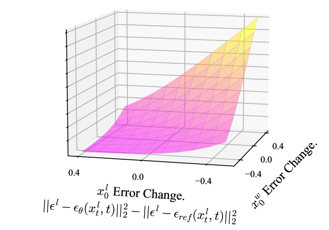
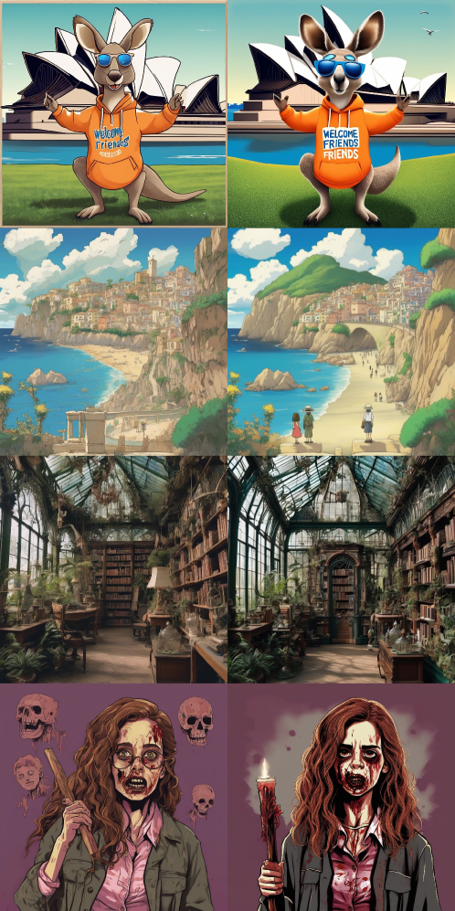

# Diffusion-DPO: Aligning Diffusion Models with Direct Preference Optimization

**Diffusion Model Alignment Using Direct Preference Optimization** (Wallace, Dang, Rafailov,
Zhou, Lou, Purushwalkam, Ermon, Xiong, Joty, Naik — arXiv **2311.12908**, CVPR **2024**)
takes **DPO**, a method invented for aligning *language* models to human preferences, and
ports it to *text-to-image diffusion* models.

The one-sentence idea: instead of training a separate reward model and then doing
reinforcement learning against it, **fine-tune the diffusion model directly on pairs of
images** — one that a human preferred, one they rejected — using a single supervised-looking
loss. The result is a model whose images humans like more: better aesthetics, better prompt
following, fewer deformed hands.

This note is written for someone who has seen diffusion models but has **never heard of DPO**.
So we build DPO from scratch (its language-model origin) and only then show the diffusion
twist. It assumes the diffusion basics from `ddpm_ddim_flow_score.md`; the recap box below is
all you need.

---

## Table of Contents

- [Recap: The One Diffusion Fact We Need](#recap-the-one-diffusion-fact-we-need)
- [Setup and Notation](#setup-and-notation)
- [What "Alignment" Means and Why Preference Pairs](#what-alignment-means-and-why-preference-pairs)
- [The Old Way: Reward Model + Reinforcement Learning](#the-old-way-reward-model--reinforcement-learning)
- [DPO for Language Models, From Scratch](#dpo-for-language-models-from-scratch)
- [The Obstacle in Porting DPO to Diffusion](#the-obstacle-in-porting-dpo-to-diffusion)
- [Diffusion-DPO: The Fix](#diffusion-dpo-the-fix)
- [Why This Is Nice](#why-this-is-nice)
- [Results and Practicalities](#results-and-practicalities)
- [Cheat-Sheet: PPO vs DPO vs Diffusion-DPO](#cheat-sheet-ppo-vs-dpo-vs-diffusion-dpo)
- [Sources](#sources)

---

## Recap: The One Diffusion Fact We Need

> **A diffusion model is trained to denoise.** Take a clean image $x_0$, pick a random
> timestep $t$, and corrupt it into $x_t = \sqrt{\bar\alpha_t}\,x_0 + \sqrt{1-\bar\alpha_t}\,\epsilon$
> (with $\epsilon \sim \mathcal{N}(0,I)$ the added noise and $\bar\alpha_t$ the cumulative
> signal-retention). A network $\epsilon_\theta(x_t, t, c)$ tries to guess the noise that was
> added, conditioned on the text prompt $c$. Training minimizes the **denoising loss**
> $$\big\| \epsilon - \epsilon_\theta(x_t, t, c) \big\|^2 .$$
> That squared error is the entire objective. *For the derivation, see `ddpm_ddim_flow_score.md`.*

Hold onto that loss — the whole Diffusion-DPO objective is going to be built out of it.

---

## Setup and Notation

| Symbol | Meaning |
|---|---|
| $c$ | The text prompt (the condition). |
| $x_0^w,\ x_0^l$ | A **winner** ("$w$") and **loser** ("$l$") image for the same prompt $c$ — the one a human preferred and the one they rejected. |
| $x_0$ | A clean image in general; $x_t$ its noised version at step $t$ (recap box). |
| $\pi_\theta$ | The **policy** — the model we are training, with parameters $\theta$. For an LLM it outputs text; for diffusion it generates an image. |
| $\pi_{\mathrm{ref}}$ | A frozen **reference** copy of the model (the pre-alignment starting point). It never trains; it is the anchor we measure change against. |
| $r(c, x)$ | A **reward**: a scalar saying how good output $x$ is for prompt $c$. |
| $\sigma(z)$ | The logistic sigmoid $\dfrac{1}{1+e^{-z}}$, squashing any real number into $(0,1)$ — read as a probability. |
| $\beta$ | A positive knob controlling how hard we hold the policy near the reference (the "KL strength"). |
| $\epsilon_\theta,\ \epsilon_{\mathrm{ref}}$ | Noise predictions from the trained policy and the frozen reference, respectively. |

---

## What "Alignment" Means and Why Preference Pairs

A base text-to-image model is trained to reproduce its training distribution — roughly, "make
images that look like the internet." That is *not* the same as "make images a human would
actually pick." People care about things the raw likelihood objective never optimized for:
composition, aesthetics, faithfully containing everything the prompt asked for, and not
producing horror-show anatomy. **Alignment** is the extra step that nudges the model toward
*human preference* rather than mere data-likelihood.

The trouble is that "how good is this image?" is hard to write down as a formula. So we don't.
Instead we ask humans a much easier question: **shown two images for the same prompt, which do
you prefer?** This gives **preference pairs** $(x_0^w, x_0^l)$ — winner and loser. Pairwise
comparison is used (rather than asking for a 1–10 score) because relative judgments are far
cheaper to collect and far more consistent across annotators: people disagree wildly on whether
an image is a "7," but usually agree on which of two images is better. The dataset **Pick-a-Pic**
is exactly this — hundreds of thousands of such human-voted pairs.

The whole game now is: **turn a pile of "$w$ beat $l$" votes into a training signal.**

---

## The Old Way: Reward Model + Reinforcement Learning

The established recipe for turning preferences into an aligned model is **RLHF**
(Reinforcement Learning from Human Feedback), done in two stages:

1. **Train a reward model** $r(c, x)$. Fit a network so that it scores winners higher than
   losers on the preference data. Now you have a stand-in for "human taste" that returns a
   number for any image.
2. **Reinforcement learning.** Let the generative model produce images, score them with the
   reward model, and use an RL algorithm (typically **PPO**) to push the model toward
   high-reward images — while a KL penalty keeps it from wandering too far from the original
   model and collapsing into a few reward-hacking tricks.

This works, but it is a genuine pain:

- **Two models, two training runs.** You must train and store the reward model *and* run RL.
- **RL is unstable and expensive.** PPO needs live sampling from the model inside the training
  loop, careful tuning, and it is fiddly to keep from diverging.
- **Reward hacking.** The policy learns to exploit blind spots of the imperfect reward model,
  producing images that score high but look wrong to humans.

The natural question DPO asks: *can we skip both the reward model and the RL, and optimize the
model directly on the preference pairs?* Surprisingly, yes.

---

## DPO for Language Models, From Scratch

This section is the crux — the part you were missing. **DPO** (Direct Preference Optimization;
Rafailov et al., 2023) was invented for LLMs. It rests on two ideas.

### Idea 1: Turn preferences into a probability (Bradley–Terry)

We need a mathematical model of "$w$ beat $l$." The classic choice is the **Bradley–Terry**
model: the probability that $w$ is preferred over $l$ depends only on the *difference* of their
rewards, passed through a sigmoid:

$$
P(x^w \succ x^l \mid c) = \sigma\big(r(c, x^w) - r(c, x^l)\big).
$$

{width=50%}

Read it: if the winner's reward is much higher than the loser's, the difference is large and
positive, $\sigma(\cdot) \to 1$ — "almost certainly $w$ wins." If the two rewards are equal, the
difference is $0$ and $\sigma(0) = 0.5$ — a coin flip. This is just a smooth, probabilistic way
of saying "higher reward should win more often." Given the preference data, the natural thing to
do is pick rewards that make the observed winners likely — i.e. minimize
$-\log \sigma\big(r(c,x^w) - r(c,x^l)\big)$.

### Idea 2: The reward is *hidden inside* the aligned model

RLHF's second stage solves this objective (informally): **maximize expected reward, but stay
close to the reference model**, with $\beta$ setting how strong that leash is:

$$
\max_{\pi_\theta}\ \ \mathbb{E}_{x \sim \pi_\theta}\big[\, r(c,x) \,\big] \;-\; \beta\, \mathrm{KL}\big(\pi_\theta \,\|\, \pi_{\mathrm{ref}}\big).
$$

**Why an *expectation*, and why *maximize* it?** Notice we quietly changed what is being
optimized. In the Bradley–Terry step we fit a *reward function* $r$ to fixed, given images.
Here $r$ is frozen (it is the learned reward model) and the thing we now train is the **policy
$\pi_\theta$ itself**. But $\pi_\theta$ is not a single image — it is a *distribution* over
images: feed it the same prompt $c$ twice and it samples different outputs, each with some
probability. So there is no single "reward of the model." The only sensible scalar summary of
"how good is this model?" is the **average reward of the images it actually tends to produce**,
and that average *is* the expectation:

$$
\mathbb{E}_{x \sim \pi_\theta}\big[\, r(c,x) \,\big] = \sum_x \pi_\theta(x \mid c)\, r(c,x).
$$

Read the sum: it weights each possible image's reward $r(c,x)$ by how likely the model is to
generate it, $\pi_\theta(x\mid c)$. An image with huge reward that the model *never* outputs
contributes nothing; an image it produces constantly dominates the average. And we **maximize**
this because $\theta$ controls exactly those weights $\pi_\theta(x\mid c)$: pushing the
expectation up means **shifting probability mass onto high-reward images and off low-reward
ones** — which is precisely "make the model prefer to generate images humans like." (We can't
just demand "output the single best image": a model *is* a distribution, so we tilt the whole
distribution toward good outputs.)

The first term pulls toward high reward; the second term, the **KL divergence** to the frozen
reference, is a penalty that grows as the policy drifts from where it started — this is what
stops it collapsing onto a handful of reward-hacked outputs. $\beta$ trades the two off: large
$\beta$ = stay timid and close to the reference, small $\beta$ = chase reward aggressively.

Here is the magic. This particular objective has a **known closed-form optimum**: the best
policy re-weights the reference by an exponential of the reward,
$\pi_\theta^\star(x) \propto \pi_{\mathrm{ref}}(x)\, e^{\,r(c,x)/\beta}$. We never actually build
that policy — but we can *rearrange it to solve for the reward*:

$$
r(c, x) = \beta \, \log \frac{\pi_\theta(x \mid c)}{\pi_{\mathrm{ref}}(x \mid c)} \;+\; \beta \log Z(c).
$$

Unpack it. The reward of any output is (up to an additive term that depends only on the prompt,
not on $x$) just **$\beta$ times the log-ratio of how much more likely the aligned model makes
that output versus the reference.** Intuition: after alignment, outputs the model *learned to
favor over the reference* are exactly the high-reward ones. The clumsy $\log Z(c)$ term is a
normalizer that is the same for the winner and the loser of a pair — so it will cancel in the
next step and we can ignore it.

### Putting them together: the reward model disappears

Substitute that expression for $r$ into the Bradley–Terry loss. The winner and loser share the
same prompt, so their $\beta\log Z(c)$ terms are identical and **cancel** in the difference. What
survives is a loss written **entirely in terms of the model's own likelihoods** — no reward model
anywhere:

$$
\mathcal{L}_{\mathrm{DPO}} = -\,\log \sigma\!\left( \beta \log \frac{\pi_\theta(x^w \mid c)}{\pi_{\mathrm{ref}}(x^w \mid c)} \;-\; \beta \log \frac{\pi_\theta(x^l \mid c)}{\pi_{\mathrm{ref}}(x^l \mid c)} \right).
$$

Read what training on this does. Inside the sigmoid we have (winner's log-ratio) minus (loser's
log-ratio). To drive the loss down, the model must make this quantity **large and positive**,
which means: **raise the likelihood of the winner relative to the reference, and lower the
likelihood of the loser relative to the reference.** That is the entire method — a plain,
stable, supervised-style loss over preference pairs. No reward model, no RL rollouts.

**What is the frozen $\pi_{\mathrm{ref}}$ actually doing — is it really a leash?** It is
tempting to say $\pi_{\mathrm{ref}}$ in the denominators reproduces the old KL leash. Be careful
here, because the loss depends *only on the difference* of the two log-ratios — call it
$u = \log\frac{\pi_\theta(x^w)}{\pi_{\mathrm{ref}}(x^w)} - \log\frac{\pi_\theta(x^l)}{\pi_{\mathrm{ref}}(x^l)}$
— and it is minimized by making $u$ as large as possible. **Nothing in the loss says "keep the
winner's probability near its reference value."** So it does *not* pull the model back toward the
reference rates; you could, in principle, satisfy the loss while driving the winner far above and
the loser far below wherever the reference started. (This is a real, documented DPO failure mode:
because only the *difference* is pinned, the winner's absolute probability can even drift
*downward* during training, as long as the loser drops faster.) The reference is a **zero-point,
not a spring.**

So where is the leash? It is **soft**, and it lives in two places:

- **The reference is what makes "reward" mean anything.** Strip $\pi_{\mathrm{ref}}$ out and you
  are left with "winner up, loser down" and no scale — the reward is *defined* as movement
  relative to the reference. That is why it sits in the denominator, not because it exerts a
  restoring force.
- **$\beta$ sets how far you must move before the push dies.** The loss is $-\log\sigma(\beta u)$,
  whose gradient vanishes once $\beta u$ is comfortably positive. For **large $\beta$**, even a
  *small* $u$ already flattens the loss, so training stops early and the policy settles close to
  the reference. For **small $\beta$**, you need a large $u$ to satisfy the loss, so the policy
  moves far. $\beta$ throttles the leash — but by *removing the incentive to keep moving* once a
  modest relative margin is reached, not by hauling the model back.

The clean theoretical statement "DPO is equivalent to KL-constrained RLHF" holds at the *global
optimum with idealized, fully-covering data*. In practice — finite preference pairs, many
gradient steps, small $\beta$ — the constraint is implicit and genuinely looser than PPO's
explicit KL penalty, and DPO **can** over-optimize and drift from the reference. So the
reward-hacking worry is not paranoia; it is why $\beta$ and early stopping matter.

---

## The Obstacle in Porting DPO to Diffusion

The DPO loss above needs one thing for each output: the model's likelihood
$\pi_\theta(x_0 \mid c)$ — the probability the model assigns to producing *that whole output*.
The trouble is that this number is trivial to get for a language model and effectively
impossible for a diffusion model. Let us see exactly why.

**Why it is easy for a language model.** An autoregressive LLM *defines* the probability of a
sequence $y = (y_1, \dots, y_N)$ by the chain rule of probability, one token at a time:

$$
\pi_\theta(y \mid c) \;=\; \prod_{n=1}^{N} p_\theta\big(y_n \mid y_{<n},\, c\big),
\qquad\Longrightarrow\qquad
\log \pi_\theta(y \mid c) \;=\; \sum_{n=1}^{N} \log p_\theta\big(y_n \mid y_{<n},\, c\big).
$$

Read it: the probability of the whole sentence is the product of the probabilities of each token
given the ones before it, and each factor $p_\theta(y_n \mid y_{<n}, c)$ is a **softmax over the
vocabulary** — a number the network reads off directly. There is nothing hidden to integrate
over: the intermediate objects (the earlier tokens $y_{<n}$) are the *observed* output itself, so
one forward pass over the sequence hands you every factor and hence the exact log-likelihood.

**Why it is a wall for a diffusion model.** A diffusion model does *not* define $x_0$ by a finite
product of readable factors. It defines it as the endpoint of a long **latent-variable** chain:
to produce the clean image $x_0$ it starts from noise $x_T$ and passes through a whole trajectory
of intermediate noisy images $x_T \to x_{T-1} \to \cdots \to x_0$, and only $x_0$ is ever
observed — the $T$ in-between images $x_{1:T} = (x_1, \dots, x_T)$ are hidden. To get the
probability of the observed $x_0$ *alone*, you must sum over every hidden path that could have
produced it, i.e. **marginalize** out those latents:

$$
\pi_\theta(x_0 \mid c) \;=\; \int \pi_\theta(x_{0:T} \mid c)\, dx_{1:T}
\;=\; \int p(x_T)\prod_{t=1}^{T} p_\theta\big(x_{t-1} \mid x_t,\, c\big)\, dx_{1:T}.
$$

This is the object that is **intractable**, and it is worth being precise about *why*:

- It is a **single integral over an enormous space** — all $T \approx 1000$ intermediate images
  at once, each of the same dimension as the image (hundreds of thousands of pixels/latents). It
  is not a finite product you can read off; it is a high-dimensional integral with no closed
  form (the product of Gaussians inside, once integrated over the path, does not simplify to
  anything you can write down).
- You **cannot even estimate it cheaply**. A naive Monte-Carlo estimate — sample some noise
  paths and average — has astronomically high variance, because almost every random path lands
  nowhere near the specific $x_0$ you are asking about, so essentially all samples contribute ≈0.

Notice the contrast is exactly the presence of hidden variables: the LLM's "intermediate steps"
*are* the observed tokens (nothing to integrate), whereas the diffusion model's intermediate
steps are unobserved and must be integrated away.

**All we ever have is a lower bound — the ELBO.** Because the marginal is out of reach, diffusion
training never maximizes $\log \pi_\theta(x_0 \mid c)$ directly. It maximizes the **ELBO**
(Evidence Lower BOund), a computable quantity guaranteed to sit *below* it,
$\text{ELBO} \le \log \pi_\theta(x_0 \mid c)$, so pushing the ELBO up drags the true log-likelihood
up with it. The ELBO is computable precisely because it is written with the *known* forward
process and the *tractable* posterior instead of the intractable marginal, and it breaks into a
**sum of per-timestep denoising terms** — the very squared error $\|\epsilon - \epsilon_\theta(x_t,t,c)\|^2$
from the recap box. *(For the ELBO and how it collapses to that per-step regression, see
`ddpm_ddim_flow_score.md`, §1.5.)*

There is a second, subtler mismatch on top of the intractability: humans express a preference on
the **final image** $x_0$, but the only quantities we *can* compute live at the level of
**individual denoising steps** along the trajectory (that per-step ELBO sum). So we cannot just
plug a diffusion likelihood into the DPO loss — there is no such number to plug in. We must move
the whole argument down to the step level, which is exactly what Diffusion-DPO does next.

---

## Diffusion-DPO: The Fix

The paper's move is to run DPO not on the (intractable) image likelihood but on the **entire
reverse diffusion path**, and then bound it back down to something computable. Three steps, at a
high level:

1. **Define preferences over trajectories.** Treat the whole reverse chain $x_{0:T}$ (the path,
   not just the endpoint) as the thing the policy "generates," and write the DPO log-ratios in
   terms of the path likelihoods.
2. **Replace the intractable likelihood by its ELBO.** Since we can't compute the path
   likelihood but can bound it, substitute the ELBO — the same per-step denoising terms diffusion
   already uses.
3. **Push the expectation over steps outside via Jensen's inequality.** This lets us approximate
   the trajectory objective by *sampling a single timestep $t$* per image (exactly as ordinary
   diffusion training does), keeping it cheap.

The reasoning has several lines of algebra; the payoff is that every "$\log \pi$" in the DPO loss
turns into a **denoising squared-error**, and the final training objective is:

$$
\mathcal{L} = -\,\log \sigma\!\Big( -\beta T \big[ \big(\|\epsilon^w - \epsilon_\theta^w\|^2 - \|\epsilon^w - \epsilon_{\mathrm{ref}}^w\|^2\big) - \big(\|\epsilon^l - \epsilon_\theta^l\|^2 - \|\epsilon^l - \epsilon_{\mathrm{ref}}^l\|^2\big) \big] \Big).
$$

Here $\epsilon^w, \epsilon^l$ are the true noises added to the winner and loser images at a shared
sampled timestep $t$; $\epsilon_\theta$ is the trainable model's noise prediction and
$\epsilon_{\mathrm{ref}}$ the frozen reference's; and $T$ is the number of diffusion steps (it
just rescales the $\beta$ leash). *Details of the derivation are in the paper, §3.*

**How to run one training step (very concrete):**

1. Take a preference pair $(x_0^w, x_0^l)$ for prompt $c$.
2. Sample **one** timestep $t$ and noise, and corrupt *both* images to $x_t^w$ and $x_t^l$.
3. Run four denoising predictions: the trainable model and the frozen reference, each on the
   winner and the loser.
4. Form the four squared errors and plug into the loss.

**What the loss actually asks for — read it in plain English.** Each bracket like
$\|\epsilon^w - \epsilon_\theta^w\|^2 - \|\epsilon^w - \epsilon_{\mathrm{ref}}^w\|^2$ compares
*how well the trainable model denoises this image versus how well the frozen reference does.* If
the trainable model's error is **lower** than the reference's, that bracket is negative — "I got
better than the anchor at this image." The loss wants the model to become **better than the
reference at denoising winners** and (relatively) **worse — or at least not more eager — at
denoising losers.** Since "better at denoising an image" is essentially "more likely to generate
that image," this is the diffusion translation of DPO's "raise winner likelihood, lower loser
likelihood, relative to the reference." The reference terms are the anchor that stops the model
from collapsing — exactly the role $\pi_{\mathrm{ref}}$ played for LLMs.

### The Role of β, Seen on the Loss Surface

We have met $\beta$ twice already — as the KL-leash strength for LLMs, and as the factor $\beta T$
that scales the diffusion loss. It is the single most important hyperparameter in DPO, so it earns
its own picture. The paper visualizes the loss as a **surface** over two axes, and those two axes
are exactly the two brackets from the loss above:

- **$x_0^w$ error change** $= \|\epsilon^w - \epsilon_\theta^w\|^2 - \|\epsilon^w - \epsilon_{\mathrm{ref}}^w\|^2$ — how much *worse* (positive) or *better* (negative) than the reference the model denoises the **winner**.
- **$x_0^l$ error change** $= \|\epsilon^l - \epsilon_\theta^l\|^2 - \|\epsilon^l - \epsilon_{\mathrm{ref}}^l\|^2$ — the same quantity for the **loser**.

The height of the surface is the loss.

*Figure 2 from "Diffusion Model Alignment Using Direct Preference Optimization" (Wallace et al.,
arXiv:2311.12908). Reproduced for educational purposes.*

**Reading the surface.** The loss is **low** (magenta valley) in the corner where the winner's
error *decreases* while the loser's error *increases* — i.e. exactly "get better at the winner,
worse at the loser." It is **high** (yellow) in the opposite corner. So gradient descent slides
the model toward the valley: improve on $x_0^w$, degrade on $x_0^l$, both measured against the
reference. This is the same message as the plain-English reading above, now drawn as geometry.

**What $\beta$ does to the surface — curvature.** Recall the loss is $-\log\sigma(\beta \cdot [\text{winner bracket} - \text{loser bracket}])$.
The $\beta$ sits *inside* the sigmoid, multiplying the error-change difference. Geometrically that
makes it a **curvature knob**:

- **Large $\beta$** — the surface is sharply curved. A small change in denoising error produces a
  large swing in loss, so the gradient saturates almost immediately: once the model has moved the
  winner/loser errors apart by a little, $\sigma(\beta \cdot \Delta) \to 1$, the loss flattens, and
  training stops pushing. The model is held **tightly near the reference** — this is the strong
  KL leash. Too large and the model barely moves and learns nothing.
- **Small $\beta$** — the surface is nearly flat, so the loss keeps rewarding *further* separation
  of winner and loser errors long after a modest margin is reached. The model is free to drift far
  from the reference, chasing the preference signal hard. Too small and it over-optimizes — the
  reward-hacking / drift regime we discussed, where image quality can actually degrade.

So $\beta$ is the dial between "stay faithful to the base model" (large) and "aggressively chase
preferences" (small), and the loss surface is the clean way to see it: **$\beta$ sets how steeply
the valley drops, hence how far the model is willing to travel before the gradient dies.** In the
paper, $\beta$ around $2000$–$5000$ works for SDXL — large, because $\beta$ is multiplied by the
big factor $T$ inside the sigmoid.

---

## Why This Is Nice

- **No reward model.** The preference signal is baked directly into the loss, just like in LLM
  DPO.
- **No reinforcement learning, no rollouts.** There is no PPO loop and no need to sample full
  images from the model during training. Every step is the familiar "noise an image, predict the
  noise" — you have simply added a frozen reference and a preference comparison on top.
- **It reuses the denoising objective you already have.** The whole loss is built out of the
  standard squared-error denoising term, so it drops into an existing diffusion training pipeline
  with minimal surgery.
- **Stable.** Being a supervised-style loss rather than RL, it trains far more predictably, and
  the frozen reference prevents the model from drifting into degenerate reward-hacked images.

---

## Results and Practicalities

The paper fine-tunes **Stable Diffusion 1.5** and **SDXL-1.0** on the **Pick-a-Pic** human
preference dataset. Across human evaluation, the DPO-aligned models are **preferred over their
base versions** on both **visual appeal** and **prompt alignment**, and the aligned SDXL is
competitive with much heavier pipelines — all from a single, stable fine-tuning objective with no
reward model or RL.

The effect is visible at a glance: in each pair below, the left image is the **base** model and
the right is the **Diffusion-DPO** model for the *same* prompt and seed. The aligned outputs are
consistently more detailed, better composed, and more faithful to the prompt.

*Qualitative comparisons from "Diffusion Model Alignment Using Direct Preference Optimization"
(Wallace et al., arXiv:2311.12908). Reproduced for educational purposes.*

Two practical notes:

- **$\beta$ is the main knob to tune** (see [The Role of β](#the-role-of-β-seen-on-the-loss-surface)).
  Too large and the model barely moves; too small and it drifts and degrades. The paper uses
  $\beta \approx 2000$–$5000$ for SDXL.
- **The reference is a frozen copy of the base model**, so you pay for a second forward pass at
  training time (to get $\epsilon_{\mathrm{ref}}$), but nothing at inference — the aligned model
  samples exactly like any ordinary diffusion model.

---

## Cheat-Sheet: PPO vs DPO vs Diffusion-DPO

| | RLHF (PPO) | DPO (LLM) | Diffusion-DPO |
|---|---|---|---|
| Needs a separate reward model? | **Yes** | No | No |
| Needs RL rollouts / online sampling? | **Yes** | No | No |
| What the loss compares | policy reward vs. KL leash | winner vs. loser **log-likelihood** ratios (vs. reference) | winner vs. loser **denoising errors** (vs. reference) |
| Anchor that prevents collapse | explicit KL penalty | frozen $\pi_{\mathrm{ref}}$ in denominators | frozen $\epsilon_{\mathrm{ref}}$ terms |
| Training stability | fiddly | stable | stable |

The through-line: **DPO shows the reward model is unnecessary because the reward is implicitly
encoded in the aligned model's likelihood ratio; Diffusion-DPO carries that same trick down to
the per-step denoising loss so it works when the likelihood itself is intractable.**

---

## Sources

- **Diffusion Model Alignment Using Direct Preference Optimization.** Bram Wallace, Meihua Dang,
  Rafael Rafailov, Linqi Zhou, Aaron Lou, Senthil Purushwalkam, Stefano Ermon, Caiming Xiong,
  Shafiq Joty, Nikhil Naik. arXiv:2311.12908 (Nov. 2023), CVPR 2024.
- **Direct Preference Optimization: Your Language Model is Secretly a Reward Model.** Rafael
  Rafailov et al., NeurIPS 2023 — the original (LLM) DPO paper, source of the derivation in
  [DPO for Language Models](#dpo-for-language-models-from-scratch).
- Companion notes in this repo: `ddpm_ddim_flow_score.md` (diffusion + denoising loss),
  `classifier-guidance-diffusion.md` and `classifier-free-guidance.md` (conditioning/guidance).
