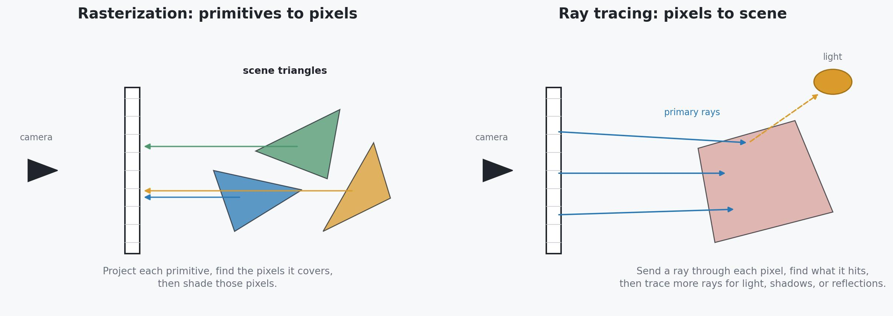
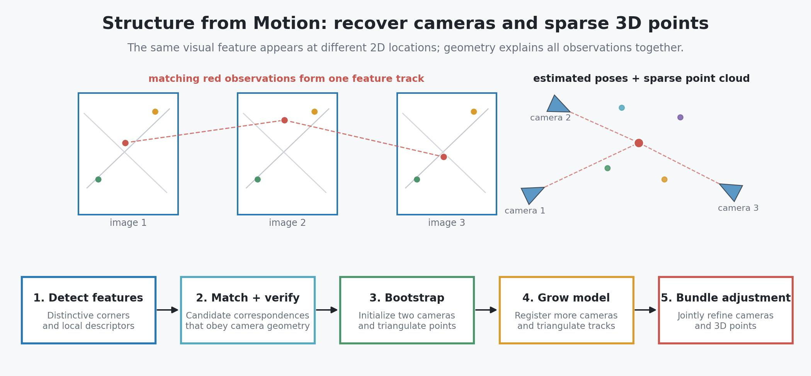
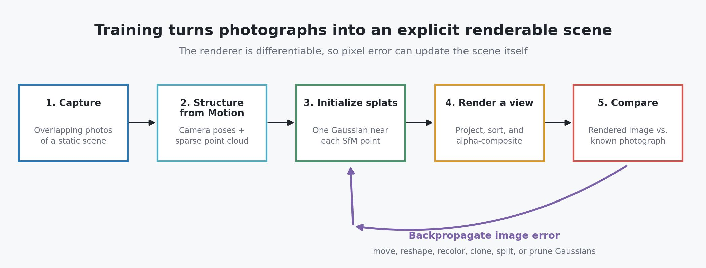
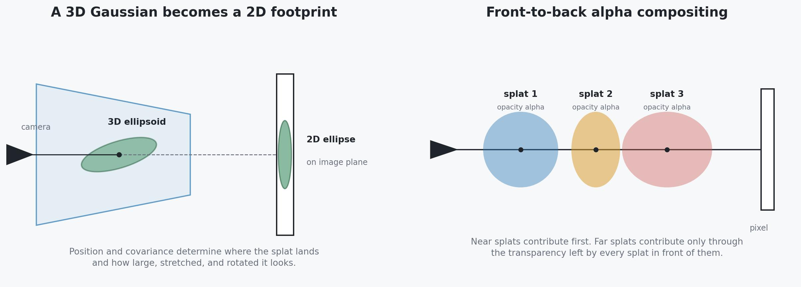

# 3D Gaussian Splatting: Turning Photographs into Real-Time 3D Scenes

3D Gaussian Splatting (3DGS) is a way to reconstruct the **appearance of a real scene** from many photographs and then render that scene from new viewpoints in real time. Instead of rebuilding the world as a clean mesh of triangles, it represents the scene using millions of soft, colored, partly transparent ellipsoids called **3D Gaussians**. To draw an image, it projects those ellipsoids onto the screen and blends their 2D footprints.

The surprising result is that a loose cloud of soft primitives can reproduce fine foliage, reflections, thin structures, and complex backgrounds extremely well. The original 2023 paper combined this representation with a fast differentiable renderer and an adaptive optimization procedure. It reached the visual quality associated with neural radiance fields (NeRFs), while training much faster and rendering high-resolution views at interactive frame rates.

That combination explains most of its popularity:

- **photorealistic novel views**, without manually constructing geometry and textures;
- **fast training**, commonly measured in minutes rather than many hours for the original NeRF methods;
- **real-time rendering**, because the final scene is explicit and rasterized rather than repeatedly queried through a neural network;
- **an open implementation**, released with code, scenes, and viewers at the moment the idea appeared;
- **a hackable representation**, where researchers can move, remove, compress, animate, or attach information to individual splats.

But a Gaussian splat is primarily an **appearance representation**, not automatically a clean geometric model or a physical simulation of the world. It can look like a room without knowing that the wall is solid, that a chair should cast a new shadow, or that an object can be picked up. Keeping this distinction in mind prevents most confusion about what 3DGS does well.

---

## Table of Contents

- [Background](#background)
  - [Rasterization vs. ray tracing](#rasterization-vs-ray-tracing)
  - [Structure from Motion and COLMAP](#structure-from-motion-and-colmap)
- [The problem: render viewpoints that were never photographed](#the-problem-render-viewpoints-that-were-never-photographed)
- [Three ways to represent a scene](#three-ways-to-represent-a-scene)
- [What exactly is a 3D Gaussian?](#what-exactly-is-a-3d-gaussian)
- [The complete reconstruction pipeline](#the-complete-reconstruction-pipeline)
- [How a Gaussian is rendered](#how-a-gaussian-is-rendered)
- [How the scene learns from photographs](#how-the-scene-learns-from-photographs)
- [Why Gaussians work so well](#why-gaussians-work-so-well)
- [Why Gaussian splatting became so popular](#why-gaussian-splatting-became-so-popular)
- [How it helps render larger parts of the world](#how-it-helps-render-larger-parts-of-the-world)
- [What Gaussian splatting is not good at](#what-gaussian-splatting-is-not-good-at)
- [Important follow-up ideas](#important-follow-up-ideas)
- [A compact mental model](#a-compact-mental-model)
- [Sources](#sources)

---

## Background

Two older ideas sit underneath 3D Gaussian Splatting. The first is **rendering**: how a known 3D scene becomes a 2D image. The second is **Structure from Motion**: how overlapping 2D photographs can reveal camera positions and some 3D structure. 3DGS uses the first idea to draw its Gaussians and the second to initialize them in the right part of space.

### Rasterization vs. ray tracing

Both rasterization and ray tracing answer the same question: given a 3D scene and a camera, what color should each pixel have? The main difference is the direction in which they organize the work.

{ width=100% }

*Rasterization is primitive-driven: ask which pixels each primitive covers. Ray tracing is pixel-driven: ask what each pixel's ray encounters. Modern renderers often combine them. Original diagram, based on the pipeline descriptions in the Khronos OpenGL overview and NVIDIA's Ray Tracing Essentials.*

#### Rasterization: project the scene onto the image

Rasterization starts from geometric primitives, usually triangles:

1. Transform each triangle's vertices from world coordinates into the camera's coordinate system.
2. Project the triangle onto the 2D image plane.
3. Find which pixels lie inside its projected footprint.
4. Use a depth buffer to keep the nearest visible surface and run a shader to calculate its color.

The key advantage is coherence: one projected triangle usually covers a block of nearby pixels, so GPUs can process those pixels efficiently in parallel. This is why rasterization became the foundation of real-time graphics.

Rasterization does not naturally follow light as it bounces around the scene. Shadows, reflections, and indirect lighting are commonly approximated with extra techniques such as shadow maps, reflection maps, screen-space effects, or precomputed lighting. These approximations can be excellent, but each effect needs its own machinery.

#### Ray tracing: search the scene from each pixel

Ray tracing starts at the camera. For each pixel, it sends a **primary ray** through that pixel and finds the closest surface the ray intersects. Once it finds the surface, it can send more rays:

- a shadow ray toward a light to check whether something blocks it;
- a reflection ray in the mirror direction;
- a refraction ray through glass;
- additional sampled rays to estimate indirect illumination.

This makes visibility, shadows, and reflections conceptually direct: follow the geometric paths that light could take. The cost is intersection search. Every ray must be tested against a large scene, and realistic lighting may require many secondary rays per pixel. Spatial acceleration structures and dedicated hardware make this much faster, but it is still generally more expensive than ordinary rasterization.

**Path tracing** is a form of ray tracing that randomly samples complete light paths, including multiple bounces. With enough samples it can reproduce complex global illumination, but a small number of samples creates noise. Offline film renderers can spend many samples per pixel; real-time systems often use fewer samples plus denoising and a hybrid rasterization pipeline.

| Question | Rasterization | Ray tracing |
| --- | --- | --- |
| Where does work begin? | Scene primitives | Image pixels or camera rays |
| Main operation | Project a primitive and find covered pixels | Intersect a ray with the scene |
| Major strength | Very fast, coherent real-time rendering | Natural visibility, shadows, reflections, and light transport |
| Major difficulty | Complex lighting needs additional approximations | Many ray-scene intersection queries are expensive |
| Common use | Games and interactive applications | Film rendering, high-quality lighting, and hybrid real-time effects |

#### Where do NeRF and 3DGS fit?

3DGS is **rasterization-like**. It starts from explicit Gaussians, projects each one into a 2D footprint, finds the image tiles and pixels it overlaps, and blends those pixels. The original implementation performs this work in custom CUDA rather than sending triangles through the GPU's fixed-function rasterizer, but the direction of work is still primitive-to-pixel.

A basic NeRF is **ray-based**, but it is not ordinary surface ray tracing. It samples many locations along each camera ray and blends their predicted densities and colors using volume rendering. This is usually called **ray marching**. The basic NeRF renderer does not find one triangle intersection and then trace reflected or shadow rays. Keeping these terms separate makes the 3DGS-NeRF speed comparison easier to understand.

### Structure from Motion and COLMAP

Structure from Motion (SfM) solves an inverse problem. Rendering starts with known cameras and 3D structure and produces images. SfM starts with overlapping images and tries to recover the cameras and 3D structure that could have produced them.

The word **motion** refers to camera motion across the photographs, not necessarily to moving objects. In fact, classical SfM works best when the scene itself remains still and only the camera moves.

{ width=100% }

*A feature seen in several images forms a track. SfM finds camera poses and a 3D point whose projections explain that track, then repeats this across many features. COLMAP packages these steps into a robust incremental pipeline. Original diagram, following the official COLMAP tutorial and Schoenberger and Frahm's incremental SfM system.*

#### The basic SfM idea

Suppose the corner of a window appears in three photographs. Its pixel coordinate differs in every image because the camera moved. If we knew the three camera poses, we could cast a ray from each camera through its observed pixel; the rays would meet near the window corner. This is **triangulation**.

But initially we know neither the 3D corner nor the camera poses. SfM solves them together by finding many repeated visual features and searching for one geometric explanation that is consistent across the images.

An incremental SfM pipeline usually follows five stages:

1. **Detect and describe features.** Find distinctive local patterns such as corners and attach a descriptor that summarizes the surrounding image patch. The descriptor helps recognize the same feature after changes in viewpoint, scale, or brightness.
2. **Match and geometrically verify them.** Find similar descriptors across image pairs, then reject matches that cannot be explained by one plausible camera-to-camera motion. This second check prevents visually similar but unrelated patches from corrupting the geometry.
3. **Bootstrap from a good image pair.** Estimate the relative motion of two cameras and triangulate an initial set of 3D points.
4. **Grow the reconstruction.** Register another image by matching its 2D features to existing 3D points, triangulate new feature tracks, and repeat.
5. **Run bundle adjustment.** Jointly refine camera parameters and 3D point locations so that projecting every point back into its images lands as close as possible to the measured feature coordinates. This projection mismatch is called **reprojection error**.

The result contains two kinds of camera parameters:

- **Intrinsics** describe the camera itself, including focal length, principal point, and lens-distortion parameters.
- **Extrinsics**, also called the camera pose, describe where the camera was and which direction it faced.

The reconstructed points are called **sparse** because they exist only at reliably matched visual features. They are not a complete surface. For 3DGS that is enough: the points provide initial locations and colors, and Gaussian optimization later fills the visual gaps.

#### What is COLMAP?

**COLMAP** is a free, open-source system that implements both Structure from Motion and optional Multi-View Stereo. It provides graphical and command-line interfaces and is widely used as the camera-calibration front end for NeRF and 3DGS pipelines.

For a standard 3DGS workflow, COLMAP typically supplies:

- calibrated camera intrinsics;
- one pose for each successfully registered photograph;
- a sparse colored point cloud;
- the visibility relationship between images and 3D points.

COLMAP can continue into **Multi-View Stereo (MVS)**, which estimates dense depth maps and fuses them into a dense point cloud or mesh. Basic 3DGS training normally does **not** need this dense stage. It consumes the sparse SfM result and learns its own dense collection of Gaussians.

SfM can fail before 3DGS training even begins. Common causes are motion blur, too little overlap, large textureless walls, repeated patterns such as identical windows, strong object motion, or drastic exposure changes. A good capture therefore moves around the scene gradually, keeps neighboring views overlapping, and records each surface from several angles.

---

## The problem: render viewpoints that were never photographed

Suppose we walk around a garden and take 150 overlapping photographs. Each photograph shows only one 2D projection of the garden. We would like to move a virtual camera to a position between the real cameras and ask: **what should the garden look like from here?** Producing such an unseen image is called **novel-view synthesis**.

This is not ordinary image interpolation. If the virtual camera moves sideways, nearby leaves must move across the image faster than distant buildings; previously hidden surfaces may become visible; shiny objects may change color with the viewing direction. The system therefore needs some internally consistent representation of 3D position, visibility, and appearance.

Traditional computer graphics solves this by constructing triangle meshes, materials, lights, and textures. That representation is excellent when artists need to edit, animate, relight, and simulate the scene. But automatically recovering clean meshes and materials from photographs is difficult, especially for hair, grass, glass, reflections, and thin structures.

Radiance-field methods take a different goal: instead of recovering every physical cause, learn enough about **what light leaves each part of the scene in each direction** to reproduce the photographs. A radiance field is therefore closer to a view-producing model of a scene than to a conventional CAD model. Both NeRF and 3DGS belong to this broad family, but they store the field differently.

## Three ways to represent a scene

{ width=100% }

*Three useful mental models. A mesh explicitly says where surfaces are. A NeRF hides the scene inside a neural function. 3DGS explicitly stores soft local primitives, but those primitives mainly encode captured appearance rather than clean surface topology. Original diagram.*

### Triangle meshes

A mesh stores a surface as vertices connected into triangles. A renderer projects the triangles onto the screen, determines which ones are visible, and shades them using materials and lights. Meshes give us topology, collision surfaces, animation rigs, and a mature editing pipeline.

The difficult part is reconstruction. A photograph tells us the final pixel color, but not how to separate geometry, material, illumination, reflection, and transparency. Photogrammetry can produce strong meshes for textured, opaque objects, but irregular materials and fine geometry remain hard.

### Neural radiance fields

A NeRF stores the scene implicitly in a neural network. Given a 3D position and a viewing direction, the network predicts density and color. To render one pixel, it samples many positions along that pixel's camera ray, queries the network at those positions, and volume-renders the results.

This representation was a breakthrough in view synthesis because it could fit complex scene appearance directly from images. Its original weakness was speed: rendering an image required a large number of neural-network evaluations, including many samples in empty space. Later methods made NeRFs dramatically faster, but this cost created room for a more graphics-like representation.

### 3D Gaussian splats

3DGS stores the scene explicitly as a collection of soft ellipsoids. Every Gaussian has a position, shape, orientation, opacity, and color parameters. Rendering does not ask a network what exists at thousands of points along every ray. It projects the Gaussians that already exist, sorts them by depth, and blends them.

This is the important middle ground:

- Like a mesh or point cloud, the scene is **explicit**: its primitives have stored locations and attributes.
- Like a radiance field, it can represent **soft density and view-dependent appearance**, rather than requiring one perfectly reconstructed surface.
- Unlike the original NeRF, its normal rendering path does **not require a neural network**. Training uses gradient descent, but the learned scene itself is a set of numbers attached to Gaussians.

## What exactly is a 3D Gaussian?

Start with the informal picture: a Gaussian is a soft blob whose influence is strongest at its center and fades smoothly with distance. In three dimensions, stretching and rotating the blob turns it into an ellipsoid. Millions of these overlapping ellipsoids can collectively approximate a complicated scene.

### Setup and notation

For Gaussian $i$:

| Symbol | Meaning |
| --- | --- |
| $\boldsymbol{\mu}_i$ | Its 3D center, a point with world coordinates $(x,y,z)$. |
| $\boldsymbol{\Sigma}_i$ | Its $3\times3$ covariance matrix, which describes its size, elongation, and orientation. |
| $o_i$ | Its learned opacity parameter, controlling how strongly it blocks and contributes light. |
| $\mathbf{c}_i(\mathbf{d})$ | Its RGB color when viewed along direction $\mathbf{d}$. The direction-dependent part is stored using spherical harmonics. |
| $\mathbf{x}$ | Any 3D location at which we evaluate the Gaussian. |
| $G_i(\mathbf{x})$ | The Gaussian's unnormalized influence at $\mathbf{x}$. It equals 1 at the center and fades toward 0 away from it. |

The influence is

$$
G_i(\mathbf{x}) = \exp\left(-\frac{1}{2}(\mathbf{x}-\boldsymbol{\mu}_i)^T
\boldsymbol{\Sigma}_i^{-1}(\mathbf{x}-\boldsymbol{\mu}_i)\right).
$$

The displacement $(\mathbf{x}-\boldsymbol{\mu}_i)$ says how far $\mathbf{x}$ is from the center. The inverse covariance $\boldsymbol{\Sigma}_i^{-1}$ measures that displacement using the Gaussian's own stretched and rotated coordinate system. The exponential turns the resulting squared distance into a smooth falloff. We omit the probability-distribution normalization constant because 3DGS uses the Gaussian as a rendering primitive, not as a probability density that must integrate to 1.

The word **covariance** comes from probability, but here its visual meaning matters more than its statistical meaning. The implementation constructs it from a learned rotation matrix $\mathbf{R}_i$ and three positive scales $s_{i,x},s_{i,y},s_{i,z}$:

$$
\boldsymbol{\Sigma}_i = \mathbf{R}_i
\begin{bmatrix}
s_{i,x}^2 & 0 & 0 \\
0 & s_{i,y}^2 & 0 \\
0 & 0 & s_{i,z}^2
\end{bmatrix}
\mathbf{R}_i^T.
$$

The three scales determine how wide the ellipsoid is along its local axes. The rotation $\mathbf{R}_i$ points those axes in the right world-space directions. Squaring the scales and building the covariance this way guarantees a valid non-negative shape during optimization. This is easier and safer than asking gradient descent to directly learn nine arbitrary covariance entries.

### Why not use spheres or ordinary points?

An ordinary point has no area, so a finite point cloud develops holes when viewed up close. A sphere has area but wastes primitives on surfaces: a wall is thin in one direction and broad in the other two. An **anisotropic** Gaussian can flatten into a small disk along the wall or stretch along a blade of grass. It spends representational capacity in the directions where the scene actually needs it.

### Why can the color depend on viewing direction?

A matte wall looks almost the same from different directions, but polished metal and other shiny surfaces do not. 3DGS stores each Gaussian's direction-dependent color using **spherical harmonics**, a small set of smooth basis functions defined over viewing directions. Their coefficients let one splat change color gradually as the camera moves.

This does not recover a true material or a light source. It records a compact approximation of how that local region looked from the training cameras. That is why view-dependent effects can look convincing while arbitrary relighting remains difficult.

## The complete reconstruction pipeline

{ width=100% }

*The reconstruction loop. The photographs provide both the target pixels and, through Structure from Motion, the initial camera geometry. The differentiable renderer connects image error back to every Gaussian parameter. Original diagram.*

### Step 1: capture overlapping photographs

The input is a set of photographs or video frames of a mostly static scene. Adjacent images need substantial overlap so that the same visual features appear in multiple views. Sharp images, broad viewpoint coverage, stable exposure, and limited object motion all help.

Why multiple views? One image cannot tell whether a colored patch belongs to a small nearby object or a large distant object. Seeing the patch move relative to the background from several cameras supplies parallax, which constrains depth.

### Step 2: estimate cameras with Structure from Motion

Before learning the Gaussians, the standard pipeline runs **Structure from Motion (SfM)**, commonly using COLMAP. SfM matches visual features across photographs and jointly estimates:

- the position and orientation of every camera;
- camera intrinsics such as focal length;
- a sparse 3D point cloud formed by triangulating matched features.

The camera estimates are essential supervision. During training, the renderer must know exactly where a photograph was taken so it can render the current scene from the same viewpoint and compare corresponding pixels.

### Step 3: initialize Gaussians from the sparse points

The original method places initial Gaussians around the SfM points. Their initial colors come from the observed point colors, while their initial scales reflect distances to nearby points.

Why not initialize Gaussians everywhere in a dense 3D grid? Most of the world volume is empty air. Starting near observed surfaces avoids spending memory and computation on empty space, and gives optimization a plausible geometric starting point.

### Step 4: render one known camera view

The current Gaussians are projected into one of the training cameras. Each 3D ellipsoid becomes an elliptical footprint on the 2D image. The renderer sorts relevant splats by depth and blends their colors from front to back.

The rendered image will initially be rough because the sparse SfM points do not cover every visible detail. The next steps improve it.

### Step 5: compare with the real photograph

Because the selected camera is a real training camera, its photograph tells us what the rendered pixels should be. A loss measures disagreement between the rendered image and that photograph.

### Step 6: update and adapt the splats

The renderer is **differentiable**: it can calculate how a small change in a Gaussian's position, shape, opacity, or color would change the final pixels. Gradient descent uses this information to reduce the image error.

The method also performs **adaptive density control**:

- **Clone** a small Gaussian when a region needs another primitive nearby.
- **Split** a large Gaussian when it covers too much structure and needs finer detail.
- **Prune** Gaussians whose opacity becomes negligible or whose size becomes unreasonable.

This adaptation is crucial. If the number and placement of splats were fixed by the sparse point cloud, textureless regions and fine details would remain underrepresented. Optimization therefore learns both the attributes of the primitives and, indirectly, how many primitives each region deserves.

## How a Gaussian is rendered

The core rendering idea is simple: **project, sort, and blend**. The engineering contribution of the original paper was making this procedure differentiable and fast enough for millions of Gaussians.

{ width=100% }

*Left: perspective projection turns a 3D covariance into a screen-space ellipse. Right: the final pixel is accumulated from near to far, with each splat consuming some of the remaining transparency. Original diagram.*

### 1. Project the center and shape

Let $\pi$ be the camera's perspective projection, which maps a camera-space 3D point to a 2D pixel coordinate. Let $\mathbf{R}_c$ and $\mathbf{t}_c$ be the camera rotation and translation that convert a world-space point into camera coordinates. The projected center of Gaussian $i$ is

$$
\mathbf{q}_i = \mathbf{R}_c\boldsymbol{\mu}_i + \mathbf{t}_c,
\qquad
\bar{\boldsymbol{\mu}}_i = \pi(\mathbf{q}_i).
$$

Here $\mathbf{q}_i$ is the Gaussian center in camera coordinates and $\bar{\boldsymbol{\mu}}_i$ is its resulting 2D center. The first equation moves the center into the camera's coordinate system; the second applies perspective division and the camera intrinsics to locate it on the image.

The 3D covariance also has to become a 2D covariance. Perspective projection is nonlinear, so the renderer locally approximates it around the Gaussian center. If $\mathbf{J}_i$ is the $2\times3$ Jacobian, or local derivative, of $\pi$ evaluated at $\mathbf{q}_i$, the screen-space covariance is approximately

$$
\bar{\boldsymbol{\Sigma}}_i \approx
\mathbf{J}_i\mathbf{R}_c\boldsymbol{\Sigma}_i\mathbf{R}_c^T\mathbf{J}_i^T.
$$

Read this from right to left. The camera rotation $\mathbf{R}_c$ expresses the world-space ellipsoid in camera coordinates. The Jacobian $\mathbf{J}_i$ then locally flattens that 3D shape onto the 2D image plane. The result $\bar{\boldsymbol{\Sigma}}_i$ determines the width, height, and orientation of the ellipse drawn on screen.

The exact derivation is less important than the consequence: **the renderer does not march through the volume to discover a Gaussian. It directly calculates where that Gaussian lands on the image.**

### 2. Compute its influence on a pixel

Let $\mathbf{p}$ be the 2D coordinate of a pixel. The opacity contributed by projected Gaussian $i$ at that pixel is

$$
a_i(\mathbf{p}) = o_i\exp\left(-\frac{1}{2}
(\mathbf{p}-\bar{\boldsymbol{\mu}}_i)^T
\bar{\boldsymbol{\Sigma}}_i^{-1}
(\mathbf{p}-\bar{\boldsymbol{\mu}}_i)\right).
$$

This is the same soft Gaussian falloff, now evaluated in screen space. The learned opacity $o_i$ sets the overall strength. The exponential makes pixels near the ellipse center receive a large contribution and pixels near its boundary receive progressively less. Implementations can ignore the effectively zero tail outside a finite bounding rectangle.

### 3. Sort and alpha-composite

Several projected Gaussians may cover the same pixel. They must be combined in visibility order. Suppose the $N$ relevant splats are sorted from nearest to farthest. The rendered RGB color $\mathbf{C}(\mathbf{p})$ is

$$
\mathbf{C}(\mathbf{p}) = \sum_{i=1}^{N}
T_i(\mathbf{p})\,a_i(\mathbf{p})\,\mathbf{c}_i(\mathbf{d}),
\qquad
T_i(\mathbf{p}) = \prod_{j=1}^{i-1}\left(1-a_j(\mathbf{p})\right).
$$

Here $T_i(\mathbf{p})$ is the **transmittance** reaching splat $i$: the fraction of light not already blocked by all nearer splats. For the first splat, the product is empty and $T_1=1$, so it receives the full opportunity to contribute. A farther splat contributes only if nearer splats leave some transparency.

For a concrete example, suppose the first two splats have opacities 0.6 and 0.5 at a pixel. The first receives weight $0.6$. Only $1-0.6=0.4$ transparency remains, so the second receives weight $0.4\times0.5=0.2$. Together they account for 0.8 of the pixel; only 0.2 remains for everything behind them and the background.

This is closely related to NeRF's volume-rendering equation. The speed difference comes mainly from **how the contributing samples are represented and found**: 3DGS has explicit primitives that can be projected and rasterized, whereas a basic NeRF repeatedly samples a ray and queries a neural field.

### 4. Make it fast with tiles

Sorting millions of Gaussians independently for every pixel would still be expensive. The original rasterizer divides the image into tiles. It finds which tiles each projected ellipse overlaps, creates tile-Gaussian pairs, sorts those pairs using tile and depth keys, and then processes pixels within each tile in parallel on the GPU.

This organization matters because neighboring pixels usually see many of the same splats. Tiling shares the setup work and produces coherent parallel workloads. Front-to-back processing can also stop early once accumulated opacity is nearly 1, because farther splats can no longer noticeably affect the pixel.

## How the scene learns from photographs

Let $\hat{\mathbf{I}}$ be an image rendered from the current Gaussians, and let $\mathbf{I}$ be the real photograph from the same camera. The original method combines an L1 pixel loss with a structural image loss:

$$
\mathcal{L} = (1-\lambda)\,\lVert\hat{\mathbf{I}}-\mathbf{I}\rVert_1
+ \lambda\,\mathcal{L}_{\mathrm{D\text{-}SSIM}}(\hat{\mathbf{I}},\mathbf{I}).
$$

The scalar $\lambda$ controls the balance between the two terms. The L1 term measures absolute RGB differences and therefore pushes individual pixels toward the correct colors. $\mathcal{L}_{\mathrm{D\text{-}SSIM}}$ is a dissimilarity derived from the Structural Similarity Index; it compares local brightness, contrast, and structure rather than treating every pixel independently. Combining them encourages both accurate colors and visually coherent detail.

Since projection, Gaussian evaluation, and alpha compositing are differentiable, the gradient of this image loss can flow back to the scene parameters. Informally:

- If an edge appears in the wrong location, gradients move or reshape nearby Gaussians.
- If a region is too transparent, gradients increase relevant opacities.
- If a surface has the wrong color from one direction, gradients adjust its spherical-harmonic coefficients.
- If one Gaussian is trying to explain too much detail, density control splits or clones it.

Training alternates across camera views. A Gaussian cannot simply match one photograph by sitting at an arbitrary depth, because it also has to explain its projections in other cameras. Multi-view agreement supplies the 3D constraint.

## Why Gaussians work so well

### Smoothness makes optimization possible

A hard point or tiny triangle can suddenly enter or leave a pixel when it moves, producing discontinuous changes that are awkward for gradient descent. A Gaussian has a smooth footprint: moving it slightly changes nearby pixel contributions gradually. That gives optimization useful gradients for position, scale, rotation, opacity, and color.

### Anisotropy matches surfaces efficiently

Real scenes contain locally flat and elongated structures. A Gaussian can become pancake-shaped along a wall or needle-shaped along a thin feature. A fixed spherical primitive would need many more copies to cover the same structure without excessive blur.

### Explicit primitives avoid repeated empty-space queries

The scene only stores primitives where optimization found visible content. During rendering, the system projects those primitives directly. It does not need to sample hundreds of locations along every ray just to learn that most of them are empty.

### Soft overlap tolerates imperfect geometry

Reconstructing exact surfaces from images is ill-posed. Soft, overlapping splats can reproduce the correct images even when their centers do not form one perfectly consistent surface. This flexibility is a major reason for the high visual quality, but it is also why a good-looking splat is not automatically a good mesh.

### Appearance is optimized directly

Traditional reconstruction often has separate stages for geometry, mesh cleanup, UV unwrapping, texture construction, and material estimation. 3DGS directly optimizes the quantities its renderer needs to reproduce the images. It solves an easier and more targeted problem: **make unseen nearby views look right**.

## Why Gaussian splatting became so popular

The general idea of rendering points as footprints, or **splats**, is decades old. The 2023 breakthrough was not simply "draw Gaussian blobs." It made four pieces work together: anisotropic Gaussians with view-dependent color, direct optimization from calibrated photographs, adaptive cloning/splitting/pruning, and a fast visibility-aware differentiable rasterizer. That combination turned an older graphics primitive into a competitive radiance-field system.

### 1. It arrived after NeRF had created the demand

By 2023, NeRF had already convinced researchers and developers that photo collections could become navigable, photorealistic 3D scenes. It had also established datasets, camera-calibration pipelines, evaluation metrics, and a large community. 3DGS did not need to sell the goal; it offered a faster route to a goal people already wanted.

### 2. It removed the most visible NeRF bottlenecks

The original 3DGS paper reported training times ranging from minutes to under an hour on its evaluated scenes, while producing high-quality 1080p views at real-time rates. The exact speed depends heavily on the scene, implementation, GPU, and quality settings, but the qualitative jump was clear: users could optimize a scene and then navigate it interactively.

Interactive rendering changes what people can build. A result that takes seconds per frame is a research demo; a result that responds immediately can become a viewer, VR experience, editing tool, or game-engine component.

### 3. The representation is easy to visualize and manipulate

"Millions of colored translucent ellipsoids" is concrete. Developers can inspect a `.ply` file, delete splats, crop a region, transform an object, reduce spherical-harmonic bands, quantize attributes, or write another renderer. The original method has sophisticated optimization and rasterization, but the final data structure is less opaque than a scene buried inside neural-network weights.

### 4. The release was unusually complete

The authors released source code, pretrained scenes, evaluation data, and interactive viewers. This let other researchers reproduce the result and let graphics programmers port the renderer to Unity, WebGL, WebGPU, and other environments. Fast community experimentation made the method visible far beyond the paper itself.

### 5. It fit commodity capture workflows

The raw input can be ordinary photographs or frames extracted from a phone or drone video. The pipeline still requires good coverage and camera calibration, and high-quality capture takes care, but it does not require artists to model every object by hand.

### 6. It opened many obvious research directions

The original method was excellent at static novel-view synthesis but left conspicuous gaps: large files, imperfect geometry, aliasing, static lighting, dynamic scenes, sparse-view failures, and limited editability. Each limitation suggested a follow-up paper. That combination of a strong baseline, open code, and tractable weaknesses produced rapid research growth.

## How it helps render larger parts of the world

For rendering captured reality, Gaussian splatting changes the basic workflow. Instead of asking artists to manually approximate a street, building, archaeological site, or landscape, a capture system can optimize its observed appearance into a scene that supports free camera movement.

This is useful for:

- telepresence and VR walkthroughs;
- cultural-heritage and site visualization;
- film and visual-effects reference or virtual production;
- robotics and autonomous-driving scene replay;
- mapping, real-estate, and construction visualization;
- fast creation of photorealistic environment backgrounds.

The original method works best on bounded scenes that fit in GPU memory. A city or long driving sequence creates three scaling problems: too many images, too many Gaussians, and too much variation in lighting and exposure. Large-scene systems address this with two recurring ideas.

### Partition space during training

Methods such as **VastGaussian** divide a large environment into spatial cells, assign relevant cameras and points to each cell, optimize cells separately or in parallel, and merge them for rendering. Partitioning makes optimization and memory manageable, while appearance modeling helps reconcile images captured under different conditions.

### Use a hierarchy during rendering

When a camera is far from a region, drawing every tiny Gaussian there is wasteful because many splats project to less than a pixel. Hierarchical methods group or replace distant detail with coarser representations and progressively load finer levels as the camera approaches. This is the Gaussian-splat analogue of level of detail in conventional graphics.

These systems make larger captures practical, but "rendering the world" needs a qualification. They reconstruct the portions observed by cameras and interpolate reliably near those observations. They do not infer a complete, physically correct planet, and visual quality degrades when the virtual camera travels far outside the captured viewpoints.

## What Gaussian splatting is not good at

### It is not automatically accurate geometry

The Gaussians are free to arrange themselves wherever they reproduce the training images. They can form several semi-transparent layers around a surface or create floating artifacts. Depth maps extracted from such a scene may therefore be less reliable than its rendered RGB images.

This matters for measurement, collision detection, robot planning, and mesh extraction. Follow-ups such as 2D Gaussian Splatting and SuGaR add stronger surface structure when geometry matters.

### It does not separate lighting from material

The learned colors and spherical harmonics absorb illumination present during capture. If we move a lamp, change the time of day, or insert a new object, the old lighting does not automatically update. Relighting requires additional inverse-rendering machinery that tries to separate geometry, material, and illumination.

### Static scenes are much easier than dynamic scenes

If a person walks through the capture or tree branches move inconsistently, different photographs disagree about what exists at the same location. The basic method assumes one static set of Gaussians. Dynamic or 4D methods add time-dependent positions, deformations, or features, but capture and optimization become more difficult.

### Memory can be large

A scene may contain millions of splats, and each one stores position, scale, rotation, opacity, color, and many spherical-harmonic coefficients. Raw scenes can consume hundreds of megabytes or more. Compression, pruning, quantization, clustering, and streaming are essential for web and mobile delivery.

### New viewpoints are interpolation, not magic

The method works best when a new camera remains near the region covered by training cameras. A view far behind all captured cameras may expose surfaces that were never observed. No representation can recover reliable detail that the input never constrained without adding a learned generative prior.

### Fine detail can alias

When camera distance or image resolution changes, a tiny Gaussian may become much smaller than a pixel. The original renderer can then produce flickering, popping, or dilation artifacts because it lacks a complete notion of how the scene should be filtered at every sampling rate. Mip-Splatting addresses this with 3D smoothing and a 2D mip-style filter.

### A splat is not a ready-made game level

Raw splats provide no triangle topology, collision mesh, navigation mesh, object hierarchy, or semantic labels. A character can visually stand in a captured room while physically passing through its walls. Interactive applications often combine the splat with proxy geometry or extract a mesh for physics and editing.

## Important follow-up ideas

The follow-ups are easiest to remember by the limitation each one targets:

| Method | Main question it addresses |
| --- | --- |
| **Mip-Splatting** | How can rendering remain stable when camera distance and sampling rate change? |
| **2D Gaussian Splatting** | Can flat, surface-aligned disks produce more consistent geometry than volumetric ellipsoids? |
| **SuGaR** | How can Gaussians be aligned to surfaces and converted into an editable mesh? |
| **VastGaussian** | How can large outdoor scenes be partitioned and optimized at scale? |
| **Hierarchical 3D Gaussians** | How can very large datasets use levels of detail and render interactively? |
| **Dynamic/4D Gaussian methods** | How can splats move and change over time rather than representing one static scene? |
| **Compression methods** | How can millions of primitive attributes be quantized, clustered, and streamed? |

These are not separate accidents. They reveal the central trade-off of 3DGS: an explicit cloud of flexible primitives is fast and easy to optimize, but it does not come with the structural guarantees of a surface, scene graph, or physical world model.

## A compact mental model

1. **Photographs constrain appearance.** Overlapping views show how scene content moves under camera motion.
2. **Structure from Motion provides the starting geometry.** It estimates cameras and a sparse point cloud.
3. **Each point grows into a learnable soft ellipsoid.** Position, shape, opacity, and view-dependent color are optimized.
4. **Rendering means project, sort, and blend.** A 3D Gaussian becomes a 2D ellipse; depth-ordered alpha compositing produces pixels.
5. **Image error reshapes the scene.** A differentiable renderer lets gradients update the splats, while density control adds detail and removes useless primitives.
6. **The final representation is explicit and fast.** No neural network is required in the original method's normal rendering loop.
7. **Its strength is visual reconstruction, not physical understanding.** It can render how a captured place looked without necessarily recovering clean surfaces, editable materials, semantics, or physics.

The one-sentence takeaway is:

> **3D Gaussian Splatting became popular because it turned NeRF-quality captured appearance into an explicit scene that trains quickly and renders like graphics, while remaining flexible enough to optimize directly from photographs.**

## Sources

- **Kerbl, Kopanas, Leimkuehler, Drettakis, "3D Gaussian Splatting for Real-Time Radiance Field Rendering" (SIGGRAPH 2023).** The foundational representation, adaptive density control, differentiable tile rasterizer, loss, and performance results. [Project page, paper, code, and scenes](https://repo-sam.inria.fr/fungraph/3d-gaussian-splatting/); [arXiv](https://arxiv.org/abs/2308.04079).
- **Ebert, "Introduction to 3D Gaussian Splatting" (Hugging Face, 2023).** Accessible walkthrough of Structure from Motion, Gaussian parameters, training, and rasterization. <https://huggingface.co/blog/gaussian-splatting>
- **Pranckevicius, "Gaussian Splatting is pretty cool!" (2023).** Graphics-programmer explanation of the final representation and rendering path, including the important distinction between 3DGS and a NeRF. <https://aras-p.info/blog/2023/09/05/Gaussian-Splatting-is-pretty-cool/>
- **Pranckevicius, "Making Gaussian Splats smaller" (2023).** Practical analysis of per-splat storage, spherical harmonics, quantization, clustering, and GPU memory. <https://aras-p.info/blog/2023/09/13/Making-Gaussian-Splats-smaller/>
- **Niantic, "Splats Change Everything" (2024).** A four-part account of the history of point-based rendering, the rise of modern 3DGS, and its relevance to spatial computing. <https://nianticlabs.com/news/splats-change-everything?hl=en>
- **Nerfstudio, "Splatfacto."** Concise implementation-oriented description of Gaussian splatting and its dependence on camera calibration and initialization. <https://docs.nerf.studio/nerfology/methods/splat.html>
- **Chen and Wang, "A Survey on 3D Gaussian Splatting."** Broader taxonomy of the representation, renderer, extensions, and applications. <https://arxiv.org/abs/2401.03890>
- **Yu et al., "Mip-Splatting: Alias-Free 3D Gaussian Splatting" (CVPR 2024).** Analysis and mitigation of sampling artifacts across camera distances and resolutions. [Project and code](https://github.com/autonomousvision/mip-splatting); [paper](https://openaccess.thecvf.com/content/CVPR2024/papers/Yu_Mip-Splatting_Alias-free_3D_Gaussian_Splatting_CVPR_2024_paper.pdf).
- **Huang et al., "2D Gaussian Splatting for Geometrically Accurate Radiance Fields" (SIGGRAPH 2024).** Surface-oriented Gaussian disks, perspective-correct splatting, and geometry-focused regularization. <https://surfsplatting.github.io/>
- **Guedon and Lepetit, "SuGaR: Surface-Aligned Gaussian Splatting for Efficient 3D Mesh Reconstruction and High-Quality Mesh Rendering" (CVPR 2024).** Surface alignment and mesh extraction from optimized Gaussians. <https://imagine.enpc.fr/~guedona/sugar/>
- **Lin et al., "VastGaussian: Vast 3D Gaussians for Large Scene Reconstruction" (CVPR 2024).** Spatial partitioning and appearance handling for large environments. <https://vastgaussian.github.io/>
- **Kerbl et al., "A Hierarchical 3D Gaussian Representation for Real-Time Rendering of Very Large Datasets" (SIGGRAPH 2024).** Hierarchical levels of detail for scenes built from thousands of images over long trajectories. <https://repo-sam.inria.fr/fungraph/hierarchical-3d-gaussians/>

The three conceptual figures in this note are original and can be regenerated with [scripts/gaussian_splatting_diagrams.py](./scripts/gaussian_splatting_diagrams.py).
