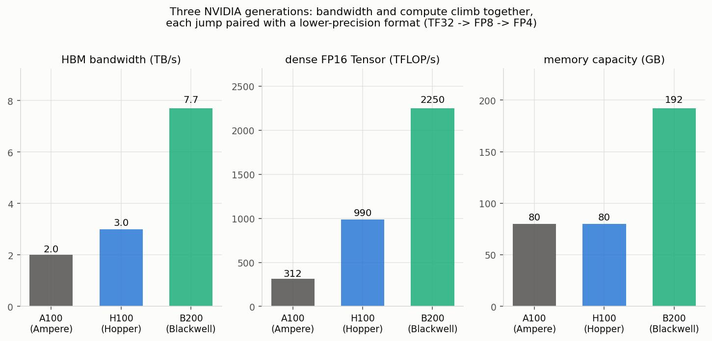

# Why Hardware Makes Matrix Multiply Fast — GPUs, TPUs, and FlashAttention

*A single lens on a pile of folklore: why a $128\times128$ matmul beats a $125\times125$ one, what "tiling" means, how a GPU is built differently from a CPU, why TPUs exist, what actually changed from A100 → H100 → B200, and why FlashAttention was such a big deal.*

If you have spent any time around deep learning you have absorbed a set of half-explained rules of thumb: "make your dimensions multiples of 8," "pad to a power of two," "the matrix multiply is the expensive part," "memory bandwidth is the real bottleneck," "FlashAttention made attention fast without changing the math." Each of these is true, but stated on its own each sounds like superstition.

This note is written for someone who has **not** read the NVIDIA performance guides, the TPU paper, or the FlashAttention paper, and wants the mental model that ties all of it together. That model is one sentence: **modern deep-learning speed is governed less by how many arithmetic operations you do (FLOPs) than by how much data you move through the memory hierarchy.** Almost everything below is a consequence of that single fact — the matrix-shape quirks, the shape of GPU and TPU silicon, and FlashAttention's whole reason for existing.

We assume you are comfortable with what a matrix multiply *is* and with undergraduate ideas like caches and parallelism. We will not write CUDA. Where softmax mechanics matter (Part 6), we lean on the companion note [`absmax-mse-vs-softmax-ce.md`](./absmax-mse-vs-softmax-ce.md) rather than re-deriving them; the "a linear layer is a matrix multiply" picture is developed in [`lora.md`](./lora.md).

---

## Table of Contents

- [Setup and Notation](#setup-and-notation)
- [Part 1 — Why the *shape* of a matrix changes its speed (128 vs 125)](#part-1--why-the-shape-of-a-matrix-changes-its-speed-128-vs-125)
- [Part 2 — The roofline: memory-bound vs math-bound](#part-2--the-roofline-memory-bound-vs-math-bound)
- [Part 3 — GPU vs CPU: the fundamental difference](#part-3--gpu-vs-cpu-the-fundamental-difference)
- [Part 4 — TPUs and the systolic array](#part-4--tpus-and-the-systolic-array)
- [Part 5 — A100 → H100 → B200: what changed and why](#part-5--a100--h100--b200-what-changed-and-why)
- [Part 6 — FlashAttention: same math, far less data movement](#part-6--flashattention-same-math-far-less-data-movement)
- [Part 7 — The KV cache: prefill, decode, and why inference is memory-bound](#part-7--the-kv-cache-prefill-decode-and-why-inference-is-memory-bound)
- [Sources](#sources)

---

## Setup and Notation

A few terms recur throughout. Read this once and refer back.

| Symbol / term | Meaning |
| --- | --- |
| **FLOP** | One floating-point operation (a multiply or an add). A matmul of shapes $M\times K$ by $K\times N$ costs about $2MNK$ FLOPs — one multiply and one add per inner-product term. |
| **byte moved** | One byte read from or written to memory. We count these separately from FLOPs — they are the other, often dominant, cost. |
| **GEMM** | *General Matrix–Matrix multiply*, $C = A B$ with $A$ of shape $M\times K$, $B$ of shape $K\times N$, $C$ of shape $M\times N$. The workhorse of deep learning. |
| **GEMV** | Matrix–**vector** multiply (one of $M,N$ equals 1). |
| **HBM** | *High-Bandwidth Memory* — the large, off-chip DRAM on a GPU board (tens of GB). Big but relatively slow to reach. |
| **SRAM** | Fast on-chip memory (registers + "shared memory" / L1). Tiny (KB–MB) but an order of magnitude faster than HBM. |
| **SM** | *Streaming Multiprocessor* — one of the ~100+ parallel compute units on an NVIDIA GPU. |
| **warp** | A group of 32 GPU threads that execute the *same* instruction in lockstep (the SIMT model). |
| **Tensor Core** | A hardware unit inside each SM that does a small dense matrix multiply (e.g. a $16\times16$-ish block) in one shot, far faster than doing it with scalar multiply-adds. |
| **tile** | A sub-block of the output matrix that one thread block is responsible for computing. |
| **arithmetic intensity** | FLOPs performed per byte moved: $\dfrac{\text{FLOPs}}{\text{bytes}}$. The single number that decides whether you are compute- or memory-limited. |
| **ops:byte ratio** | A property of the *hardware*: peak FLOP/s divided by peak byte/s. Compare arithmetic intensity to this to see which resource runs out first. |

The two costs — FLOPs and bytes moved — race each other. Whichever takes longer sets your runtime. Parts 1 and 2 make that race precise.

---

## Part 1 — Why the *shape* of a matrix changes its speed (128 vs 125)

### 1.1 Tiling: the reason shape matters at all

A GPU does not compute the output matrix $C$ in one monolithic operation. It **cuts $C$ into rectangular tiles** — say $128\times128$ — and hands each tile to one *thread block* (a group of threads that lives on one SM). That block loads the slice of $A$ and the slice of $B$ it needs, multiplies them, and writes its tile of $C$. Stepping along the shared $K$ dimension in chunks, it accumulates the result.

Why bother tiling instead of streaming the whole thing? **Data reuse** — and to see why it matters we have to count *bytes moved*, not just FLOPs. A matmul is unusually rich in reuse: in $C = AB$, each element of $A$ is used in $N$ different output elements (once for every column of $B$), and each element of $B$ is used in $M$ of them (once for every row of $A$). The whole performance question is whether you *exploit* that reuse or throw it away. Consider the two extremes.

**The naive extreme: no reuse.** Suppose you compute each output element $C_{ij}=\sum_k A_{ik}B_{kj}$ independently, pulling its operands straight from HBM every time. Each output element then costs $2K$ reads (a length-$K$ row of $A$ and a length-$K$ column of $B$), so across all $MN$ outputs you read about $2MNK$ elements from HBM while doing about $2MNK$ FLOPs. That is roughly **one FLOP per element moved — arithmetic intensity ≈ 1.** From Part 2, an intensity of 1 sits far to the *left* of the roofline ridge (which is ~40–140): the operation is hopelessly **memory-starved**, and the Tensor Cores spend almost all their time waiting on HBM. The same row of $A$ gets dragged across the slow bus $N$ separate times; the same column of $B$, $M$ times. Enormous, redundant traffic.

**The tiled extreme: load once, reuse many times.** Now instead assign one $T\times T$ tile of $C$ to a thread block. It loads the corresponding $T\times K$ block of $A$ and $K\times T$ block of $B$ into on-chip SRAM/registers **once** — about $2TK$ reads from HBM — and then performs all $T^2K$ multiply-adds for that tile reading its operands from fast SRAM, not HBM. Every value that was loaded is now **reused about $T$ times** before it is discarded. HBM traffic for the tile drops from the naive $\sim 2T^2K$ down to $\sim 2TK$: a factor of $T$ fewer trips to slow memory. Equivalently, the arithmetic intensity climbs from $\approx 1$ to $\approx T$.

Put a number on it: with a $128\times128$ tile, each loaded value feeds roughly **128 multiply-adds** instead of one, so you make on the order of **128× fewer HBM reads**. That single change lifts arithmetic intensity from $\approx 1$ (deep in the memory-bound region) to $\approx 128$ — right around the roofline ridge — which is exactly what moves the matmul from *memory-starved* to *compute-bound*, where the Tensor Cores can finally run near peak. **This is what "tiling manufactures high arithmetic intensity" means:** the raw operation has intensity $\approx 1$, and tiling is the transformation that trades a big block of scarce SRAM for a $T$-fold cut in HBM traffic. It is the "move less data" principle of Part 2 applied at the level of a single matmul.

![Two side-by-side schematics. Left ("Naive: no reuse"): an output tile at top with many red arrows reaching straight down into a wide "HBM (huge, slow)" slab at the bottom, annotated that each row of A is re-read N times and each column of B M times; a callout reads "HBM reads ≈ 2MNK ⇒ AI ≈ 1 (memory-starved: Tensor Cores idle)". Right ("Tiled: load once, reuse T×"): a single thick blue arrow carries one bulk "load 2TK once" from the HBM slab up into an "SRAM (tiny, fast)" box holding the A-tile and B-tile; from that SRAM box many green arrows fan out to the output tile, annotated "each loaded value reused T times"; a callout reads "HBM reads ≈ 2TK ⇒ AI ≈ T (compute-bound)".](./assets/tiling_reuse.jpg){ width=100% }
*Tiling converts a memory-starved operation into a compute-bound one. Naively, every multiply refetches its operands from slow HBM (intensity ≈ 1). Tiled, a block is loaded into fast SRAM once and each value is reused $T$ times, cutting HBM traffic from $\sim\!2MNK$ to $\sim\!2TK$ (intensity ≈ $T$). (Recreated in our notation; the reuse/arithmetic-intensity argument follows the NVIDIA Matrix Multiplication and GPU-performance guides.)*

One practical wrinkle: a full $T\times K$ strip may itself be too big for SRAM when $K$ is large, so the block walks the shared $K$ dimension in **chunks**, loading a $T\times K_\text{chunk}$ slice of $A$ and a $K_\text{chunk}\times T$ slice of $B$ at a time and **accumulating** partial sums into the tile of $C$ (which stays resident in registers the whole time). The reuse story is unchanged: each $A$/$B$ element is still streamed in only once and reused across the tile; only the output tile is held in place.

That is also why tiling exists in the first place, and why the tile has a *fixed, hardware-chosen* size: it must be small enough that a tile's operands (plus the resident output tile) fit in the SM's limited SRAM/registers, yet large enough that the $T$-fold reuse actually pays for the load. Common tile sizes are $128\times128$, $256\times64$, $256\times128$, and so on — never $125\times117$. That fixed tile size is the root of every quirk below.

### 1.2 Tile quantization: partial tiles do full work

Here is the first place $128$ beats $125$. If your output matrix's dimensions are **not multiples of the tile size**, the tiles at the edges hang off the end of the matrix. The hardware still launches a *full* tile for them — it cannot launch a fractional thread block — so those edge tiles do nearly a full tile's worth of multiply-adds while producing only a sliver of useful output. The wasted work is called the **tile quantization** effect.

NVIDIA's own example: a $384\times256$ output with $128\times128$ tiles fits perfectly (3×2 = 6 tiles). But nudge one dimension just past a tile boundary and you spill into an extra row/column of tiles that are almost entirely padding — executing up to **1.5× more operations for 0.39% more actual data**. A $125\times125$ matrix pays exactly this tax: it still occupies the same tiles a $128\times128$ would, but three of those "128" columns and rows are wasted padding.

{ width=100% }
*Left: tile quantization — dimensions that don't divide the tile force nearly-empty edge tiles. Right: wave quantization — a tile count that doesn't divide the SM count leaves a nearly-empty tail wave. (Recreated in our notation; the $384\times256$ tile example and the 117-tiles-on-108-SMs example are from the NVIDIA Matrix Multiplication performance guide.)*

### 1.3 Wave quantization: partial waves leave SMs idle

The same "you can't do a fraction" problem repeats one level up. All the tiles are distributed across the GPU's SMs. An A100 has **108 SMs**, so it can run 108 tiles concurrently — one "wave." If your matmul produces, say, 117 tiles, you get one full wave of 108 plus a **tail wave of just 9 tiles**. That tail wave uses $9/108 = 8.3\%$ of the GPU but takes roughly as long as the full wave, so your effective throughput for that portion collapses and total runtime can nearly **double** for adding just a few tiles. This is the **wave quantization** effect (the right panel above).

The fix is the same in spirit: pick dimensions (and batch sizes) so the tile count is a multiple of, or comfortably larger than, the SM count, so the last wave is full or the tail is amortized over many waves.

### 1.4 Tensor Core alignment: the innermost granularity

There is a *third*, finest level of granularity. Tensor Cores — the units that make the matmul fast — consume operands in fixed small blocks (conceptually $16\times16$). To feed them without waste, the matrix dimensions need to be multiples of a hardware-friendly number. Concretely (with modern cuBLAS):

| Data type | Wants dimensions that are multiples of | Most efficient on A100 |
| --- | --- | --- |
| INT8 | 16 | 128 |
| FP16 | 8 | 64 |
| TF32 | 4 | 32 |

When $K$ (the contraction dimension) is not a multiple of 8 for FP16, the older library couldn't even use Tensor Cores; letting it do so was a documented **2–4× speedup**. If your dimension is misaligned, the hardware pads to the next multiple and the extra lanes compute zeros — pure waste.

### 1.5 Putting it together: why padding to a power of two is "free speed"

Now the folklore is just arithmetic. Padding $125 \to 128$ does three good things at once:

1. **Tensor Core alignment** — 128 is a multiple of 8/16/32/64, so no lanes are wasted at the innermost level.
2. **No tile quantization** — 128 is exactly the tile size, so no edge tiles are mostly padding.
3. **Cleaner wave packing** — nice round tile counts are more likely to fill whole waves of SMs.

The counterintuitive punchline is that the $128\times128$ matmul can be genuinely *faster in wall-clock time* than $125\times125$ **even though it does more arithmetic** — because it wastes nothing at any of the three granularities, while the "smaller" matrix quietly pays for full tiles, a ragged tail wave, and misaligned Tensor Core lanes. Powers of two (and multiples of 8/16/128) are not magic; they are simply the numbers that divide evenly at every level of the hardware's fixed block structure.

---

## Part 2 — The roofline: memory-bound vs math-bound

Part 1 was about *waste* at fixed granularities. Part 2 is the deeper question: even with a perfectly shaped matmul, what actually limits you — the arithmetic units, or the pipe feeding them data?

### 2.1 Arithmetic intensity vs the hardware's ops:byte ratio

Every kernel has an **arithmetic intensity**: FLOPs done per byte moved to/from HBM. Every GPU has an **ops:byte ratio**: its peak FLOP/s divided by its peak byte/s. The comparison is the whole story:

$$
\text{math-bound} \iff \frac{\text{FLOPs}}{\text{bytes}} \;>\; \frac{\text{peak FLOP/s}}{\text{peak byte/s}},
\qquad \text{else memory-bound.}
$$

Read this literally. The left side is what your *algorithm* asks for (work per byte). The right side is what the *hardware* offers (work it can do in the time it takes to move one byte). If your algorithm does more math per byte than the hardware's break-even point, the arithmetic units are the bottleneck (**math-bound**) — you are using the chip well. If it does less, the memory pipe is the bottleneck (**memory-bound**) — the arithmetic units are starved and idle, and buying more FLOPs would not help at all.

For a GEMM the arithmetic intensity works out to

$$
\text{AI} \;=\; \frac{2MNK}{2\,(MK + NK + MN)} \;=\; \frac{MNK}{MK + NK + MN},
$$

where the numerator $2MNK$ is the FLOP count and the denominator counts the bytes of the two inputs read plus the output written (times the bytes per element, which cancels into the constant). The key feature: intensity **grows with the matrix size**. Big square matmuls reuse each loaded byte many times; skinny ones barely reuse anything.

### 2.2 The roofline picture and two worked examples

Plot attainable throughput against arithmetic intensity and you get the famous **roofline**: a sloped line (you are on the memory "roof," throughput = bandwidth × intensity) that rises until it hits a flat ceiling (peak compute). The corner where they meet is the **ridge point**.

![Roofline plot on log-log axes. A sloped line rises from the bottom-left (the memory-bandwidth limit) until it meets a flat horizontal ceiling at 125 TFLOP/s (the compute limit); the corner is the ridge point at 139 FLOP/byte. The region left of the ridge is shaded and labeled memory-bound; right of it, math-bound. Three example points are marked: a GEMV/activation at arithmetic intensity under 1 (deep in memory-bound), a skinny GEMM at intensity ~124 (just short of the ridge, still memory-bound), and a large square GEMM at intensity ~2730 (well into math-bound, sitting on the compute ceiling).](./assets/roofline_memory_vs_math.jpg){ width=78% }
*The roofline. Left of the ridge you are starved for data; right of it you are limited by raw compute. (Recreated in our notation with V100-class numbers — 125 TFLOP/s peak, 0.9 TB/s HBM, ridge ≈ 139 FLOP/byte; the two GEMM examples and the framing are from the NVIDIA guides.)*

Concretely, on a V100 (ridge ≈ 139 FLOP/byte):

- A large square **$8192\times8192\times8192$** GEMM has AI ≈ **2730** — far above the ridge, comfortably **math-bound**. It reuses each byte thousands of times; the Tensor Cores run near peak.
- A skinny **$8192\times128\times8192$** GEMM has AI ≈ **124** — *below* the ridge, so it is **memory-bound** despite being a huge matmul. The thin $K=128$ dimension kills reuse.
- A **GEMV** (or an elementwise op like ReLU) has AI **< 1** — hopelessly memory-bound. There is essentially no reuse: you read each number, do one or two FLOPs, and move on.

### 2.3 Why this is the crux of the whole note

Here is the lesson that Parts 4 and 6 both cash in: **if you are memory-bound, adding FLOPs does nothing.** A faster arithmetic unit accelerates a bottleneck you don't have. The only way to go faster is to **move less data** — raise arithmetic intensity by reusing what you have already loaded. This is why memory bandwidth so often matters more than peak FLOPs in practice, why TPUs are built around maximizing reuse, and why FlashAttention wins by *reorganizing data movement* while doing the exact same (indeed, slightly more) arithmetic. Keep this sentence in mind: *the bottleneck for most real workloads is the pipe, not the pump.*

---

## Part 3 — GPU vs CPU: the fundamental difference

You don't need the microarchitecture nitty-gritty to get the one idea that matters. It is a difference of **goal**, and everything else follows.

### 3.1 Latency cores vs throughput cores

A **CPU is built to finish a single thread as fast as possible** — to minimize *latency*. Because most code is a serial chain of dependent steps sprinkled with unpredictable branches, a CPU spends most of its transistors *not* on arithmetic but on making one thread fast: large caches (so data is close), out-of-order execution and branch prediction (so it never stalls waiting to discover what to do next), deep pipelines. It has a handful of these big, clever cores.

A **GPU is built to finish an enormous number of independent threads per second** — to maximize *throughput*. It spends its transistors on thousands of small, simple arithmetic lanes and almost nothing on cleverness per lane. When one group of threads stalls waiting on memory, the GPU doesn't try to avoid the stall (as a CPU would); it just **switches to another group that is ready**, keeping the arithmetic units busy. It hides latency behind sheer parallelism instead of fighting it.

{ width=100% }
*The design split in one picture: a CPU spends area on a few fat latency-optimized cores plus large caches/control; a GPU spends area on a sea of thin throughput-optimized lanes. (Schematic, recreated; a standard illustration in the CUDA / NVIDIA GPU-architecture literature.)*

### 3.2 SIMT, warps, and occupancy

The GPU's simple lanes are ganged together: a **warp** of 32 threads executes the same instruction at the same time on 32 different data elements (the **SIMT**, single-instruction-multiple-thread, model). This is cheap because 32 lanes share one instruction decoder — it is why a GPU can afford so many lanes. The flip side is that heavily branchy code (where threads in a warp want to do different things) runs poorly; matmul, where every lane does the identical multiply-add, is the perfect fit.

**Occupancy** is the term for having enough warps resident on each SM so that whenever some are stalled on memory, others are ready to run. High occupancy is how the "hide latency behind parallelism" trick actually works — you need a deep enough backlog of ready warps to paper over the long trip to HBM.

### 3.3 The memory hierarchy is the constraint

Both machines have a memory hierarchy, but on a GPU it is the thing you spend all your effort managing (recall Part 2). From fast/tiny to slow/huge: **registers → SRAM (on-chip "shared memory"/L1) → L2 cache → HBM (DRAM)**. As you go down, capacity grows by orders of magnitude but bandwidth falls.

{ width=100% }
*The GPU memory hierarchy (A100-class, approximate): each step down multiplies capacity but divides bandwidth. Tiling (Part 1) and FlashAttention (Part 6) are both about keeping working data as high up this pyramid as possible. (Recreated; figures are approximate A100-class values, on-chip SRAM ~19 TB/s and HBM ~1.5–2 TB/s per the FlashAttention paper and NVIDIA guides.)*

The A100 concretely: 108 SMs, a 40 MB L2 cache, and 40–80 GB of HBM at roughly 1.5–2.0 TB/s, versus on-chip SRAM at an estimated ~19 TB/s — a **~10× bandwidth cliff** between on-chip and off-chip. Every performance technique in this note is, at bottom, a strategy for staying on the fast side of that cliff.

---

## Part 4 — TPUs and the systolic array

If the GPU is a general throughput machine, the **TPU** (Google's Tensor Processing Unit) is the answer to a sharper question: *if you already know the workload is almost entirely matrix multiply, how little hardware can you get away with?*

### 4.1 Why build one at all

Google measured that MLPs, CNNs, and LSTMs — all dominated by matmul — made up **95% of their datacenters' neural-network inference demand**. For that workload, most of a CPU's (and much of a GPU's) transistor budget — caches, branch predictors, out-of-order machinery — is *overhead*: silicon and power spent making irregular general-purpose code fast, which a wall of matmuls simply doesn't need. A domain-specific chip can delete all of that and spend the area on multiply-accumulate units instead.

### 4.2 The systolic array: reuse baked into the wiring

The heart of the first TPU is a **systolic array**: a $256\times256$ grid of **65,536 multiply-accumulate (MAC) units**. Instead of each MAC fetching its operands from memory, operands **flow through the grid** — activations stream in from one edge, weights are held in place, and each value that enters is **reused across an entire row or column of MACs** as it propagates. Partial sums accumulate as they march through. The name "systolic" is the analogy to a heartbeat pumping data rhythmically through the array.

{ width=62% }
*A systolic array (small 4×4 stand-in for the TPU's 256×256). One value read from memory feeds a whole row or column of multipliers as it flows through — reuse is built into the wiring, not managed in software. (Schematic, recreated; the 256×256 / 65,536-MAC design is from Jouppi et al., "In-Datacenter Performance Analysis of a TPU," 2017.)*

Why this is the right shape: it is Part 2's "move less data" principle turned into physical wiring. In a naive matmul each MAC would need its own operand fetch; in a systolic array **one HBM read feeds many multiplies** because the value physically travels past many MACs. Arithmetic intensity is maximized by the layout itself, so the array can run near peak with a modest memory system — the original TPU pairs it with a large (28 MiB) *software-managed* on-chip buffer instead of a cache hierarchy.

### 4.3 The design philosophy: deterministic and lean

Because the workload is regular, the TPU drops the features that make general chips complex: **no caches, no branch prediction, no out-of-order execution, no speculation.** Execution is **deterministic**, which also makes it easy to hit a tight 99th-percentile latency target for serving. The result is a chip that is small and low-power for its throughput: the 2017 paper reports roughly **15–30× the performance** and **30–80× the performance-per-watt** of contemporary CPUs and GPUs on those inference workloads (with the usual caveats — it was measured against 2015-era parts, and later GPUs with better memory closed much of the gap). The durable lesson is not the specific multiplier but the principle: **specialize the silicon to the workload and you can delete everything the workload doesn't use.**

---

## Part 5 — A100 → H100 → B200: what changed and why

Rather than memorize spec sheets, read each generation as *solving a specific bottleneck* exposed by the previous one. The through-line is the same one from Part 2: feed the arithmetic units faster, and let them chew lower-precision numbers so there are more FLOPs per byte.

{ width=100% }
*Three NVIDIA generations. Bandwidth and compute rise together, and each jump is paired with a new lower-precision format that raises FLOPs-per-byte. (Recreated from vendor-published specs; dense FP16 Tensor throughput shown without sparsity.)*

**A100 (Ampere, 2020) — the baseline.** 108 SMs, HBM2 at ~1.5–2.0 TB/s, third-gen Tensor Cores with TF32/FP16, ~312 dense FP16 Tensor TFLOP/s. This is the machine most of the numbers in Parts 1–3 refer to.

**H100 (Hopper, 2022) — feed the beast, and go to FP8.** 132 SMs and HBM3 at ~3.0 TB/s (the first GPU with HBM3). Its interesting parts are all about *data movement and precision*:

- **Tensor Memory Accelerator (TMA):** a dedicated hardware unit that performs large asynchronous bulk copies between HBM and SRAM. On A100, threads themselves had to compute all the addresses and issue the loads; the TMA offloads that entirely, so the arithmetic threads keep computing instead of babysitting memory transfers — a direct attack on the Part 2 bottleneck.
- **Thread-block clusters + distributed shared memory:** groups of thread blocks on different SMs can be co-scheduled and read each other's SRAM directly, about **7× faster** than routing data through HBM. This lets a tile's working set be shared across SMs without a round-trip to slow memory.
- **Transformer Engine + FP8:** new 8-bit float formats (E4M3 and E5M2) with hardware that dynamically picks FP8 vs 16-bit per layer to hold accuracy. Halving the bytes per number doubles both effective bandwidth and Tensor Core throughput — NVIDIA quotes up to **9× faster training and 30× faster inference** on large language models versus A100.

**B200 (Blackwell, 2025) — bigger still, and go to FP4.** To beat the reticle limit (the largest die you can manufacture), a B200 is **two dies fused into one logical GPU** (208 billion transistors total) linked at 10 TB/s so software sees a single chip. It carries **192 GB of HBM3e at ~7.7 TB/s** and a **second-generation Transformer Engine** that adds **FP4/FP6** with per-block ("micro-tensor") scaling — pushing FLOPs-per-byte even higher for inference. In practice this lands at roughly **~2× the real training throughput** of H100 on large models.

The pattern across all three: **more and faster memory, better hardware for moving data on-chip, and ever-lower-precision number formats.** Two of those three levers are about data movement, and the third (lower precision) is itself a way to move fewer bytes per number. The chips keep confirming Part 2's thesis.

---

## Part 6 — FlashAttention: same math, far less data movement

Now the payoff. **FlashAttention** (Dao, Fu, Ermon, Rudra, Ré, 2022) made the attention layer several times faster *without approximating anything* — the output is bit-for-bit the exact same attention. It did this purely by being **IO-aware**: reorganizing which data lives where so it stops thrashing HBM. It is Part 2's lesson applied to the single most important operation in a transformer.

### 6.1 The problem: attention is memory-bound, not compute-bound

Standard attention, for sequence length $N$ and head dimension $d$, computes scores $S = QK^\top$ (an $N\times N$ matrix), then $P = \mathrm{softmax}(S)$ (also $N\times N$), then output $O = PV$. Here $Q,K,V$ are the query/key/value matrices of shape $N\times d$. The naive implementation **writes the full $N\times N$ matrix $S$ out to HBM, reads it back to apply softmax, writes $P$ back to HBM, and reads it again** to multiply by $V$.

That is a disaster for two reasons. First, memory: storing $N\times N$ is **$O(N^2)$** and blows up quadratically with sequence length. Second — the deeper point — the operation is **memory-bound**: the actual matmuls are cheap relative to the enormous traffic of shuttling that $N\times N$ matrix in and out of slow HBM several times. The GPU's Tensor Cores spend most of their time waiting on the memory pipe. By Part 2, throwing more FLOPs at it would do nothing; you must move less data.

### 6.2 The insight: count HBM traffic, and keep the matrix on-chip

FlashAttention's stated missing principle is exactly ours: attention algorithms should be **IO-aware — account for reads and writes between levels of GPU memory**, not just count FLOPs. The relevant numbers are the ones from Part 3, which the paper spells out for the A100: on-chip **SRAM at ~19 TB/s but only ~192 KB per SM**, versus **HBM at ~1.5–2.0 TB/s with 40 GB**. The whole game is to keep the attention computation up in that 19 TB/s SRAM and **never materialize the $N\times N$ matrix in HBM at all.**

The obstacle is softmax. Softmax over a row needs the whole row (to find the max for numerical stability and to sum the exponentials for normalization), which seems to force you to have the entire row of $S$ at once. FlashAttention breaks that dependency.

### 6.3 Tiling plus an online (streaming) softmax

Split $Q$, $K$, and $V$ into blocks sized to fit in SRAM. For each block of queries, **walk over the blocks of keys/values one at a time**, computing that small $Q_iK_j^\top$ block in SRAM. The trick is to carry a little **running softmax state** and rescale as you go:

- $m$ — the running maximum score seen so far (for numerical stability),
- $\ell$ — the running sum of exponentials $\sum e^{\,s-m}$ (the normalizer),
- $O$ — the running, rescaled output accumulator.

When a new block arrives with a larger max, you rescale the previously accumulated $\ell$ and $O$ by $e^{\,m_\text{old}-m_\text{new}}$ so everything stays on a consistent scale, then fold in the new block. After the last key/value block, $O$ divided by $\ell$ is *exactly* the standard softmax-weighted output — no approximation. (This is the same numerically-stable softmax, computed incrementally; for why softmax needs that max-subtraction and how its normalization works, see [`absmax-mse-vs-softmax-ce.md`](./absmax-mse-vs-softmax-ce.md).)

![Schematic of the attention computation. A dashed N×N grid labeled "the full N×N scores matrix is never stored in HBM," split into a 3×3 grid of blocks. Rows are labeled Q1, Q2, Q3; columns are labeled K1,V1 / K2,V2 / K3,V3. One block (Q2·K2ᵀ) is highlighted as being "in SRAM." An arrow points to a side panel, "running softmax state (kept in SRAM)," listing m = running max, ℓ = running sum of e^(s−m), O = rescaled output. A caption reads: walk over K/V blocks one at a time, update (m, ℓ, O) on the fly — exact softmax, no full matrix.](./assets/flash_attention_tiling.jpg){ width=88% }
*FlashAttention tiles Q/K/V into SRAM-sized blocks and streams the softmax, keeping only the small running statistics $(m,\ell,O)$ — so the $N\times N$ matrix never touches HBM. (Recreated in our notation; cf. Dao et al., 2022, Figure 1.)*

### 6.4 The backward pass: recompute instead of store

Training needs the attention matrix again for gradients. Storing it during the forward pass would reintroduce the $O(N^2)$ HBM cost we just eliminated. So FlashAttention **doesn't store it** — in the backward pass it **recomputes** each attention block on the fly from the saved statistics $(m,\ell)$ and the inputs. This trades extra FLOPs for far less memory traffic, which is a *great* trade precisely because attention is memory-bound (Part 2 again): the recompute FLOPs are nearly free, and we save the expensive HBM round-trips.

### 6.5 The results, and the one-sentence takeaway

By counting HBM accesses instead of FLOPs, FlashAttention needs roughly **9× fewer HBM accesses** than standard attention for typical sizes, and drops memory from **$O(N^2)$ to $O(N)$** in sequence length. That translates to real speedups: about **15% end-to-end on BERT-large** (seq 512), **3× on GPT-2** (seq 1K), and **2.4× on long-range-arena** (seq 1K–4K) — and it made previously-infeasible long-context settings (Path-X at 16K, Path-256 at 64K) trainable at all, purely by fitting in memory.

The takeaway ties the whole note into one bow: **FlashAttention does the exact same math as standard attention — in fact slightly more arithmetic, because of recomputation — yet runs several times faster, because it moves far less data.** That is the entire thesis of this note in a single result. Fast hardware is a pump; performance is almost always limited by the pipe. Whether you are padding a matrix to 128, wiring a systolic array, adding a Tensor Memory Accelerator, or streaming a softmax, the winning move is the same: **keep the data close, and move less of it.**

---

## Part 7 — The KV cache: prefill, decode, and why inference is memory-bound

FlashAttention (Part 6) made *training* attention fast. But when you actually *use* a trained model — generating text one token at a time — a different inefficiency dominates, and the fix, the **KV cache**, is again a pure data-movement trick. This part is where the note's thesis finally lands on the thing you interact with every day: an LLM answering a prompt.

### 7.1 The redundancy a cache removes

A decoder LLM generates **autoregressively**: to produce token $t+1$ it runs a full forward pass over the sequence so far, and each attention layer needs the keys and values of *every previous token*. Recall from Part 6 that attention turns the current token's query $Q$ against the keys $K$ and values $V$ of all tokens: $O = \mathrm{softmax}(QK^\top)V$, where $K$ and $V$ are the per-token projections $K_i = x_i W_K$, $V_i = x_i W_V$ (here $x_i$ is token $i$'s hidden state and $W_K, W_V$ are the frozen key/value projection weights).

The naive loop recomputes $K$ and $V$ for **all** tokens at **every** step. That is almost entirely wasted work, and here is the exact reason why: the projection weights $W_K, W_V$ are **frozen** at inference, and attention is **causal** (a token only attends to itself and earlier tokens). So $K_i$ and $V_i$ for an already-seen token $i$ are *bit-for-bit identical* on every future step — token $i$'s hidden state doesn't change when we append token $i+1$. Recomputing them is like re-deriving the same number over and over. Concretely, extending a 5-token sequence to 6 tokens re-derives about $25/36 \approx 69\%$ of the attention work it already did.

{ width=100% }
*The KV cache eliminates redundant recomputation: since frozen weights + causal masking make each past $K_i,V_i$ identical across steps, we compute them once and reuse. (Recreated in our notation; cf. the HuggingFace "KV Cache from Scratch in nanoVLM" and "KV Cache basics" blogs.)*

### 7.2 What gets cached — and why only $K$ and $V$, not $Q$

The fix is to **store** the keys and values as we go. We keep a per-layer cache of $K$ and $V$, each of shape `(batch, num_heads, seq_len, head_dim)`, and on each decode step we compute $K,V$ for **only the new token** and append them:

$$
K \leftarrow \text{concat}(K_{\text{cache}},\, k_{\text{new}}), \qquad
V \leftarrow \text{concat}(V_{\text{cache}},\, v_{\text{new}}).
$$

Then attention for the new token runs its single query against the full cached $K,V$.

Why cache $K$ and $V$ but **not** the queries $Q$? Because their roles across time are opposite. A key/value pair for position $i$ is **reused by every future token** — $K_0,V_0$ are read when token 1 attends back to token 0, again when token 2 does, and so on forever. A query, by contrast, is **used exactly once**: token $t$'s query attends to the past, produces token $t$'s output, and is then never needed again. There is nothing to reuse, so there is nothing worth caching. Caching $Q$ would store data no future step ever reads.

### 7.3 Prefill vs decode — two phases with opposite bottlenecks

This splits generation into two phases with strikingly different hardware behavior — and this is exactly the Part 2 roofline showing up in production inference.

**Prefill** processes the entire input prompt in **one parallel forward pass**, computing $K,V$ for all prompt tokens at once and populating the cache. Because it multiplies a whole matrix of token states by the weights, prefill is a big, dense **GEMM with high arithmetic intensity — it is compute/math-bound** (right of the ridge in Part 2). The GPU's Tensor Cores run near peak; this is the phase that does "real" arithmetic.

**Decode** then emits tokens **one at a time**, each step running a *single* new token's query against the entire cached $K,V$. That is a matrix–**vector** product — a GEMV — with arithmetic intensity below 1. To generate one token, the GPU must **stream the entire KV cache (and the model weights) out of HBM** and do only a tiny amount of math on it. So decode is squarely **memory-bandwidth-bound**: its speed is set by how fast you can read the cache from HBM, *not* by how many FLOPs the chip can do.

{ width=100% }
*Prefill runs once and is compute-bound; decode runs per token and is memory-bound. This is the roofline of Part 2 dictating the economics of LLM serving. (Recreated in our notation; cf. the HuggingFace KV-cache blogs.)*

The cache turns per-step cost from re-deriving the whole history ($O(n^2)$ work across a generation) into just appending and reading ($O(n)$), which in the nanoVLM walkthrough is already a **~38% generation speedup** on a small model — and far more on long sequences.

### 7.4 The price of the cache — and how people shrink it

Caching trades compute for **memory**, and that memory is substantial. The cache size is

$$
\text{cache bytes} \;=\; 2 \,\cdot\, n_{\text{layers}} \,\cdot\, n_{\text{heads}} \,\cdot\, d_{\text{head}} \,\cdot\, \text{seq\_len} \,\cdot\, \text{batch} \,\cdot\, \text{bytes/elem},
$$

where the leading $2$ counts $K$ **and** $V$, $n_{\text{layers}}$ is the number of transformer layers, $n_{\text{heads}}\cdot d_{\text{head}}$ is the model width per token, and the rest scale it by how many tokens and requests you hold. The thing to notice is that it grows **linearly with sequence length and batch size** — every extra token of context, and every extra concurrent request, costs a fixed slice of HBM. For a LLaMA-7B-class model this works out to roughly **0.5 MB per token**, so a single 2K-token request eats on the order of **~1 GB** of HBM just for its cache (larger models or fp32 push this to several GB).

This is why the trade, while essentially **always worth it** for speed, creates the real bottleneck in LLM serving: the KV cache — not the model weights — is often what caps how long a context you can serve and how many requests you can batch, and (per 7.3) its size is exactly the bytes you must stream every decode step. So the whole game becomes **shrink the cache you have to move**:

- **Multi-Query / Grouped-Query Attention (MQA / GQA):** let many attention heads *share* one set of $K,V$ instead of each head having its own. This cuts the cache (and the bytes streamed per step) by the sharing factor with little quality loss — a direct attack on the memory-bound decode bottleneck.
- **PagedAttention (vLLM):** manage the cache in fixed-size *pages* like virtual memory, so requests don't each reserve a giant contiguous block. This slashes fragmentation and lets you pack far more concurrent sequences into the same HBM.

Both are the same move we have seen all note long, now applied to inference: **the pump is fast; the pipe is the limit — so move fewer bytes.** The KV cache removes redundant *compute*; MQA/GQA and PagedAttention then shrink the *memory traffic and footprint* that the cache itself creates.

---

## Sources

- **NVIDIA — Matrix Multiplication Background User's Guide.** The definitive explanation of tiling, tile/wave quantization, Tensor Core alignment, and arithmetic intensity for GEMMs. <https://docs.nvidia.com/deeplearning/performance/dl-performance-matrix-multiplication/>
- **NVIDIA — GPU Performance Background User's Guide.** SMs, the SIMT/warp model, the memory hierarchy, and the math-bound vs memory-bound / ops:byte framing. <https://docs.nvidia.com/deeplearning/performance/dl-performance-gpu-background/>
- **NVIDIA — Hopper Architecture In-Depth** (developer blog). TMA, thread-block clusters and distributed shared memory, the Transformer Engine and FP8, HBM3, NVLink. <https://developer.nvidia.com/blog/nvidia-hopper-architecture-in-depth/>
- **Jouppi et al., "In-Datacenter Performance Analysis of a Tensor Processing Unit" (ISCA 2017).** The systolic array, the deterministic design philosophy, and the CPU/GPU/TPU comparison. arXiv:1704.04760 — <https://arxiv.org/abs/1704.04760>
- **Dao, Fu, Ermon, Rudra, Ré, "FlashAttention: Fast and Memory-Efficient Exact Attention with IO-Awareness" (NeurIPS 2022).** IO-awareness, tiling + online softmax, recomputation, and the SRAM/HBM numbers. arXiv:2205.14135 — <https://arxiv.org/abs/2205.14135>
- **NVIDIA Blackwell (B100/B200) architecture** — vendor materials and secondary summaries for the dual-die design, HBM3e, and the second-gen Transformer Engine / FP4. <https://www.nvidia.com/en-us/data-center/technologies/blackwell-architecture/>
- **HuggingFace — "KV Cache from Scratch in nanoVLM."** Why the cache exists, prefill vs decode, and a from-scratch PyTorch implementation with the generation loop. <https://huggingface.co/blog/kv-cache>
- **HuggingFace — "The KV Cache: How It Eliminates Redundancy" (atharv6f).** Concise conceptual take on what gets cached, why only K/V, and the memory-vs-compute tradeoff. <https://huggingface.co/blog/atharv6f/kv-cache-basics>

**Companion notes in this repo:** [`absmax-mse-vs-softmax-ce.md`](./absmax-mse-vs-softmax-ce.md) for softmax mechanics (needed in Part 6) and [`lora.md`](./lora.md) for the "a linear layer is a matrix multiply" picture.
