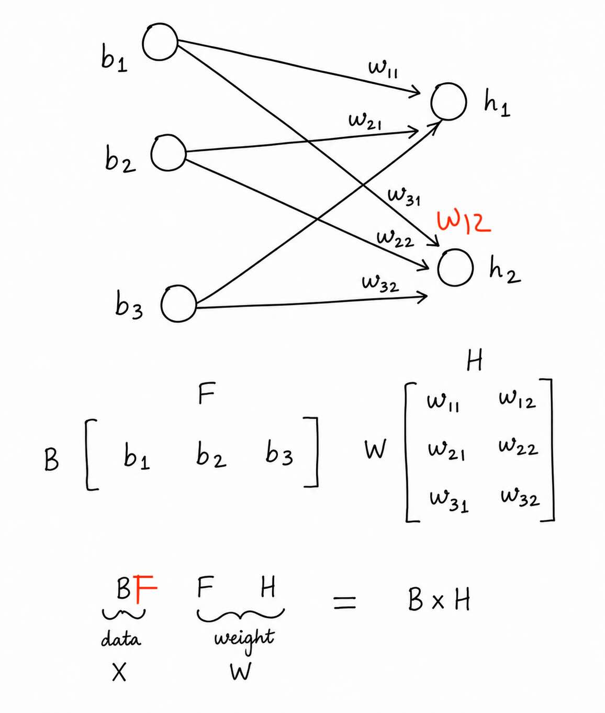

# Low-Rank Adaptation (LoRA) Training Summary

{ width=50% }

This document provides a concise mathematical and operational overview of applying Low-Rank Adaptation (LoRA) to a large fully connected layer.

---

### 1. Dimensional Setup & The Problem

Consider a standard fully connected layer undergoing fine-tuning:
* **Input ($X$):** Shape $(B, F)$ where $B$ is the batch size and $F$ is the number of input features.
* **Base Weight Matrix ($W$):** Shape $(F, H)$ where $H$ is the number of output features.
* **Output ($Y$):** Shape $(B, H)$.

In standard full fine-tuning, the forward pass is $Y = XW$. When $F$ and $H$ are massive (e.g., $4096 	imes 4096$), updating $W$ directly requires tracking $F 	imes H$ gradients and optimizer states, which is highly VRAM-intensive.

---

### 2. The LoRA Solution

LoRA freezes the original weight matrix $W$ and parameterizes the weight update matrix $\Delta W$ using a low-rank decomposition. Two trainable matrices are introduced:
* **Matrix $A$:** Shape $(F, r)$
* **Matrix $B$:** Shape $(r, H)$

Where $r$ is the chosen low-rank hyperparameter ($r \ll \min(F, H)$). 

#### Core Mathematical Identity:
$$\Delta W = AB$$

---

### 3. The Forward Pass

During training, the input $X$ is passed through both the frozen base model weights and the active low-rank adapters in parallel. The resulting outputs are summed up:

$$Y = X(W + \Delta W) = XW + X(AB)$$

*Note: In practical implementations, a scaling factor $\frac{\alpha}{r}$ is applied to the adapter path ($X(AB) \cdot \frac{\alpha}{r}$), where $ lpha$ is a constant hyperparameter.*

---

### 4. Why Initialization Matters

Proper initialization of the LoRA matrices is critical for training stability and performance. 

* **Matrix $A$** is initialized using a random Gaussian distribution (e.g., $\mathcal{N}(0, \sigma^2)$).
* **Matrix $B$** is initialized entirely to **zeros**.

#### Why is this specific initialization strategy used?

1. **Zero Initial Update:** Because $B = 0$, the product $\Delta W = AB$ is exactly a matrix of zeros at step zero:
   $$\Delta W = A \times 0 = 0$$
2. **Behavioral Continuity:** Since $\Delta W = 0$ at the start of training, the forward pass simplifies to:
   $$Y = XW + X(0) = XW$$
   This guarantees that the model behaves **exactly** like the original pre-trained model at the very first training step. There is no initial performance degradation, distortion, or shock to the network.
3. **Symmetry Breaking:** If both matrices were initialized to zero, gradients wouldn't flow properly or break symmetry effectively during backpropagation. Initializing $A$ randomly and $B$ to zero breaks symmetry while preserving the initial zero-state behavior of $\Delta W$.

---

### 5. Backpropagation & Efficiency

During the backward pass:
* $W$ remains frozen and receives no gradients.
* Gradients are computed strictly for the parameters in $A$ and $B$.
* **Parameter Reduction:** Instead of updating $F 	imes H$ parameters, the optimizer only tracks $r(F + H)$ parameters. For $F=4096, H=4096, r=8$, this reduces the trainable parameter count from **16,777,216** down to **65,536** (a ~99.6% reduction in trained weights).

---


# Applying LoRA to Convolutional Neural Networks (CNNs)

While LoRA is traditionally associated with fully connected layers in Large Language Models, it is also highly effective for Convolutional Neural Networks (CNNs), particularly in generative AI (like fine-tuning Stable Diffusion models). 

There are two ways to understand how LoRA is applied to convolutions: a conceptual matrix approach and a practical, native implementation approach.

---

## Method 1: The Conceptual Approach (`im2col`)

Conceptually, a convolution can be represented as a standard matrix multiplication using an operation called **`im2col`** (image-to-column).

Given a Convolutional weight tensor $W$ of shape `(O, I, K_h, K_w)` (where $O$=out channels, $I$=in channels, $K$=kernel size):

1. **Flattening:** * The input image patches are unrolled into a massive 2D matrix.
   * The weight tensor $W$ is flattened into a 2D matrix of shape $(O, I \cdot K_h \cdot K_w)$.
2. **Applying LoRA:** Because $W$ is now a 2D matrix, you apply LoRA standardly:
   * **Matrix $A$:** Shape $(r, I \cdot K_h \cdot K_w)$
   * **Matrix $B$:** Shape $(O, r)$
   
   $$\Delta W = B \cdot A$$

*Drawback:* Explicitly unrolling the image into a matrix consumes highly redundant and massive amounts of VRAM, making this impractical for real-world code.

---

## Method 2: The Native Convolutional Approach (Practical Implementation)

Libraries like Hugging Face `peft` do not flatten tensors. Instead, they replicate the low-rank bottleneck using actual, lightweight Convolutional layers running in parallel with the frozen base layer.

### The Setup
Suppose the base frozen layer is:
`base_layer = nn.Conv2d(I, O, K, stride=S, padding=P)`

LoRA introduces two new parallel convolutional adapters:

1. **Adapter A (Down-Projection):**
   Handles the spatial logic (kernel size, stride, padding) but squashes the channel dimension to the tiny rank $r$.
   `lora_A = nn.Conv2d(I, r, K, stride=S, padding=P, bias=False)`

2. **Adapter B (Up-Projection):**
   Takes the $r$ channels and projects them back to $O$ channels. Since spatial logic is already handled, this is just a $1 	imes 1$ convolution.
   `lora_B = nn.Conv2d(r, O, kernel_size=1, stride=1, padding=0, bias=False)`

### The Forward Pass
The input $x$ flows through the frozen base weights and the active adapters simultaneously:

```python
def forward(x):
    # Frozen base convolution
    base_output = base_layer(x)
    
    # Active LoRA adapter path (with scaling)
    lora_output = lora_B(lora_A(x)) * (alpha / r)
    
    return base_output + lora_output
```

### Initialization Matters (Again)
Just like in fully connected layers:
* `lora_A` is initialized with random weights (e.g., Kaiming initialization).
* `lora_B` is initialized entirely to **zeros**.

This ensures that at step zero, `lora_output = 0`, and the CNN behaves exactly like the un-fine-tuned original model.
